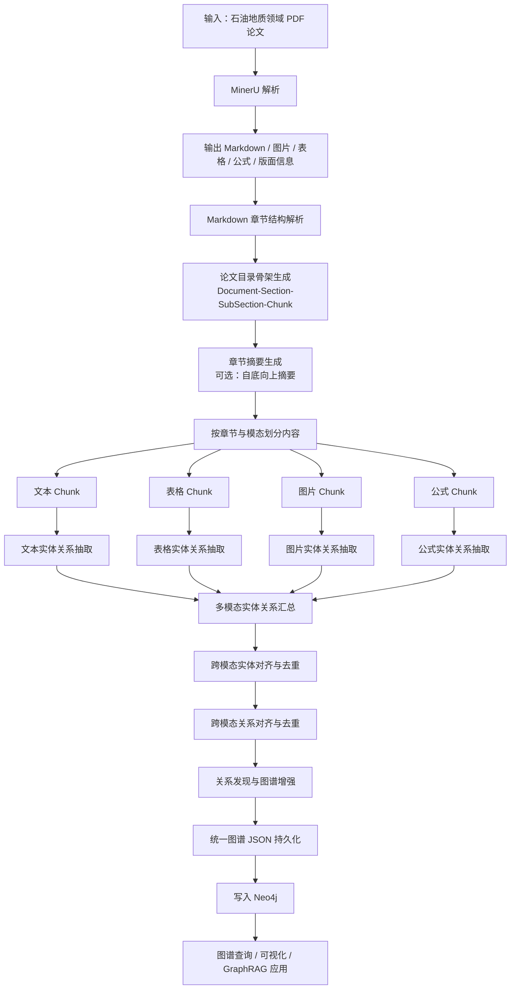
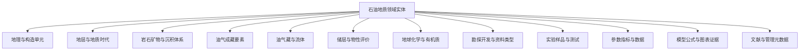

# 面向石油地质领域的多模态知识图谱构建

本项目面向石油地质领域 PDF 论文文档，构建一套从 **PDF 解析、章节结构恢复、多模态内容切分、Schema 约束抽取、跨模态对齐去重、关系发现到 Neo4j 图数据库写入** 的流水线式多模态知识图谱构建系统。

系统输入为石油地质领域相关 PDF 论文，经过 MinerU 解析得到 Markdown 文档，再按论文目录层级、章节内容和模态类型进行结构化拆分，分别调用文本、表格、图片、公式等模态抽取算法完成实体与关系抽取，最终形成可追溯、可融合、可持久化、可写入 Neo4j 的多模态知识图谱。

---

## 1. 项目目标

本项目的核心目标不是简单从论文中抽取三元组，而是构建一个面向石油地质论文的完整知识工程流程，重点解决以下问题：

1. 如何从 PDF 论文中恢复“文档—章节—子章节—Chunk”的层次化结构。
2. 如何识别正文、表格、图片、公式等不同模态中的知识。
3. 如何基于石油地质领域 Schema 对实体类型和关系类型进行约束抽取。
4. 如何对不同章节、不同模态中的重复实体和关系进行对齐、标准化与去重。
5. 如何进一步发现跨模态、跨章节的潜在关系。
6. 如何将每个阶段的图谱数据持久化为统一 JSON，并最终写入 Neo4j。

---

## 2. 核心思路

本项目采用 **“论文结构骨架 + 多模态知识抽取 + Schema 约束 + 跨模态融合 + 关系发现 + 图数据库写入”** 的整体思路。

其中，论文目录骨架用于保存论文原始层级和证据来源，多模态抽取用于从文本、表格、图片和公式中获取领域知识，Schema 用于约束抽取范围和关系类型，对齐去重用于解决跨模态重复表达，关系发现用于补充隐含语义关联，Neo4j 用于最终知识图谱存储、查询和可视化。

整体设计原则如下：

- **结构先行**：先恢复论文目录骨架，再进行知识抽取，保证每个实体和关系都能回溯到原始章节、Chunk 或模态证据。
- **Schema 约束**：所有实体和关系抽取都必须受到石油地质领域 Schema 约束，避免抽取“研究、结果、方法、特征”等泛化无效词。
- **多模态分治**：文本、表格、图片、公式分别采用不同抽取策略，先独立抽取，再统一融合。
- **证据绑定**：每个实体、关系、事件、参数都保留来源文档、章节、Chunk、图号、表号、公式号等证据字段。
- **阶段持久化**：每个流水线阶段都输出独立 JSON 文件，便于调试、回溯、评估和断点续跑。
- **统一图谱格式**：所有阶段输出的图谱 JSON 都采用统一的 `nodes`、`relations`、`metadata` 结构。

---

## 3. 实现流程

### 3.1 总体流程图



---

## 4. 流水线阶段说明

### 4.1 PDF 解析阶段

输入数据为石油地质领域 PDF 论文文档。系统首先调用 MinerU 对 PDF 进行解析，得到 Markdown 文本、图片、表格、公式以及版面相关信息。

输入：

```text
data/raw_pdf/
```

输出：

```text
data/mineru_output/
```

建议输出内容：

```text
data/mineru_output/
├── paper_001/
│   ├── full.md
│   ├── images/
│   ├── tables/
│   ├── formulas/
│   ├── content_list.json
│   └── layout.json
```

阶段输出 JSON：

```text
output/stage_01_mineru_parse.json
```

主要内容：

```json
{
  "document_id": "paper_001",
  "source_pdf": "data/raw_pdf/paper_001.pdf",
  "markdown_path": "data/mineru_output/paper_001/full.md",
  "image_dir": "data/mineru_output/paper_001/images",
  "table_dir": "data/mineru_output/paper_001/tables",
  "formula_dir": "data/mineru_output/paper_001/formulas",
  "parse_status": "success"
}
```

---

### 4.2 Markdown 章节划分阶段

系统读取 MinerU 生成的 Markdown 文件，根据标题层级、编号规则和正文结构，将论文划分为章节树。

目标是生成：

```text
Document -> Section -> SubSection -> Chunk
```

例如：

```text
论文
├── 摘要
├── 1 地质背景
│   ├── 1.1 区域构造背景
│   ├── 1.2 地层发育特征
├── 2 样品与实验方法
├── 3 储层特征
│   ├── 3.1 岩石学特征
│   ├── 3.2 孔隙结构特征
```

阶段输出 JSON：

```text
output/stage_02_section_tree.json
```

节点示例：

```json
{
  "id": "sec_001",
  "type": "Section",
  "title": "1 地质背景",
  "level": 1,
  "parent_id": "doc_001",
  "order": 1,
  "text": "章节正文内容",
  "source": {
    "document_id": "paper_001",
    "page_start": 1,
    "page_end": 3
  }
}
```

---

### 4.3 论文目录骨架生成

这是本项目的第一个核心创新点。

系统根据章节划分结果生成论文目录骨架图，将论文结构本身作为图谱的一部分保存下来。目录骨架不只是文本切分结果，而是后续所有实体、关系、图表、公式的证据锚点。

骨架节点包括：

| 节点类型 | 说明 |
|---|---|
| `Document` | 论文文档节点 |
| `Section` | 一级章节节点 |
| `SubSection` | 二级或三级章节节点 |
| `Chunk` | 最小文本块或模态块 |
| `Figure` | 图片节点 |
| `Table` | 表格节点 |
| `Formula` | 公式节点 |

骨架关系包括：

| 关系类型 | 说明 |
|---|---|
| `HAS_SECTION` | 文档包含章节 |
| `HAS_SUBSECTION` | 章节包含子章节 |
| `HAS_CHUNK` | 章节包含 Chunk |
| `HAS_FIGURE` | 章节包含图片 |
| `HAS_TABLE` | 章节包含表格 |
| `HAS_FORMULA` | 章节包含公式 |
| `NEXT` | 同层级章节或 Chunk 的顺序关系 |
| `SOURCE_FROM` | 抽取结果来源于某个章节或 Chunk |

阶段输出 JSON：

```text
output/stage_03_document_skeleton_graph.json
```

---

### 4.4 章节摘要生成阶段，可选

这是本项目的第二个核心创新点。

系统支持对章节内容进行 **自底向上摘要**：

1. 先对最底层 Chunk 生成摘要。
2. 再聚合 Chunk 摘要形成子章节摘要。
3. 再聚合子章节摘要形成一级章节摘要。
4. 最后形成论文级摘要或研究主题概述。

该功能是可选的，适合长论文和长章节场景。摘要不会替代原文，而是作为抽取辅助上下文，用于提升实体识别、关系判断和跨章节关系发现效果。

阶段输出 JSON：

```text
output/stage_04_section_summary.json
```

示例：

```json
{
  "id": "sec_003",
  "title": "3 储层特征",
  "summary": "本章主要描述研究区长7段储层的岩性、孔隙结构、物性参数和成岩作用特征。",
  "children_summary": [
    {
      "id": "sec_003_001",
      "title": "3.1 岩石学特征",
      "summary": "储层岩性以细粒砂岩和粉砂岩为主，矿物组分包括石英、长石和黏土矿物。"
    }
  ]
}
```

---

### 4.5 按模态划分 Chunk

在章节树基础上，系统进一步按模态划分 Chunk。每个 Chunk 都保留所属文档、章节、页码、顺序号和模态类型。

模态类型包括：

| 模态 | 类型标识 | 说明 |
|---|---|---|
| 文本 | `text` | 普通正文段落 |
| 表格 | `table` | Markdown 表格或 MinerU 表格 |
| 图片 | `image` | 地质图、剖面图、岩心图、薄片图、曲线图等 |
| 公式 | `formula` | LaTeX 公式或图片公式 |
| 图题/表题 | `caption` | 图表标题与说明文字 |

阶段输出 JSON：

```text
output/stage_05_modal_chunks.json
```

Chunk 示例：

```json
{
  "id": "chunk_0001",
  "document_id": "paper_001",
  "section_id": "sec_003",
  "modality": "text",
  "content": "研究区长7段储层主要发育细粒砂岩和粉砂岩……",
  "order": 1,
  "source": {
    "page": 5,
    "section_title": "3 储层特征"
  }
}
```

---

## 5. 多模态抽取算法

### 5.1 文本模态抽取

文本模态主要从正文 Chunk 中抽取石油地质实体、属性、关系和事件。

抽取内容包括：

- 地理与构造单元：盆地、凹陷、隆起、斜坡、断裂带、区块等。
- 地层与地质时代：组、段、层、目的层、层序界面、地质时代等。
- 岩石与沉积体系：岩性、矿物、沉积相、亚相、微相、沉积环境等。
- 油气成藏要素：烃源岩、储层、盖层、圈闭、运移通道、成藏过程等。
- 储层评价参数：孔隙度、渗透率、TOC、Ro、含油饱和度等。
- 实验与测试：样品、实验、分析方法、测试结果等。

阶段输出 JSON：

```text
output/stage_06_text_extraction.json
```

---

### 5.2 表格模态抽取

表格模态用于抽取结构化参数、样品信息、实验数据和对比结果。

典型抽取对象：

- 样品编号
- 层位
- 岩性
- TOC
- Ro
- 孔隙度
- 渗透率
- 厚度
- 含油气性
- 实验条件
- 测量结果

表格抽取结果既可以形成实体，也可以形成参数属性或测量事件。

阶段输出 JSON：

```text
output/stage_07_table_extraction.json
```

---

### 5.3 图片模态抽取

图片模态用于处理石油地质论文中的各类图件。

常见图片类型：

| 图片类型 | 抽取重点 |
|---|---|
| 地质图 | 盆地、构造单元、断裂、区块、沉积相展布 |
| 地震剖面图 | 断层、地层界面、圈闭、构造样式 |
| 连井剖面图 | 井、层位、砂体展布、储层连续性 |
| 岩心照片 | 岩性、沉积构造、裂缝、含油显示 |
| 薄片照片 | 矿物、孔隙、裂缝、成岩作用 |
| 曲线图 | 参数、坐标轴、趋势、拐点、相关关系 |
| 成藏模式图 | 源储盖组合、运移路径、圈闭、成藏过程 |

阶段输出 JSON：

```text
output/stage_08_image_extraction.json
```

---

### 5.4 公式模态抽取

公式模态主要用于抽取公式、变量符号、参数定义、计算关系和模型含义。

典型抽取内容：

- 公式节点：`Formula`
- 符号节点：`Symbol`
- 参数节点：`Parameter`
- 模型节点：`Model`
- 计算关系：`computed_by`
- 变量依赖关系：`depends_on`
- 公式定义关系：`defines_symbol`

阶段输出 JSON：

```text
output/stage_09_formula_extraction.json
```

---

## 6. Schema 设计

### 6.1 Schema 设计原则

本项目使用石油地质领域 Schema 对抽取过程进行约束。Schema 的核心原则包括：

1. 只抽取具有石油地质知识价值的对象。
2. 实体和属性分离，可作为关系端点的对象抽为实体，数值、单位和描述信息优先作为属性。
3. 关系必须有明确证据，不能只因为两个实体共同出现就建立关系。
4. 每个实体和关系都需要保留证据片段和来源章节。
5. 支持文本、表格、图片、公式中的实体、参数、过程和证据关系。

---

### 6.2 顶层实体类型

本项目建议将实体划分为以下 12 个一级类：



---

### 6.3 推荐实体类型白名单

```text
Basin, Depression, Uplift, Slope, FaultZone, StructuralBelt, Sag, PlayFairway, Block, Location,
ChronostratigraphicUnit, LithostratigraphicUnit, StratigraphicMember, ReservoirInterval, StratigraphicBoundary, SequenceStratigraphicUnit, GeologicAge,
Lithology, RockComponent, Mineral, SedimentaryFacies, Subfacies, Microfacies, SedimentaryStructure, DepositionalSystem, Diagenesis,
SourceRock, Reservoir, Seal, Trap, MigrationPathway, CarrierSystem, ChargingEvent, AccumulationProcess, PreservationCondition, PetroleumSystem,
OilGasField, OilGasReservoir, Hydrocarbon, NaturalGas, CrudeOil, FormationWater, FluidProperty, GasContentState,
ReservoirSpace, PoreStructure, Fracture, Porosity, Permeability, Saturation, EffectiveThickness, ReservoirQuality, SweetSpot,
OrganicMatter, TOC, KerogenType, ThermalMaturity, HydrocarbonGenerationPotential, Biomarker, Isotope, GeochemicalIndex, AdsorptionCapacity, AdsorptionHeat,
SeismicData, SeismicAttribute, Well, WellLog, Core, ThinSection, Outcrop, DrillingOperation, ProductionTest,
Sample, Experiment, Instrument, AnalyticalMethod, ExperimentalCondition, MeasurementResult, Standard,
Parameter, PhysicalParameter, GeochemicalParameter, ReservoirParameter, ThermodynamicParameter, GeologicalQuantity, DataSeries, Trend, Unit,
Model, Formula, Symbol, Chart, Map, Profile, Table, TableCell, FigureEvidence,
Paper, Section, Organization, Author, Project, DataSource
```

---

### 6.4 推荐关系类型白名单

```text
part_of, contains, belongs_to, subtype_of, has_member,
located_in, adjacent_to, overlies, underlies, correlates_with, bounded_by,
has_lithology, has_component, has_facies, deposited_in, formed_by, altered_by,
acts_as_source, acts_as_reservoir, acts_as_seal, forms_trap, migrates_along, charges, accumulates_in, controlled_by, preserved_by,
has_property, has_value, measured_by, measured_under, evaluated_by, indicates, evidence_of,
increases_with, decreases_with, positively_correlated_with, negatively_correlated_with, greater_than, less_than, differs_from, affects, causes,
uses_method, applies_to, fits, computed_by, depends_on, defines_symbol, has_symbol, has_unit,
source_from, shown_in, extracted_from, supports, contradicts, quantifies, aligns_with,
has_participant, has_time, has_location, has_condition, has_result, precedes, causes_event
```

---

## 7. 统一图谱 JSON 格式

为了保证每个阶段都能持久化保存，并且便于后续融合、调试和写入 Neo4j，本项目统一采用如下 JSON 图谱格式。

```json
{
  "metadata": {
    "project": "petroleum-geology-mmkg",
    "document_id": "paper_001",
    "stage": "stage_06_text_extraction",
    "version": "v1.0",
    "created_at": "2026-07-09 10:00:00"
  },
  "nodes": [],
  "relations": [],
  "statistics": {
    "node_count": 0,
    "relation_count": 0
  }
}
```

---

### 7.1 统一节点格式

```json
{
  "id": "node_uuid",
  "name": "鄂尔多斯盆地",
  "type": "Basin",
  "label_zh": "盆地",
  "modality": "text",
  "properties": {
    "alias": ["鄂盆"],
    "description": "大型沉积构造单元"
  },
  "source": {
    "document_id": "paper_001",
    "section_id": "sec_001",
    "chunk_id": "chunk_0001",
    "page": 2,
    "evidence_span": "鄂尔多斯盆地位于华北克拉通西部……"
  },
  "confidence": 0.91
}
```

---

### 7.2 统一关系格式

```json
{
  "id": "rel_uuid",
  "source": "node_uuid_1",
  "target": "node_uuid_2",
  "type": "located_in",
  "relation_zh": "位于",
  "description": "研究区位于鄂尔多斯盆地东南部",
  "modality": "text",
  "properties": {
    "direction": "subject_to_object"
  },
  "source_evidence": {
    "document_id": "paper_001",
    "section_id": "sec_001",
    "chunk_id": "chunk_0001",
    "page": 2,
    "evidence_span": "研究区位于鄂尔多斯盆地东南部。"
  },
  "confidence": 0.88
}
```

---

## 8. 跨模态对齐与去重

不同模态中可能会重复出现同一实体或同一关系。例如：

- 正文中出现“长7段储层”。
- 表格中出现“长7”。
- 图题中出现“延长组长7段”。
- 剖面图中标注“长7储层段”。

系统需要对这些表达进行对齐和去重。

### 8.1 实体对齐依据

实体对齐综合考虑：

1. 名称相似度。
2. 别名和简称规则。
3. 实体类型一致性。
4. 所属章节或上下文相似度。
5. 向量语义相似度。
6. Schema 中的上下位约束。
7. LLM 二次判断。

### 8.2 关系对齐依据

关系对齐综合考虑：

1. 关系两端实体是否已经对齐。
2. 关系类型是否一致或可归一。
3. 证据来源是否相同或相近。
4. 关系描述是否语义一致。
5. 置信度是否达到阈值。

阶段输出 JSON：

```text
output/stage_10_modal_alignment_dedup.json
```

---

## 9. 关系发现与图谱增强

在完成显式抽取和去重后，系统进一步进行关系发现，用于补充论文中没有直接抽出、但可由跨模态证据支持的潜在关系。

例如：

- 表格中的 TOC 数据支持“烃源岩评价”。
- 曲线图中的趋势支持“温度升高导致吸附量下降”。
- 地质图中的断裂展布支持“断裂控制圈闭发育”。
- 公式中的变量定义支持“参数由公式计算”。


阶段输出 JSON：

```text
output/stage_11_relation_discovery.json
output/stage_12_enhanced_graph.json
```

---

## 

---

## 11. 项目目录结构

推荐项目目录如下：

```text
petroleum-geology-mmkg/
├── README.md
├── requirements.txt
├── run_pipeline.py
├── config/
│   ├── app_config.py
│   ├── schema_config.py
│   ├── model_config.py
│   └── neo4j_config.py
├── data/
│   ├── raw_pdf/
│   │   └── paper_001.pdf
│   ├── mineru_output/
│   │   └── paper_001/
│   │       ├── full.md
│   │       ├── images/
│   │       ├── tables/
│   │       ├── formulas/
│   │       ├── content_list.json
│   │       └── layout.json
│   └── sample/
├── schema/
│   ├── entity_schema.json
│   ├── relation_schema.json
│   ├── event_schema.json
│   └── schema_graph.cypher
├── src/
│   ├── parser/
│   │   ├── mineru_loader.py
│   │   ├── markdown_parser.py
│   │   └── section_splitter.py
│   ├── skeleton/
│   │   ├── document_skeleton_builder.py
│   │   └── chunk_builder.py
│   ├── summarizer/
│   │   └── bottom_up_summarizer.py
│   ├── extractors/
│   │   ├── text_extractor.py
│   │   ├── table_extractor.py
│   │   ├── image_extractor.py
│   │   ├── formula_extractor.py
│   │   └── schema_constrained_extractor.py
│   ├── alignment/
│   │   ├── entity_aligner.py
│   │   ├── relation_aligner.py
│   │   └── deduplicator.py
│   ├── discovery/
│   │   └── relation_discovery.py
│   ├── graph/
│   │   ├── graph_schema.py
│   │   ├── graph_merger.py
│   │   ├── graph_validator.py
│   │   └── neo4j_writer.py
│   └── utils/
│       ├── llm_client.py
│       ├── vlm_client.py
│       ├── embedding_client.py
│       ├── json_io.py
│       └── logger.py
├── prompts/
│   ├── text_extraction_prompt.md
│   ├── table_extraction_prompt.md
│   ├── image_extraction_prompt.md
│   ├── formula_extraction_prompt.md
│   └── relation_discovery_prompt.md
├── output/
│   ├── stage_01_mineru_parse.json
│   ├── stage_02_section_tree.json
│   ├── stage_03_document_skeleton_graph.json
│   ├── stage_04_section_summary.json
│   ├── stage_05_modal_chunks.json
│   ├── stage_06_text_extraction.json
│   ├── stage_07_table_extraction.json
│   ├── stage_08_image_extraction.json
│   ├── stage_09_formula_extraction.json
│   ├── stage_10_modal_alignment_dedup.json
│   ├── stage_11_relation_discovery.json
│   ├── stage_12_enhanced_graph.json
│   └── final_graph.json
├── logs/
└── tests/
    ├── test_parser.py
    ├── test_extractor.py
    ├── test_alignment.py
    └── test_neo4j_writer.py
```

---

## 12. 推荐运行方式

### 12.1 安装依赖

```bash
pip install -r requirements.txt
```

### 12.2 配置模型与数据库

在 `config/app_config.py` 中配置：

```python
LLM_API_BASE = "your_llm_api_base"
LLM_API_KEY = "your_llm_api_key"
LLM_MODEL_NAME = "your_llm_model"

VLM_API_BASE = "your_vlm_api_base"
VLM_API_KEY = "your_vlm_api_key"
VLM_MODEL_NAME = "your_vlm_model"

NEO4J_URI = "bolt://localhost:7687"
NEO4J_USER = "neo4j"
NEO4J_PASSWORD = "your_password"
```

建议实际项目中使用环境变量保存密钥，避免将真实 API Key 和数据库密码提交到仓库。

### 12.3 运行完整流水线

```bash
python run_pipeline.py \
  --input data/raw_pdf \
  --output output \
  --enable-summary \
  --enable-relation-discovery \
  --write-neo4j
```

### 12.4 只生成 JSON 图谱，不写入 Neo4j

```bash
python run_pipeline.py \
  --input data/raw_pdf \
  --output output \
  --enable-summary \
  --enable-relation-discovery \
  --skip-neo4j
```

---

## 13. 阶段输出文件说明

| 阶段 | 输出文件 | 说明 |
|---|---|---|
| 1 | `stage_01_mineru_parse.json` | PDF 经 MinerU 解析后的文件索引 |
| 2 | `stage_02_section_tree.json` | Markdown 章节树 |
| 3 | `stage_03_document_skeleton_graph.json` | 文档—章节—子章节—Chunk 骨架图 |
| 4 | `stage_04_section_summary.json` | 自底向上章节摘要，可选 |
| 5 | `stage_05_modal_chunks.json` | 按章节和模态划分后的 Chunk |
| 6 | `stage_06_text_extraction.json` | 文本实体关系抽取结果 |
| 7 | `stage_07_table_extraction.json` | 表格实体关系抽取结果 |
| 8 | `stage_08_image_extraction.json` | 图片实体关系抽取结果 |
| 9 | `stage_09_formula_extraction.json` | 公式实体关系抽取结果 |
| 10 | `stage_10_modal_alignment_dedup.json` | 跨模态实体关系对齐去重结果 |
| 11 | `stage_11_relation_discovery.json` | 关系发现候选与最终结果 |
| 12 | `stage_12_enhanced_graph.json` | 增强后的多模态图谱 |
| 13 | `final_graph.json` | 可写入 Neo4j 的最终统一图谱 |

---

## 14. 示例：从一句话到图谱

原文：

```text
鄂尔多斯盆地长7段主要发育湖相页岩，TOC 含量较高，是研究区重要烃源岩。
```

抽取实体：

```json
[
  {
    "name": "鄂尔多斯盆地",
    "type": "Basin"
  },
  {
    "name": "长7段",
    "type": "StratigraphicMember"
  },
  {
    "name": "湖相页岩",
    "type": "Lithology"
  },
  {
    "name": "TOC",
    "type": "TOC"
  },
  {
    "name": "烃源岩",
    "type": "SourceRock"
  }
]
```

抽取关系：

```json
[
  {
    "source": "长7段",
    "relation": "located_in",
    "target": "鄂尔多斯盆地"
  },
  {
    "source": "长7段",
    "relation": "has_lithology",
    "target": "湖相页岩"
  },
  {
    "source": "湖相页岩",
    "relation": "acts_as_source",
    "target": "烃源岩"
  },
  {
    "source": "烃源岩",
    "relation": "has_property",
    "target": "TOC"
  }
]
```

---

## 15. 项目创新点

### 15.1 论文目录骨架生成

系统从 MinerU 解析后的 Markdown 中恢复论文目录层级，生成：

```text
Document -> Section -> SubSection -> Chunk
```

该结构不仅用于文本切分，还作为知识图谱中的证据骨架。后续所有实体、关系、图表、公式都可以通过 `SOURCE_FROM` 关系回溯到具体论文、章节和 Chunk。

### 15.2 自底向上章节摘要

系统支持从 Chunk 到子章节、从子章节到章节、从章节到论文的自底向上摘要机制。该功能可以提升长文档抽取稳定性，并为跨章节关系发现提供更完整的语义上下文。

### 15.3 Schema 约束的石油地质抽取

系统使用石油地质领域 Schema 约束抽取范围，将实体限定在盆地、地层、岩性、沉积相、储层、烃源岩、盖层、圈闭、参数、实验、图表和公式等专业对象中，减少无效泛化实体。

### 15.4 多模态分治抽取

系统针对文本、表格、图片和公式分别设计抽取策略：

- 文本负责事实描述和因果关系。
- 表格负责参数、样品和实验数据。
- 图片负责空间结构、视觉对象和趋势。
- 公式负责模型、变量、计算关系。

### 15.5 跨模态对齐去重

系统将不同模态中的同名、别名、简称和上下文相似实体进行对齐，解决同一地质对象在正文、表格、图片、公式中重复出现的问题。

### 15.6 关系发现与图谱增强

在显式抽取的基础上，系统进一步结合语义相似度、证据邻近度、Schema 约束和 LLM 判断，发现跨章节、跨模态的潜在关系。

### 15.7 全流程 JSON 持久化

每个阶段均输出独立 JSON 文件，并采用统一图谱结构，便于调试、断点续跑、质量评估和后续扩展。

---

## 16. 后续扩展方向

1. 增加图谱质量评估模块，包括实体覆盖率、关系准确率、证据命中率和跨模态对齐准确率。
2. 增加人工校验界面，对低置信度实体和关系进行人工审核。
3. 支持批量论文构建跨文档知识图谱。
4. 支持基于图谱的 GraphRAG 问答。
5. 支持图谱可视化分析，包括章节结构图、实体关系图和跨模态证据链图。
6. 支持更多石油地质模态，如测井曲线、地震剖面、岩心照片和扫描电镜图像的专门解析。

---

## 17. 许可证

本项目仅用于科研学习和毕业论文实验场景。若用于生产环境，请根据数据来源、模型服务和图数据库部署方式补充相应许可证说明。

