· 专题研究 ·

Doi: 10． 20086 /j． cnki． yskw． 2026． 5047

# 鄂尔多斯盆地西南缘双峰式火成岩年代学、成因及构造意义

郭 伟1，任军峰2，崔军平1，3，任战利1，3，王红伟2，宋昊昱1，刘国庆

( 1． 西北大学地质学系，陕西 西安 710069; 2． 中国石油长庆油田分公司勘探开发研究院，陕西 西安 710018;3． 西北大学大陆演化与早期生命全国重点实验室，陕西 西安 710069)

摘 要: 鄂尔多斯盆地西南缘广泛出露中元古代岩浆岩，相关研究对揭示 Columbia 超大陆裂解过程具有重要意义为厘清岩浆成因及该时代构造演化特征，本文对鄂尔多斯盆地西南缘骑安沟地区的双峰式火成岩开展了系统的岩石学 锆石 U-Pb 年代学与地球化学研究 锆石 U-Pb 定年结果显示，花岗斑岩和玄武安山岩的年龄分别为 1 79410 Ma 和1 803±21 Ma，指示其形成于中元古代 地球化学特征表明，花岗斑岩为过铝质 $\mathbf { A } _ { 2 }$ 型花岗岩，富集大离子亲石元素( LILE) 且亏损高场强元素( HFSE) ，具有较高的 Rb/Sr 值( 2． 95～3． 55) ，反映其源于地壳熔融 玄武安山岩属钙碱性系列，具有 LILE 选择性富集 HFSE 显著亏损的岛弧型配分特征，稀土元素配分曲线右倾，较大陆地壳具高La /Nb( 3． 83～ 4． 01) La /Ta( 342 ～ 355) 值，指示其来源于富集岩石圈地幔，且受地壳物质混染影响，Nb /Ta = 17． 8 ～18． 6，Rb、Th 明显富集，Eu 异常不明显( ${ \delta \mathrm { E u } } = 0 . 9 6 \sim 0 . 9 7 )$ 表明岩浆演化过程中未经历明显的斜长石分离结晶作用。根据构造判别图解及区域构造背景综合分析，认为该套双峰式火成岩形成于中元古代造山后大陆板内伸展环境，反映了华北克拉通约1.80Ga期间的裂解事件。

关键词: 鄂尔多斯盆地西南缘; 骑安沟双峰式火成岩; 中元古代; 造山后伸展

中图分类号: P588． 12; P597+． 3

文献标识码: A

文章编号: 1000－6524( 2026) 02－0223－22

# Chronology， petrogenesis， and tectonic significance of bimodal igneous rocks along the southwestern margin of the Ordos Basin

GUO Wei1， REN Jun-feng2， CUI Jun-ping1，3， REN Zhan-li1，3， WANG Hong-wei2， SONG Hao-yuand LIU Guo-qing

( 1． Department of Geology， Northwest University， Xi'an 710069， China; 2． Exploration and Development Research Institute of PetroChina Changqing Oilfield Company，Xi'an 710018，China; 3． State Key Laboratory of Continental Evolution and Early Life， Northwest University， Xi'an 710069， China)

Abstract: Mesoproterozoic magmatic rocks are extensively exposed along the southwestern margin of the Ordos Basin． Relevant studies are of great significance for revealing the breakup process of the Columbia Supercontinent To clarify the magmatic genesis and the tectonic evolution characteristics of this era， this paper conducts systematic petrological， zircon U-Pb geochronological， and geochemical studies on the bimodal igneous rocks in the Qi'angou area of the southwestern Ordos Basin． Zircon U-Pb dating results show that the ages of the granite porphyry and basaltic andesite are 1 794±10 Ma and 1 803±21 Ma， respectively， indicating their formation in the Mesoproterozoic Geochemical characteristics reveal that the granite porphyry is a peraluminous A -type granite， enriched in largeion lithophile elements ( LILE ) and depleted in high field strength elements ( HFSE ) ， with relatively high Rb /Sr ratios ( 2． 95 ～ 3． 55 ) ， reflecting its origin from crustal melting． The basaltic andesite belongs to the calc-alkaline series， exhibiting island arc-type distribution characteristics of selective LILE enrichment and significant HFSE depletion， with right-inclined rare earth element ( REE ) distribution patterns． Compared with the continental crust， it has higher La /Nb ( 3． 83 ～ 4． 01 ) and La /Ta ( 342 ～ 355 ) ratios， indicating its derivation from the enriched lithospheric mantle and influence of crustal material contamination ( Nb /Ta = 17． 8 ～ 18． 6， obvious Rb-Th enrichment) ． The insignificant Eu anomaly $( \delta \mathrm { E u } = 0 . 9 6 \sim 0 . 9 7 )$ suggests that the magma did not undergo obvious plagioclase fractional crystallization during its evolution． Comprehensive analysis based on tectonic discrimination diagrams and regiona tectonic settings indicates that this set of bimodal igneous rocks formed in a post-orogenic intracontinental extensional environment during the Mesoproterozoic， reflecting the breakup event of the North China Craton around 1． 80 Ga Key words: southwestern margin of the Ordos Basin; Qi'angou bimodal igneous rocks; Mesoproterozoic; postorogenic extension

Fund support: Changqing Oilfield's Major Science and Technology Special Project ( 2024D1JC06 )

作为形成于3．8 Ga 的古老陆核，华北克拉通经历了多阶段多期次的构造演化( Wu and Zhong，1998; 翟明国等，2014) 前人研究认为，华北克拉通基底于约2．5 Ga 由多个微陆块拼合形成，可划分为胶辽 前淮 许昌 阜平 济宁和阿拉善地块 6 个地块 ( Zhai et al． ，2005; Zhai and Santosh，2011 )2．25～2． 0 Ga 期间，其西北部 中部及东北－东部发育3 条主裂谷带，裂谷盆地进一步演化为洋盆并启动俯冲过程( Santosh，2010; Zhai and Santosh，2011;翟明国等，2021) 历经长期俯冲－增生作用后，克拉通于 1． 97～1． 82 Ga 通过陆块碰撞完成最终克拉通化，形成孔兹岩带( 北部) 中央造山带( 中部) 及胶－辽－吉带( 东部) 3 条主缝合带( Zhai and Peng，2007; Santosh et al． ，2011; 刘 建 辉 等，2025 )1．80 Ga 时期华北克拉通进入伸展构造环境，伴随区域性伸展作用，克拉通内发育多组陆内裂谷系统基性岩墙群及非造山岩浆活动产物( 李江海等，2001; 翟明国，2004; 陈杰等，2024)

1．80～1． 75 Ga 是华北克拉通伸展作用的起始年代，这个阶段与南缘熊耳群火山岩及五台 恒山地区的基性岩墙群密切相关，期间岩浆活动记录了克拉通早期减薄和陆内伸展的地质过程。前人对这些岩浆事件进行了大量研究，认为这一时期的构造活动是 Columbia 超大陆裂解的初始( 陆松年等，2002;翟明 国 等，2014; 相 振 群，2014; Huang et al． ，2020) ，但对华北克拉通西南缘的研究仍有些薄弱( 赵太平等，2001，2004; 彭澎等，2004; 徐欢等，2020; 相振群等，2020; 李秋根等，2024) ，对地质事件的性质和构造背景的认识尚存在争议，如 Zhao 等( 2009) 根据火山岩地球化学特点，认为南缘的熊耳群火山岩具有钙碱性特点，形成于大陆边缘弧环境，而翟明国( 2004) 赵太平等( 2004) 姜盛洪( 2015)等认为其形成于与地幔柱相关的大陆裂解环境，Zhao 等( 2018) 相振群等( 2020) 认为南缘登封地区石秤花岗闪长岩是碰撞后形成的 因此，查明华北克拉通西南缘1．8 ～ 1．6 Ga 的构造事件性质及其动力学机制，对于探究华北克拉通的构造环境转变及其与哥伦比亚超大陆裂解的关系有着重要的意义。

在1．80～1．75 Ga 期间，华北克拉通形成了广泛发育的双峰式火成岩组合，如熊耳群的双峰式火山－侵入岩。 最近，作者在位于鄂尔多斯盆地西南缘的陇县骑安沟地区，识别出一套新的由玄武安山岩与花岗斑岩组成的典型双峰式火成岩组合，对该套火成岩的岩石学特征 地球化学组成进行了研究，并进行了锆石 U-Pb 定年分析，厘定其成因机制及形成时代，进而为华北克拉通西部－鄂尔多斯盆地在中元古代的构造演化过程提供了重要证据，同时探究了其与南缘熊耳群岩浆事件及哥伦比亚超大陆裂解的关系。

## 1 地质背景与岩石学特征

鄂尔多斯盆地位于华北克拉通( NCC) 西部，现今构造格局可划分为6个单元：伊盟隆起、西缘逆冲带 天环坳陷 伊陕斜坡 晋西挠褶带及渭北隆起( 杨华等，2000; 何登发，2022; 赵凡凡等，2025) 盆地周缘受控于新生代地堑系，北接阴山造山带，南邻秦岭造山带，东抵吕梁山构造带，西缘为贺兰－六盘山逆冲带，形成典型的盆－山耦合体系。 该盆地发育于太古宙－古元古代结晶基底之上，属大型多旋回叠合盆地( 何登发，2022; 赵凡凡等，2025) ，其沉积演化序列包含五大阶段: 中－新元古代裂陷槽期、早古生代浅水台地期、晚古生代近海平原期、中生代内陆湖盆期及新生代周缘断陷期( 何登发，2022; 刘国庆等，2024) 盆地内构造较为简单，以水平－缓西倾( 小于 3°) 的单斜为特征，但盆地边缘有较为复杂不同走向 不同样式的构造带发育，造山作用强烈，活动类型不均一，形成了不同的盆山耦合系统( Linet al． ，2016) 。

研究区位于鄂尔多斯盆地西南缘六盘山地区( 图1a) 研究区内断裂发育，以脆性断裂为主，呈NW-NWW 向展布，主要为逆断层。 断面上局部可见近水平擦痕构造，反映其具有复杂的演化历史。 该期断裂主要活动时期为燕山-喜山期，新近纪以来新构造断裂特征比较明显。

研究区六盘山断裂带西部陇县骑安沟地区出露中酸性火成岩( 图 1b) ，本文花岗斑岩样品( LTX-1LTX-2) 采样点坐标为 N35°3． 674' E106°34． 540'，玄武 安 山 岩 ( LTX-3 LTX-4 ) 采 样 点 坐 标 为N35°2． 986' E106°35． 058' 由于受第四系覆盖层影响，两种岩体之间的接触关系在野外未能准确观测，但火成岩体与围岩下白垩统紫红色砂岩、泥岩及震旦系碳酸盐岩均呈断层接触，推测其为断层接触而不是侵入关系 花岗斑岩主要以岩墙形式分布( 图2a) ，玄武安山岩主要以岩株形式产出，表面风化较为严重，区域呈带状展布，部分岩体断面出露较

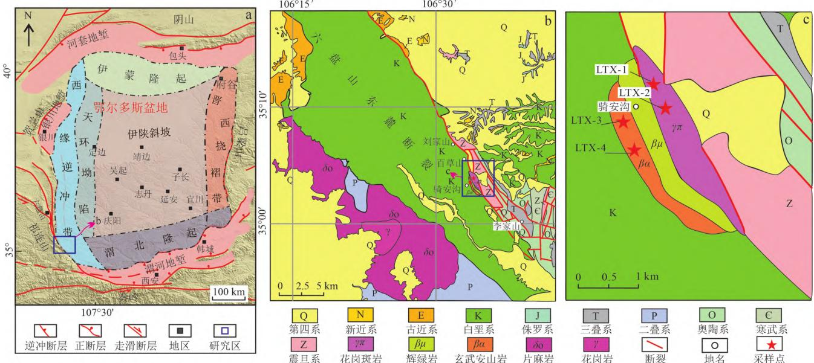  
图 1 鄂尔多斯盆地主要构造单元及邻区地质简图( a) 骑安沟及邻区地质简图( b、c) ( 据陕西省地质局区测队，1967)  
Fig． 1 Simplified geological map of the major tectonic units of the Ordos Basin and its adjacent areas ( a) ，and simplified geological maps of the Qi'angou area and its adjacent areas ( b，c) ( after the Regional Geological Survey Team of Shaanxi Provincial Bureau of Geology，1967)

新鲜。

花岗斑岩表面呈肉红色，具有中细粒花岗结构或斑状结构，块状构造( 图 2c) ，斑晶主要为钾长石( 图2b) ，约占全岩20% 显微镜下可以观测到长石表面不干净，出现蚀变矿物; 约 10%斑晶为石英斑晶，有的表面干净，周边出现溶蚀现象，也有石英斑晶内部被溶蚀; 斜长石斑晶约占 5%，基质为微晶质，以石英与长石为主并含有部分暗色矿物，主要为细粒至微晶质( 图3a 3b)

玄武安山岩呈灰黄色－灰绿色，具气孔构造( 图2d) 斑晶主要以斜长石为主，含量约占全岩20% 斜长石无色 板状 半自形－自形，聚片双晶发育，表面发生了绿泥石化 绢云母化蚀变; 角闪石暗色矿物含量约占 10%，呈半自形－自形 基质主要为斜长石微晶，含量约占 60%，可见聚片双晶，发生绢云母化蚀变，暗色矿物微晶约占 10%，黑色玻璃质约占25%，充填于微晶之中，局部可见杏仁体，被方解石和硅质填充( 图3c 3d)

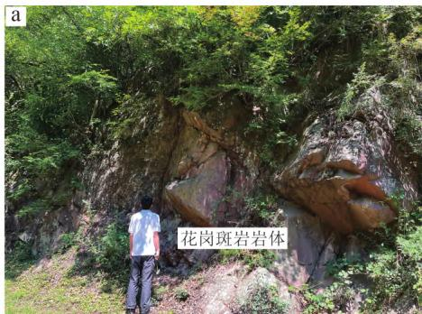

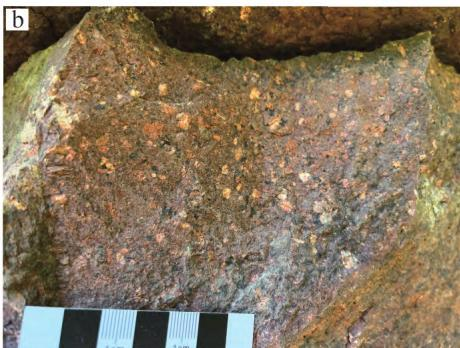

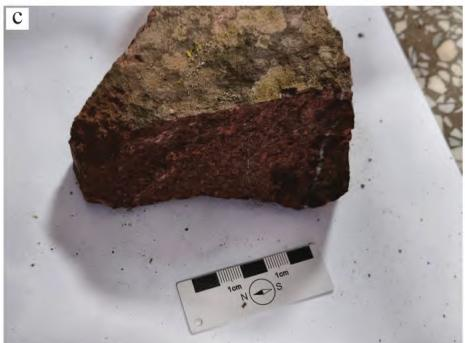

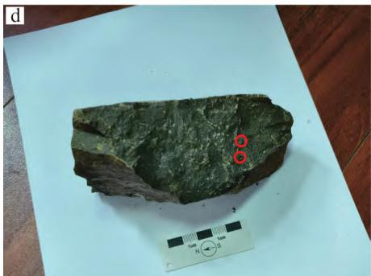  
图 2 骑安沟双峰式火成岩野外露头  
Fig． 2 Field outcrops of bimodal igneous rocks in Qi'angou area  
a—花岗斑岩岩体呈岩墙出露; b—花岗斑岩表面可见钾长石斑晶; c—花岗斑岩手标本，新鲜面为肉红色，可见块状构造; d—玄武安山岩 表面可见气孔构造  
a—granite porphyry occurring as a dike; b—K-feldspar phenocrysts visible on the surface of granite porphyry; c—fresh surface of granite porphyry is flesh-red，with massive structure; d—vesicular structure on the surface of basaltic andesite

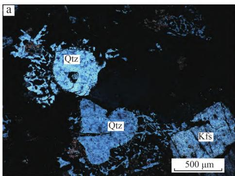

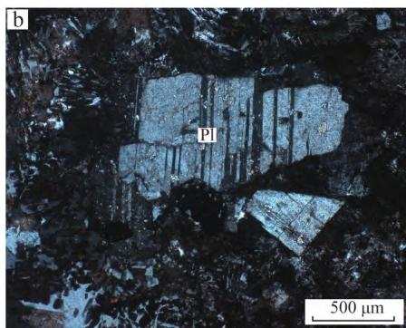

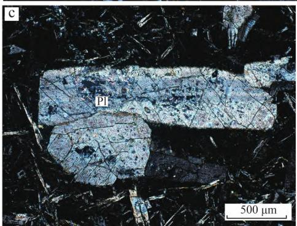

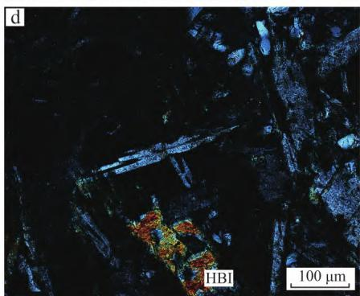  
图 3 双峰式火成岩正交偏光显微照片  
Fig． 3 Photomicrographs of bimodal igneous rocks under orthogonal polarization  
a—花岗斑岩中石英斑晶的内部溶蚀; b—花岗斑岩中斜长石的聚片双晶; c—玄武安山岩中斜长石表面发生蚀变;  
d—玄武安山岩中角闪石与长石类矿物共生; Qtz—石英; Kfs—钾长石; Pl—斜长石; HBl—角闪石  
a—dissolution textures of quartz in granite porphyry; b—polysynthetic twinning of plagioclase in granite porphyry; c—altered plagioclase in basaltic andesite; d—intergrowth of amphibole and feldspar in basaltic andesite; Qtz—quartz; Kfs—K-feldspar; Pl—plagioclase; HBl—hornblende

## 2 分析方法

## 2． 1 锆石测年

从野外露头采集的样品首先进行清洁和切割，以去除杂质和风化的外部，随后实验室进行锆石颗粒分离，优选晶形完好 裂痕较少或无裂痕 透明度高且无包裹体的锆石用于制靶 样品制备和锆石U-Pb 年龄测定分析在西北大学大陆演化与早期生命全国重点实验室进行，采用美国Gatan 公司生产的配备有 GATAN MINICL 系统的高真空分析扫描电子显微镜( JSM-EST 100) 进行 CL 成像 。 锆石 U-Pb 年龄测定与稀土元素分析在西北大学演化与早期生命全国重点实验室进行，分析仪器为 LA-ICP-MS。 锆石 U-Pb 年龄测定详细的实验测试步骤可见参考文献( 袁洪林等，2003)

## 2．2 样品主、微量元素分析

样品主 微量元素在西北大学大陆演化与早期生命全国重点实验室进行测定 使用玛瑙研钵将新鲜样品研磨成小于 200 目的岩石粉末，通过 X 射线荧光技术( XRF，Rigaku RIX 2100) 在熔融玻璃珠上测定主要氧化物。 选择 BCR-2 和 GBW07105 作为监测过程的标准样品，其分析准确度优于 1%，分析误差＜5%。 微量元素通过电感耦合等离子体质谱( Agilent 7500 a ICP-MS) 进行测量 。 样品的溶解通过使用 1． 5 mL HNO+1． 5 mL HF+0． 02 mL HClO 的开放容器 分解和使用 HNO+HF 的封闭高压瓶的组合来实现 标准样品选自国际标准物质 BHVO-1BCR-2 和 AGV-1。 对大多数微量元素的分析误差小于2%，准确度优于10%。

## 3 分析结果

## 3． 1 锆石 U-Pb 年代学

骑安沟花岗斑岩样品( LTX-1、LTX-2) 分选出来的锆石大多为无色或浅褐色( 图4) ，少量颜色较深，呈透明－半透明状，粒径为100～150 m，长宽比多为1∶1～1∶2，主体呈自形或半自形柱状，多数发育震荡环带。 玄武安山岩样品( LTX-3) 锆石粒径较小，为 $5 0 \sim 1 0 0 ~ \mu \mathrm { m }$ ，长宽比为 1 ∶ 1 ～ 1 ∶ 1． 5，大部分为浅褐色，呈自形或半自形柱状，部分发育震荡环带。

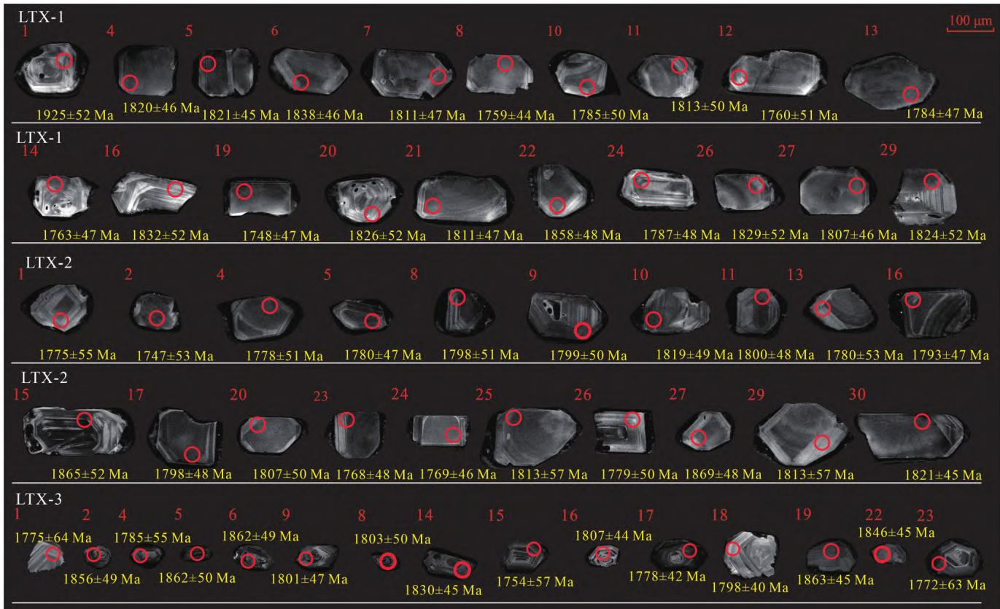  
图 4 双峰式火成岩中锆石阴极发光图像  
Fig． 4 Cathodoluminescence images of zircons from the bimodal igneous rocks

Th/U 值是判别锆石成因的重要指标，岩浆成因锆石通常具有较高的 Th /U 值( Vavra et al． ，1996;杨长江等，2010; 李霄琦等，2025) 本文样品中锆石均具有较高的 Th/U 值，其中花岗斑岩中锆石的Th /U 值为 0． 56 ～ 0． 99，玄武安山岩中的锆石 Th /U值为0．57～0． 99( 表 1) ，指示样品中的锆石为岩浆成因。 样品中锆石的稀土元素球粒陨石标准化配分曲线( 图 5a 5b) 显示，花岗斑岩具有轻稀土元素( LREE ) 亏 损 $[ \mathrm { \ L a } / \mathrm { S m } ] _ { \mathrm { ~ N ~ } } < 0$ ．5］ 重 稀 土 元 素( HREE) 富集 $\mathrm { [ \ G d / Y b ] } _ { \mathrm { \Delta N } } { > } 2 . 0 \mathrm { J }$ 特征，配分曲线呈左倾型，具有 Eu 负异常 玄武安山岩锆石的稀土元素配分模式与花岗斑岩相似( 图5c)

在测定锆石年龄时，我们采用 $^ { 2 0 7 } \mathrm { P b } / ^ { 2 0 6 } \mathrm { P b }$ 年龄表征较老 $\mathrm { \Lambda } | > 1 \ \mathrm { G a } )$ 的锆石， $^ { 2 0 6 } \mathrm { P b } / ^ { 2 3 8 } \mathrm { U }$ 年龄表征较年轻( $< 1 \ \mathrm { G a } )$ 的锆石( Black et al． ，2003) 两个花岗斑岩样品获得的加权平均年龄分别为 $1 ~ 7 9 4 { \pm } 1 7 ~ \mathrm { M a }$ $\left( \mathrm { \ M S W D } = 0 . \ 5 5 \right)$ 和 $1 ~ 7 9 4 \pm 1 0 ~ \mathrm { { M a } \left( \ M S W D = 1 . ~ 1 7 \right) }$ ( 图6a 6b) ，玄武安山岩获得的加权平均年龄为$1 ~ 8 0 3 { \pm } 2 1 ~ \mathrm { M a } \ l ( ~ \mathrm { M S W D } = 0 . 4 5 )$ ( 图 6c) 。

骑安沟花岗斑岩的主量元素分析显示，其 $\mathrm { S i O } _ { 2 }$ 含量较高，介于 70． 65% ～71． 12%之间，K O 含量也较高，为 5． 84% ～6． 54% 全碱含量( $\mathrm { N a } _ { 2 } \mathrm { O } + \mathrm { K } _ { 2 } \mathrm { O } )$ 为8． 41% ～ 8． 59%， $\mathrm { N a } _ { 2 } \mathrm { O } / \mathrm { K } _ { 2 } \mathrm { O }$ 值为 0． 29 ～ 0． 47 在深成岩岩性分类图解中投入正长花岗岩范围( 图7b)在 $\mathrm { K } _ { 2 } \mathrm { O } \mathrm { - } \mathrm { S i O }$ 2 图解中，样品属于钾玄岩系列( 图 7c) 。$\mathrm { { A l } } _ { 2 } \mathrm { { O } } _ { 3 }$ 含 量 为 12． 38% ～ 12． 66%，铝 饱 和 指 数$\mathrm { \left( \ A / C N K \right) }$ 较高，为 1． 04 ～1． 18，在 A/NK－A/CNK 图解中均落入过铝质区域( 图 7d) $\mathrm { M g O }$ 含量为0． 89% ～ 0． 91% $\mathbf { \sigma } _ { \mathbf { \bullet } } \mathrm { C a O }$ 含量为 0． 3% ～ 0． 6% 。 较低的$\mathrm { M g O }$ 和 $\mathrm { C a O }$ 含量以及较高的 $\mathrm { S i O } _ { 2 }$ 含量，符合A 型花岗斑岩的典型特征。

## 3． 2 全岩地球化学特征

## 3． 2． 1 主量元素

骑安沟花岗斑岩与安山岩的主量元素地球化学测试结果见表 2 因为安山岩烧失量高 $\mathbf { \left( \begin{array} { l l } { \mathbf { L O I } } & { \mathbf { = } } \end{array} \right. }$ 4． 31%～4． 63%，均值 4． 47%) ，指示显著蚀变作用( 徐欢等，2020) ，本文在处理花岗斑岩和安山岩的主量元素数据时进行 LOI 了校正，以下数据均为校正后的含量数据

玄武安山岩样品的 $\mathrm { S i O } _ { 2 }$ 含 量 为 54． 32% ～54． 46%，属中性岩浆岩。 在( $\mathrm { N a } _ { 2 } \mathrm { O } + \mathrm { K } _ { 2 } \mathrm { O } \vert \ { - } \mathrm { S i O } _ { 2 }$ 图解中，样品点位于Irvine 线之下，属于亚碱性系列，投在玄武安山岩区域( 图 7a) ; 样品 $\mathrm { K } _ { 2 } \mathrm { O }$ 含量较低( 1． 11% ～1． 20%) ， $\mathrm { N a } _ { 2 } \mathrm { O }$ 含量较高( 4． 35% ～ 4． 38%) ，在K O－SiO 图解中主要属于钙碱性系列( 图7c)$\mathrm { A l } _ { 2 } \mathrm { O } _ { 3 }$ 含量较高，为 14． 31% ～14． 38%，铝饱和指数$\mathrm { ~ ( ~ A / C N K ) ~ }$ 为 1． 04 ～ 1． 09，亦属过铝质岩石( 图 7d) 。此外，样品具有较高的全铁含量 $\left( \mathrm { \ T F e } _ { 2 } \mathbf { O } _ { 3 } = \mathbf { \Gamma } 1 2 \right.$ ． 16%～ 12． 23%) ，而 TiO2 、 CaO 和 $\mathrm { P } _ { 2 } 0 _ { 5 }$ 含量较低，平均值分别为 1． 22% 、 2． 78%和 0． 43% 。

## 3． 2． 2 微量元素

微量元素分析结果见表 3 在微量元素原始地幔标准化图解( 图8b) 中，花岗斑岩样品呈现出 LILE( Rb Ba K) 富集与 HFSE( Nb Ti P) 亏损特征，具显著 Sr 负异常 。 岩石具有较高的 Rb/Sr 值( 2． 95 ～3．55) ，远高于 I 型和 S 型花岗质岩石( 分别为 0． 61和 1． 81) ，与 A 型花岗斑岩地球化学特征类似( Whalen et al． ，1987) ，同时呈现高 $\mathrm { G a } / \mathrm { A l }$ 值，介于3． 61～3． 85 之间，平均 3． 73，与 A 型花岗斑岩特征相似( Frost et al． ，2001; 徐欢，2019) 玄武安山岩样品呈现 LILE( Rb、Ba、K、U) 富集与 HFSE( Nb、Ta) 亏损的特征，其 $\mathrm { B a } / \mathrm { T h } { > } 8 0 \mathrm { , N b } / \mathrm { L a } { < } 0 . 5$ 的比值特征符合俯冲带弧岩浆岩地球化学特征( Pearce et al． ，1984)

在稀土元素球粒陨石标准化配分图解( 图 8a)中，花岗斑岩样品稀土总量较高 $\mathrm { ~  ~ { ~ \vert ~ \Sigma ~ { ~ R E E } = 7 8 4 . ~ 8 1 \times } ~ }$ $1 0 ^ { - 6 } \sim 8 6 2 . 7 5 \times 1 0 ^ { - 6 } )$ ，LREE /HREE = 11． 20 ～ 11． 31，具强 烈 LREE/HREE 分 馏， $\mathrm { ~ \left( ~ L a / Y b \right) _ { \mathrm { ~ N ~ } } = ~ 1 3 . ~ 2 1 ~ \sim ~ }$ 14． 41，Eu 异常明显( $\delta \mathrm { E u } = 0 . 5 1 \sim 0 . 5 2 )$ ，配分模式为轻稀土元素富集 重稀土元素平坦的右倾型; 玄武安山岩样品稀土总量低 $\mathrm { ~ ( ~ \Sigma R E E } = 1 9 0 . ~ 5 4 \times 1 0 ^ { - 6 } ~ \sim$ $1 9 5 . 5 1 \times 1 0 ^ { - 6 } \big )$ ， $\mathrm { L R E E / H R E E } = 6 . \ 5 9 \sim 6 . \ 8 7$ ，平均6．73，轻稀土元素富集，重稀土元素平坦化，轻重稀土元素分馏中等，球粒陨石标准化曲线总体右倾，$\left( \mathrm { \ L a } / \mathrm { Y b } \right) _ { \mathrm { \scriptsize { N } } } = 6 . 5 9 \sim 6 . 8 7$ ，Eu 异常不明显 $\delta \mathrm { E u } = 0 . 9 6 $ $\sim 0 . 9 7 )$

## 4 讨论

## 4．1 源区与岩体成因分析

## 4．1．1 花岗斑岩源区与成因分析

结合本研究区花岗岩样品主 微量数据及邻区保家山花岗岩样品数据 ( 徐欢等，2014) ，对盆地西南缘花岗斑岩源区进行了综合分析 研究区花岗斑岩样品 $\mathrm { M g O }$ 含 量 ( 0． 89% ～ 0． 91%) 和 $\mathrm { C a O }$ 含 量( 0． 30% ～ 0． 60%) 均较低，而 K O 和 $\mathrm { N a } _ { 2 } \mathrm { O }$ 含量较高，反映出碱性特征，同时稀土元素富集，尤其轻稀土元素富集，符合 A 型花岗斑岩的特征( 席振等，2024; 刘 伟 等，2024) ，在 $\mathrm { \left[ \ K _ { 2 } O + N a _ { 2 } O \right] / C a O ] }$ $\scriptstyle \left( \ Z \mathrm { r + N b + C e + Y } \right)$ 图解( 图 $9 \mathrm { a } )$ 中，本研究数据均落入在 A 型花岗斑岩中，同时在 $\mathrm { N b - Y - C e }$ 图解中，研究数据落在 $\mathbf { A } _ { 2 }$ 型花岗岩中( 图9b)

Table 1 L
A⁃IC
P⁃MS zircon
U⁃Pb dating results of igneous rocks表 1 火
成岩样品的LA⁃IC
P⁃MS 锆
石U⁃Pb 定
年分析结果  
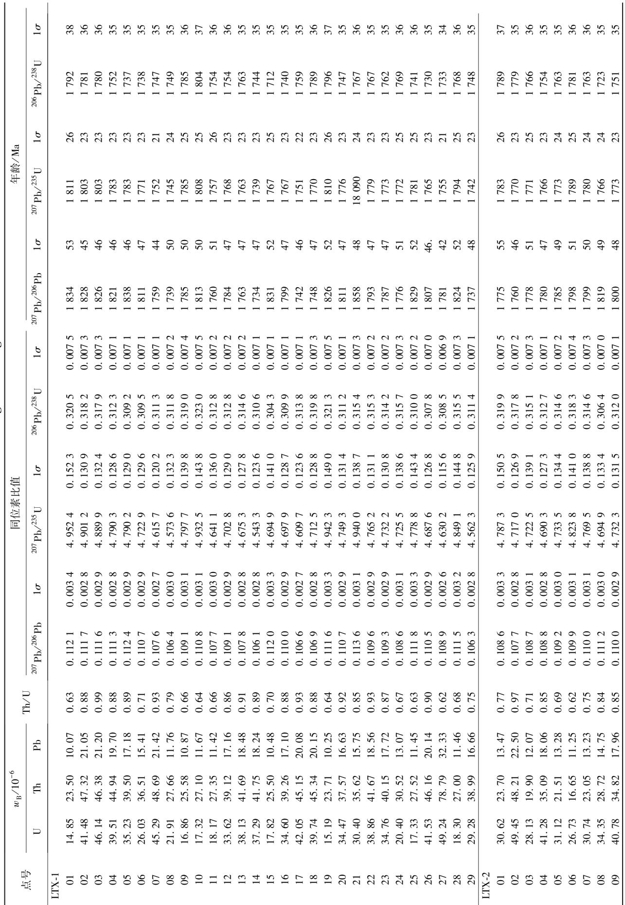

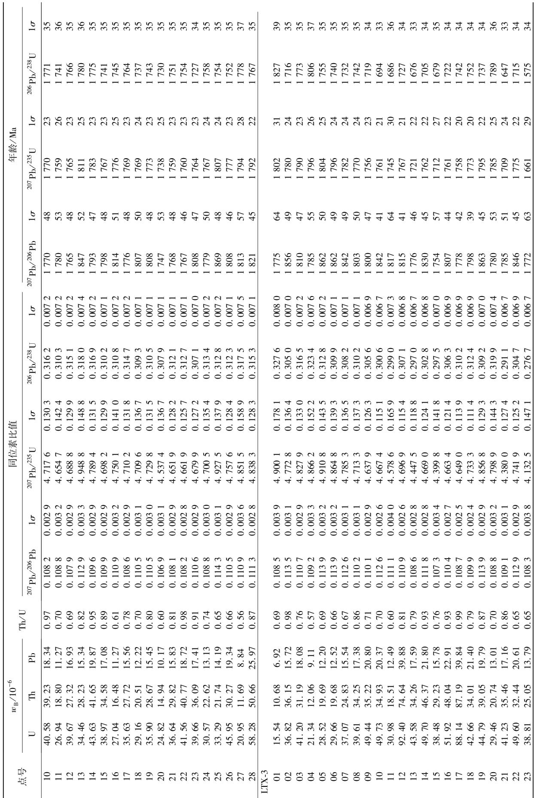

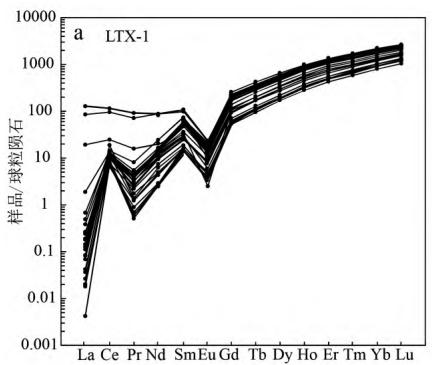

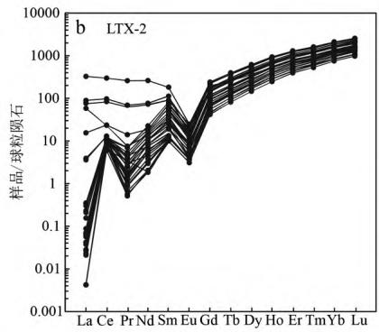

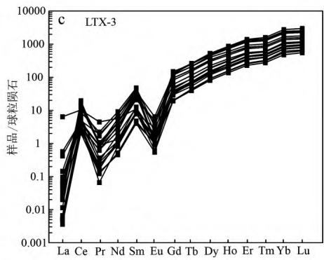  
图 5 火成岩样品中锆石的稀土元素球粒陨石标准化配分曲线( 标准化值据 Sun and McDonough，1989)

Fig． 5 Chondrite-normalized REE patterns of zircon from igneous rocks ( normalized values after Sun and McDonough，1989)  
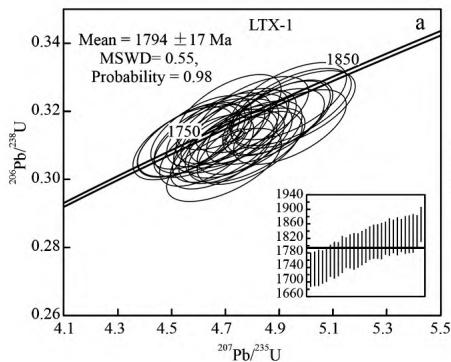

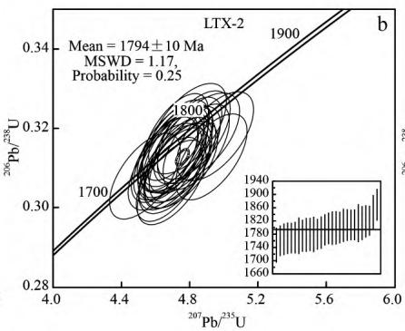

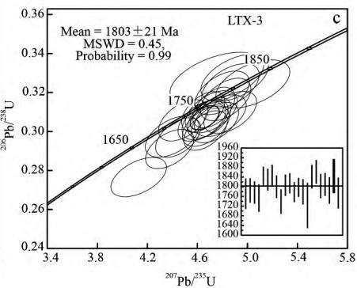  
图 6 双峰式火成岩锆石 U-Pb 年龄谐和图  
Fig． 6 U-Pb concordia diagrams of zircon from bimodal igneous rocks

表 2 骑安沟花岗斑岩( LXT-1、2) 和玄武安山岩( LTX-3、4) 的主量元素分析结果  
Table 2 Analysis results of major elements for the Qi'angou granite porphyry $\mathbf { \left( \mathbf { L X T 1 , 2 } \right) }$ and basaltic andesite $\mathbf { ( L T X - 3 , 4 ) }$  
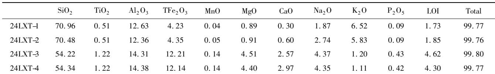

A 型花岗斑岩成因较为复杂，前人对 A 型花岗斑岩成因的研究主要包括以下几种观点: ① 由 I 型花岗质岩浆被抽离后，残留的下地壳麻粒岩的低程度熔融形成( King et al． ，1997; Bonin，2007) ; ② 由地壳岩石受幔源岩浆底侵加热发生熔融( Anderson，1983; Zhao and Zhai，2013) ; ③ 由地幔玄武质岩浆高度结晶分异 ( Kerr and Fryer，1993; 俞礽安等，2016) ; ④ 由壳源花岗质岩浆与幔源镁铁质岩浆混合作用形成 ( Yang et al． ，2006) 研究区花岗斑岩， Ti较高的 Zr 含量表明了花岗斑岩源区很可能来自地壳，同时产于地壳减薄的构造背景( Eby，1992) 地幔和地壳均值的Rb/Sr 值分别为0．03 和0．35，样品的 Rb /Sr 值( 2． 95 ～ 3． 55) 明显较高，其源区更可能来自上地壳 ( Taylor and McLennan，1985) 。 La /Nb值为 2． 42～2． 76，也暗示岩浆来自壳源( 刘伟等，2024) ; 稀土元素球粒陨石标准化分配曲线中出现明显的 Eu 负异常现象也反映壳源的特征( 潘少军等，2025) ; $\mathbf { M } \mathbf { g } ^ { \# }$ 值是判断岩浆来源的重要参数，花岗斑岩的 $\mathrm { M g } ^ { \# }$ 值平均 29． 4，一般地幔物质如果参与成岩，岩体的 $\mathbf { M } \mathbf { g } ^ { \# }$ 值会大于 45，因此花岗斑岩的低 $\mathbf { M g } ^ { \# }$ 值也是岩浆来自地壳的重要证据( ${ \mathrm { R a p p ~ a n d ~ W a t s o n } } ,$ 1995; Smithies，2000) ; 花岗斑岩样品的铝饱和指数( A/CNK) 为 1． 04～1． 18，属过铝质，也与地壳熔融形

${ \mathrm { F i g . } }$ 7 Plots of major element geochemistry for bimodal igneous rocks  
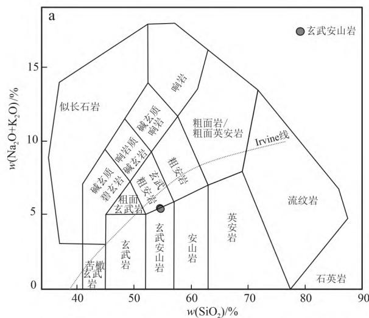

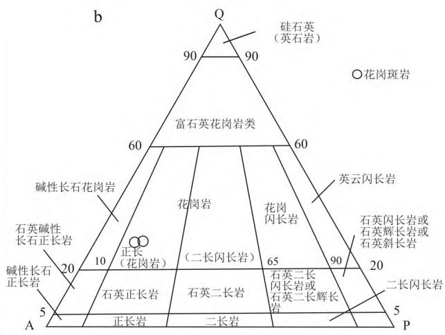

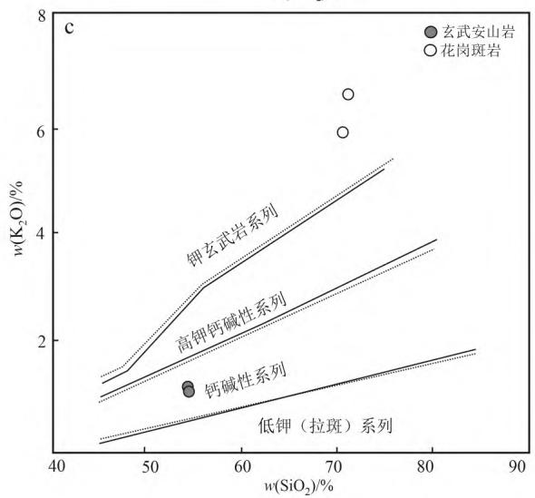

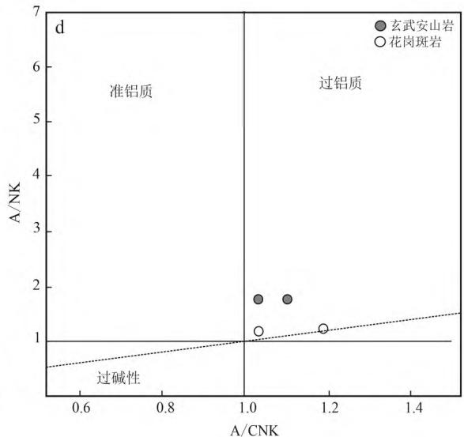  
图 7 双峰式火成岩主量元素分析图解  
$\mathrm { a } { - } ( \mathrm { \ N a } _ { 2 } \mathrm { O } { + } \mathrm { K } _ { 2 } \mathrm { O } ) \ { - } \mathrm { S i O }$ 图解( 底图据 Middlemost，1994) ; b—QAP 图解( 底图据 Le Maitre，1989) ; c—K O－SiO 判别图 ( 底图据 Middlemost，1994) ; d—A /NK－A /CNK 图解( 底图据 Shand，1943)  
$\mathrm { a } { - } ( \mathrm { N a } _ { 2 } \mathrm { O } { + } \mathrm { K } _ { 2 } \mathrm { O } ) \ { - } \mathrm { S i O } _ { 2 }$ 2 diagram( base map after Middlemost，1994) ; b—QAP diagram ( base map after Le Maitre，1989) ;  
$\mathrm { c } { - } \mathrm { K } _ { 2 } 0 { - } \mathrm { S i } 0 _ { 2 }$ discrimination diagram( base map after Middlemost，1994) ; d—A /NK－A /CNK diagram( base map after Shand，1943)

成的花岗质岩浆岩相似

( La/Yb) 值能够表示轻 重稀土元素的分异程度，δEu 值能有效指示斜长石结晶分异程度$\left( \mathrm { \ L a } / \mathrm { Y b } \right) _ { \mathrm { \scriptsize ~ N } } { - } \delta \mathrm { E u }$ 图解可以反映出花岗斑岩与玄武质安山岩的源区物质来源与岩浆演化的连续性，通过图解可以看出花岗斑岩属于壳型( 图 $1 0 \mathrm { a } )$ ，由此基本可以判断研究区花岗斑岩为地壳熔融形成的 相邻地区的保家山花岗斑岩同样属于 A 型花岗斑岩( 徐欢等，2014) ，在 $\mathrm { L a } / \mathrm { Y b } ) _ { \textrm { N } } { - } \delta \mathrm { E u }$ 图解中投入壳型中，地球化学特征也与研究区花岗斑岩接近，综合来看，西南缘的花岗斑岩的源区应该为地壳岩浆。

$$
w _ {\mathrm{B}} / 1 0 ^ {- 6}
$$

表 3 骑安沟花岗斑岩( LXT-1、2) 、玄武安山岩( LTX-3、4) 微量元素分析结果  
Table 3 Analysis results of trace elements for the Qi'angou granite porphyry $| \mathbf { L X T - 1 } , 2 \rangle$ and basaltic andesite $\mathbf { ( L T X - 3 , 4 ) }$  
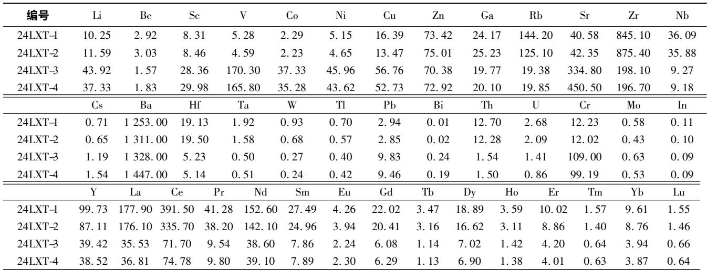

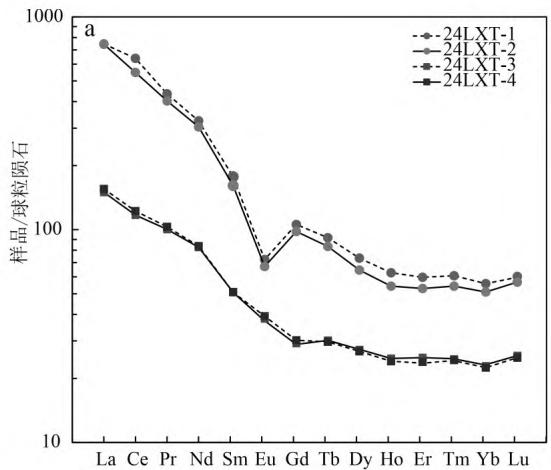

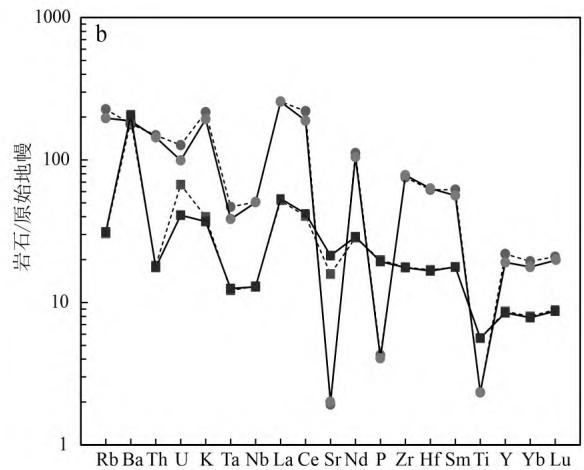  
图 8 双峰式火成岩的稀土元素球粒陨石标准化分布型式图( a) 及微量元素原始地幔标准化蛛网图( b)( 标准化值据 Sun and McDonough，1989)

Fig． 8 Chondrite-normalized rare earth element ( REE) patterns ( a) and primitive mantle-normalized spider diagram of trace elements ( b) for bimodal igneous rocks ( normalized values after Sun and McDonough，1989)  
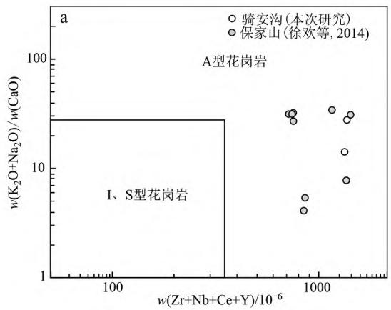

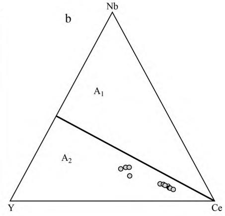  
图 9 花岗斑岩类型划分图  
Fig． 9 Classification diagrams of granite porphyry types  
$\mathrm { \ a { - } ( K _ { 2 } O { + } N a _ { 2 } O ) \ / C a O { - } ( \ Z r { + } N b { + } C e { + } Y ) }$ 图解( 底图据 Whalen et al． ，1987) ; b—Nb－Y－Ce 图解( 底图据 Eby，1992)  
a— $\cdot \left( \mathrm { \ K _ { 2 } O + N a _ { 2 } O } \right) / \mathrm { C a O - \left( \mathrm { \ Z r + N b + C e + Y } \right) }$ diagram ( base map from Whalen et al． ，1987) ; b—Nb－Y－Ce diagram ( base map from Eby，1992)

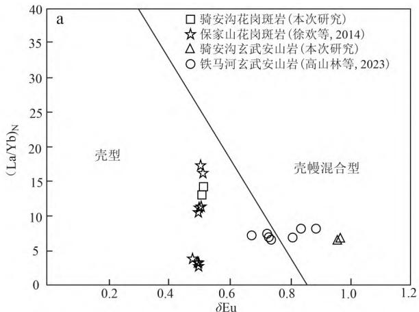

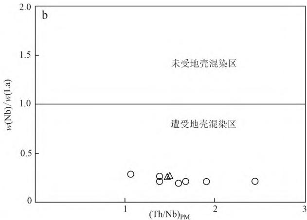  
图 10 双峰式火成岩成因判别图版  
Fig． 10 Genetic discrimination diagram for bimodal igneous rocks  
$\mathrm { a } { - } \mathrm { ( \ L a / Y b ) } _ { \textrm { N } } { - } \delta \mathrm { E u }$ 图解( 底图据姜盛洪，2015) ; $\mathrm { \ b { - } N b / L a { - } \big ( \ T h / N b \big ) _ { \partial \ p M } }$ 图解( 底图据王刚等，2019)  
a—( La /Yb) N －δEu diagram( base map from Jiang Shenghong，2015) ; $\mathrm { \ b { - } N b / L a { - } \big ( \ T h / N b \big ) _ { \ p M } }$ diagram ( base map from Wang Gang et al． ，2019)

## 4． 1． 2 玄武安山岩源区与成因分析

## ( 1) 分离结晶

安山岩成因目前比较复杂，主要分为以下几种:① 地幔橄榄岩的部分熔融熔体在上升过程中与地壳物质混染形成( DePaolo，1981) ; ② 玄武质岩浆通过分离结晶作用演化成安山质岩浆( Kay and Kay，1993) ; ③ 基性岩浆和酸性岩浆混合形成( Strecket al． ，2007) ; ④ 基性岩石的部分熔融形成( Woodand Turner，2009; 李肖龙等，2019)

邻区铁马河玄武安山岩与骑安沟玄武安山岩形成时代相近( 高山林等，2023) ，可做对比分析 在主量元素哈克图解( 图 11) 上可以看出，骑安沟玄武安山岩与铁马河玄武安山岩的 $\mathrm { S i O } _ { 2 }$ 含量与 $\mathrm { M g O }$ $\mathrm { T F e } _ { 2 } \mathrm { O } _ { 3 }$ 含量没有关联性( 图 11c 11d) ，同时骑安沟玄武安山岩的 Zr Hf HREE 均无明显亏损，表明不存在石榴子石类矿物的分离结晶; $\mathrm { M g O }$ 与 Ni Cr 含量之间无关联性， $\mathrm { M g O }$ 含量与 CaO 含量之间也无关联性，说明不存在橄榄石 辉石等镁铁质矿物分离结晶 在哈克图解中可以发现， $\mathrm { { A l } } _ { 2 } \mathrm { { O } } _ { 3 }$ 含量随着 $\mathrm { S i O } _ { 2 }$ 含量的增加而减少，呈现降低趋势( 图 11f) ， $\mathrm { { N a } } _ { 2 } \mathrm { { O } }$ 含量随着 SiO 含量的增加先减少再增加( 图 11b) ，表明存在斜长石的分离结晶，但结合 Eu 异常并不明显的特征，推测斜长石分离结晶应该不显著

## ( 2) 地壳混染

在岩浆上升过程中，可能会经历地壳的混染导致岩浆的成分发生改变 在 $\mathrm { \Delta N b / L a - ( \Delta T h / N b ) _ { \Delta _ { \it P M } } }$ 图解( 图10b) 中可以发现样品点均在遭受地壳混染区域，在( $\mathrm { L a } / \mathrm { Y b } ) _ { \textrm { N } } – \delta \mathrm { E u }$ 图解( 图10b) 中也可以看到安山岩属于壳幔混合型。

在微量元素原始地幔标准化蛛网图中可以发现Nb Ta 等高场强元素亏损( 图 8b) ，表明有地壳物质的加入，Rb、Th 等 LILE 元素富集也表明岩浆可能经历了上地壳物质的混染( 吴玉峰等，2016) 地壳相对于原始地幔熔体亏损 Nb、Ta 等难熔高场强元素( HFSE) ，并伴随显著降低的 Nb/Ta 值( 地壳中$\mathrm { N b } / \mathrm { T a } = 8 . 3 3 \sim 1 3 . 3 3$ ，地幔中 $\mathrm { N b } / \mathrm { T a } = 1 8 . 2 7 )$ ( Nealet al． ，2002) ，玄武安山岩样品的 $\mathrm { N b / T a }$ 值为 17． 8 ～18． 6; Zr/Hf 值可指示岩浆源区，地幔中 Zr/Hf 值约为 50，而地壳中 Zr /Hf 值约为 36( Anderson，1983) ，研究区玄武安山岩的 Zr/Hf 均值为 38; 受到混染的岩石 Sm/Nd 值一般均＜0． 3( 周伏顺等，2024) ，玄武安山岩的 Sm/Nd 值平均为 0． 2，这些都表明岩浆经历了地壳混染

## ( 3) 源区特征

Na元素在石榴子石以及辉石中的相容性会随着源区压力的降低而逐渐降低，但是 Ti 元素的相容性则会保持不变或增加( Kinzler，1997) ，因此岩石的 Na/Ti 值可以准确反映岩浆熔融深度的变化 玄武安山岩的 Na/Ti 均值为3．57，相对偏高，指示源区深度相对较浅 Lu/Hf－La/Sm 协变体系在火山岩成因判别方面具有明确的构造指示意义，本区玄武安山岩样品在图12a 中集中于尖晶石二辉橄榄岩演化趋势线 ( Regelous et al． ，2003) 附近，揭示其地幔源区处于＜80 km 深度的尖晶石相稳定域。

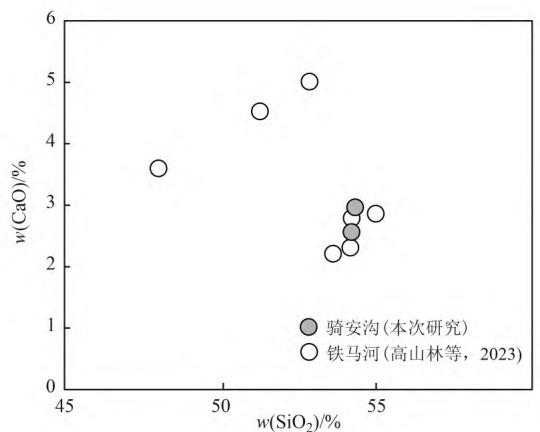

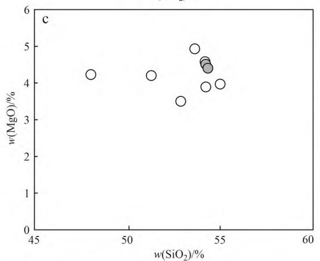

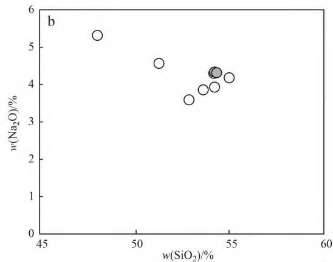

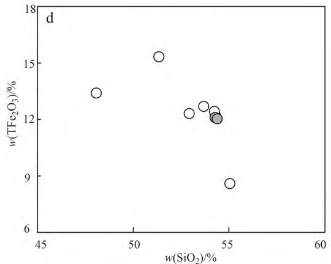

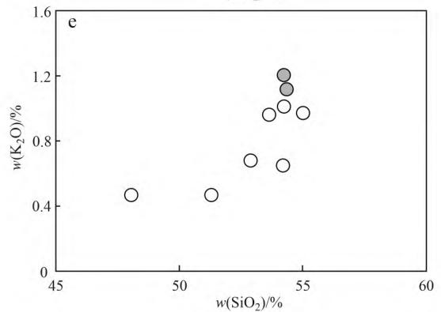  
图 11 玄武安山岩哈克图解  
Fig． 11 Harker diagrams of basaltic andesite

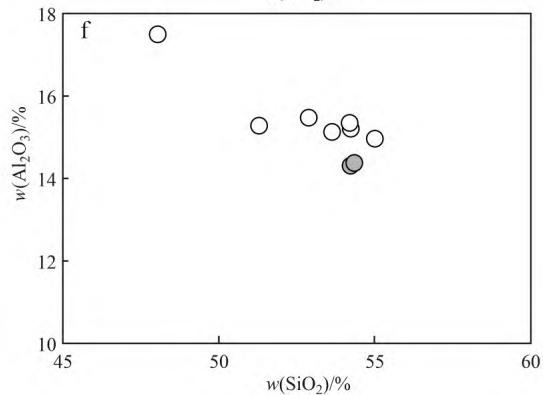

研究区玄武安山岩的 $\mathrm { L a / N b }$ 均值为 3． 92，大于1．50，反映出岩浆源区具有富集地幔的特征，同时高$\mathrm { { B a } ( \textnormal { 1 } 3 2 8 \times 1 0 ^ { - 6 } \sim 1 \ 4 4 7 \times 1 0 ^ { - 6 } ) \ S r ( \ 3 3 4 \times 1 0 ^ { - 6 } \sim 4 5 1 \times 1 0 ^ { - 6 } ) }$ $1 0 ^ { - 6 } )$ 指示地壳混染或富集地幔源区( Marschall andSchumacher，2012) 。 $\mathrm { T h } / \mathrm { N b } = 0 . \ 1 6 \sim 0 . \ 1 7$ ，高于原始地幔( 0．116) ，低于大陆地壳( 0． 89) ，可能反映富集地幔或弱地壳混染( 夏林圻等，2007) 玄武安山岩样品的 $\mathrm { L a / T a }$ 均值达 71． 5，远高于岩石圈地幔源区岩浆的判别阈值( $\mathrm { L a } / \mathrm { T a } { > } 2 5 )$ ( Lassiter and DePaolo，2013) Nb /La 值低( 均值 0． 25) ，与未受岩石圈混染的软流圈地幔熔体( $\mathrm { N b / L a } { > } 1 )$ 具有明显差异 这种高 $\mathrm { L a / T a }$ 与低 Nb/La 的特征，符合俯冲带流体交代作用下岩石圈地幔部分熔融的地球化学行为 样品具有较高的 Ba/Th，均值为 912，Sr/Nd 均值为10． 05，Th /Nb 均值为 0． 165，La /Nb 均值为 3． 92，这些数据反映源区受到了俯冲流体交代的影响( 高山林等，2023) ，同时在 $\mathrm { { T h / L a { - } C e / P b } }$ 图( 图 12b) 中可以发现样品符合俯冲流体交代的趋势

根据上述分析，认为研究区样品源区为经俯冲流体交代的岩石圈地幔，熔体上升过程中经历了地壳混染作用。 同一区域的铁马河玄武安山岩与本文样品地球化学特征类似，其成因为岩石圈富集地幔经历地壳混染，且形成年龄相近( 高山林等，2023) ，结合上文的花岗斑岩研究结果，推测鄂尔多斯盆地西缘在古元古代晚期与中元古代初期地幔上升引起岩石圈减薄，上地壳发生部分熔融，熔融的地壳物质形成 A 型花岗岩，早期的富集地幔上涌物质与地壳物质混合形成玄武安山岩，因此认为玄武安山岩与花岗斑岩应相伴形成，并无前后顺序，这些火成岩形成于同一期构造活动( 徐欢等，2014; 高山林等，2023)

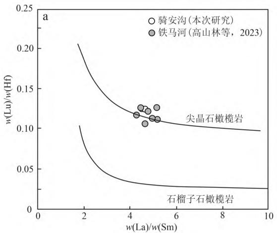

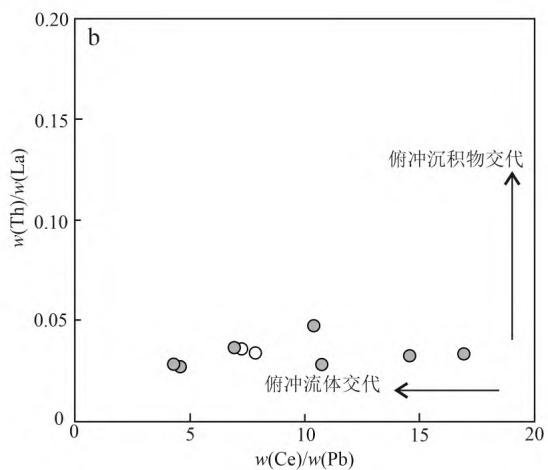  
图 12 玄武安山岩源区特征判别图版  
Fig． 12 Discrimination diagram for source characteristics of basaltic andesite  
a—Lu /Hf－La /Sm 图解 ( 底图据 Regelous et al． ，2003) ; b—Th /La－Ce /Pb 图解( 底图据 Stolz et al． ，1996)  
a—Lu /Hf－La /Sm diagram ( base map from Regelous et al． ，2003) ; b—Th /La－Ce /Pb diagram ( base map from Stolz et al． ，1996)

## 4． 2 区域大地构造分析

A 型花岗斑岩以碱性 无水 非造山带特征而闻名， $\mathbf { \nabla } _ { \mathbf { \beta } } \mathbf { A } _ { 2 }$ 型花岗斑岩为造山后花岗斑岩，与碰撞后伸展 弧后拉张等机制相关( Loiselle and Wones，1979;万俊等，2017) 研究区花岗斑岩样品为 $\mathrm { A } _ { 2 }$ 型花岗岩( 图 9b) ，在 Rb－( Yb+Ta) 图解( 图 13a) 中，样品落在板内构造环境中，在 $\mathrm { A l } _ { 2 } \mathrm { O } _ { 3 } - \mathrm { S i O } _ { 2 }$ 图解( 图 13b) 中落在与裂谷有关和陆内造陆隆起的环境中

玄武安山岩样品的地球化学特征表现为轻稀土元素( LREE) 和大离子亲石元素( LILE) 的显著富集，同时呈现高场强元素( HFSE) 的系统性亏损Sr Nb 及 Ti 等不相容元素的负异常，符合俯冲带岩浆活动的典型分异趋势，显示活动大陆边缘岛弧的地球化学特征 ( Pearce，1984) 在 Zr /Y － Zr 图解( 图14a) 中投在板内拉斑及火山弧玄武岩区域，在Hf/3－Th－Ta 图解( 图 14b) 中投在岛弧拉斑玄武岩区域 前人认为 Zr 和 Y 在大陆玄武岩遭到地壳或岩石圈混染时不会因为受到影响而发生含量改变，因此 Zr 和 Y 可以更加精确地反映玄武岩的构造环境( 夏林圻等，2007) ，研究区玄武安山岩 Zr 含量明显较高( 197 ～ 198) ，Zr /Y 值( 5． 02 ～ 5． 10) 也大于岛弧玄武岩的数值( ＜4) ，在 Zr/Y－Zr 图解中投在 WPB板内玄武岩上( 图 14a) ，虽然在 Hf/3－Th－Ta 图解中位于岛弧玄武岩区域，但结合地球化学数据的判别被认为是典型大陆板内环境的标志( 夏林圻等，2007; 高山林等，2023) ，因此认为研究区双峰式火成岩应该都属于板内环境

在中元古代，华北克拉通发生了多起岩浆活动，大致可以分为5 个阶段，1．80～1．77 Ga 阶段的岩浆活动标志着中元古代岩浆作用的开始，是克拉通由碰撞造山向伸展环境转换的关键转折期( 彭澎等，2004; 相振群等，2020) 该期岩浆活动与南缘熊耳群火山岩及五台 恒山地区的基性岩墙群密切相关，熊耳群火山岩以玄武安山质 安山质岩石为代表，其次是英安岩与流纹质岩石，玄武岩占极少数。 前人研究表明熊耳群火山岩具有典型的双峰式火成岩的特征，被认为形成于大陆边缘三叉裂谷环境，与华北克拉通内广泛分布的基性岩墙群都被认为是克拉通化后旋即拉伸裂解的产物( 赵太平等，2004a; 耿元生等，2019) 本次研究的岩浆活动同样发生在这个时期，并且处于鄂尔多斯盆地西南缘，与熊耳群的分布相近，结合邻区石咀子花岗岩 白家沟花岗岩

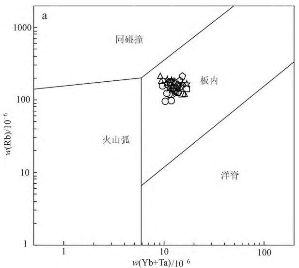

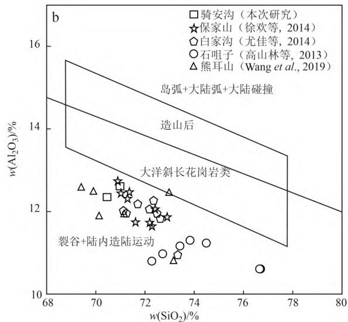  
图 13 花岗斑岩构造环境判别图解  
Fig． 13 Discrimination diagram of the tectonic setting for granite porphyr  
a—Rb－( Yb+Ta) 图解( 底图据 Pearce，1984) ; $\mathrm { \ b - { A l } _ { 2 } { O _ { 3 } - S i O _ { 2 } ( } }$ 底图据 Maniar and Piccoli，1989)  
c—Rb－( Yb+Ta) diagram( base map from Pearce，1984) ; $\mathrm { b } { \mathrm { - } } \mathrm { A l } _ { 2 } \mathrm { O } _ { 3 } { \mathrm { - } } \mathrm { S i O } _ { 2 } |$ base map from Maniar and Piccoli，1989)

保家山花岗岩( 图 13) 保家山辉绿岩、铁马河辉绿岩和玄武安山岩( 图14) 等岩体的地球化学数据，利用构造环境图解以及对相同时期的构造活动分析，认为这些火成岩都发育于板内裂谷环境( 高山林等，2013; 尤佳等，2014; 徐欢 等，2014，2020; Wanget al． ，2019; Xu et al． ，2019) ，华北克拉通西南缘的鄂尔多斯盆地在 1． 8 Ga 应该与华北克拉通南缘相似，都处于伸展构造环境，在中元古代早期 1． 8 Ga左右华北克拉通发生了广泛裂解事件，导致下地幔物质上涌，岩石圈减薄发生部分熔融，从而形成了大规模的岩浆活动，形成多种类型的火成岩( 图 15)本文鄂尔多斯盆地西南缘火成岩的成因与构造环境特征均与其相似，因此认为其岩浆活动应该为熊耳群火成岩活动的延伸，并且鄂尔多斯盆地西南缘在中元古代初期应该为华北克拉通南缘三岔裂谷系的组成部分。

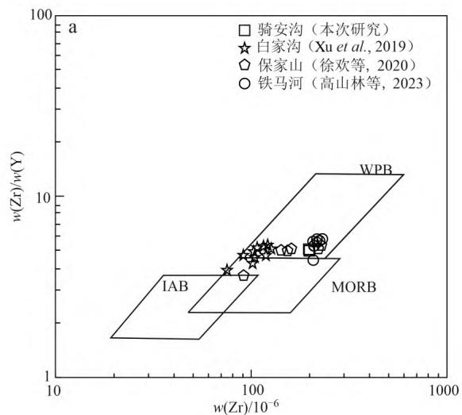

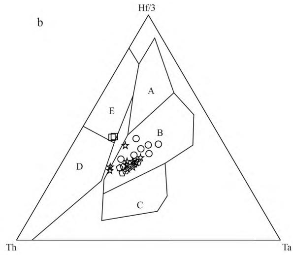  
图14 玄武安山岩构造环境判别图解  
Fig． 14 Discrimination diagram of the tectonic setting for basaltic andesite in Qi'angou  
a—Zr /Y－Zr 2007 b—Hf－Th－Ta Wood 1980 WPB— MORB— IAB— 弧玄武岩:A一亏损型洋中脊玄武岩:B一富集型洋中脊玄武岩和板内玄武岩:C一板内碱性玄武岩:D一钙碱性玄武岩：E一岛弧玄武岩 a—Zr /Y－Zr diagram base map after Xia Linqi et al． 2007 b—Hf－Th－Ta diagram after Wood 1980 WPB—within-plate basalt MORB— mid-ocean ridge basalt; IAB—island arc basalt; A—depleted MORB; B—enriched MORB ＆ within-plate basalt; C—within-plate alkaline basalt; D—calc-alkaline basalt; E—island arc basalt

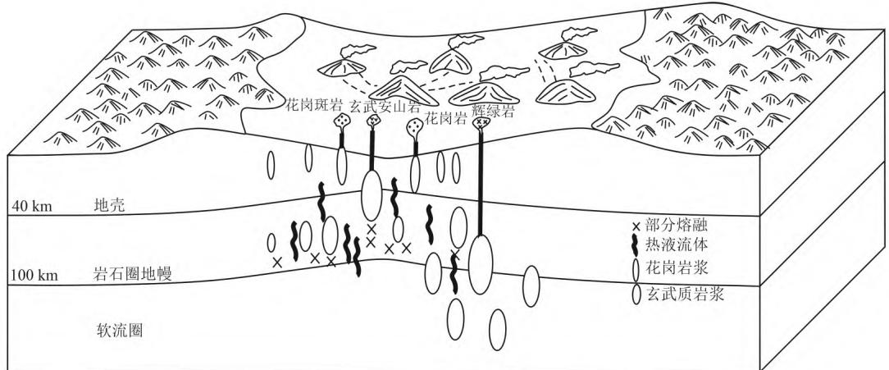  
图 15 鄂尔多斯盆地西南缘岩浆源区示意图( 据 Xu et al． ，2019 修改)  
Fig． 15 Schematic diagram of the magma source region in the southwestern margin of Ordos Basin ( modified after Xu et al． ，2019)

此外，已有大量研究表明，华北克拉通是哥伦比亚( Columbia) 超大陆的重要组成部分，参与了该超大陆的汇聚与裂解过程 许多学者认为，华北克拉通在约 1． 80 Ga 发生的裂解事件标志着 Columbia 超大陆裂解的开始( 陆松年等，2002; 翟明国等，2014; Zhong et al． ，2021) ，同时此次超大陆裂解过程贯穿整个中元古代，并伴随着多期岩浆事件的发生( Zhao et al． ，2012; 相振群，2014; Zhong et al． ，2021) ，这些岩浆事件主要发生在克拉通的东部及南缘地区，而西南缘地区的岩浆活动相对较少，且多与裂解早期阶段相关( 图 16) 综合分析表明，研究区出露的火成岩形成于华北克拉通约1．80 Ga 时期的广泛裂解事件，代表了 Columbia 超大陆裂解的起始阶段，为理解 Columbia 超大陆在 1． 80 Ga 时期的初始裂解过程提供了重要的地质证据。

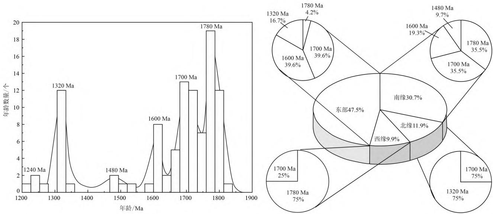  
图 16 华北克拉通中元古代岩浆岩年龄分布  
Fig． 16 Age distribution of Mesoproterozoic magmatic rocks in the North China Craton  
数据引自赵太平等( 2001，2004b) 等 李江海( 2001) 廖超林等( 2003) 彭澎等( 2004) 胡俊良等( 2007) Zhang 等( 2007) 崔敏利等( 2010) ( 2013) ( 2014) ( 2014，2020) Deng ( 2016) ( 2017) Xu ( 2017) Wang ( 2019) ( 2019) Xu 2019 2024  
The data are cited from Zhao Taiping et al． ，2001，2004b; Li Jianghai，2001; Liao Chaolin et al． ，2003; Peng Peng et al． ，2004; Hu Junliang et al． ，2007; Zhang et al． ，2007; Cui Minli et al． ，2010; Gao Shanlin et al． ，2013; You Jia et al． ，2014; Xu Huan et al． ，2014，2020; Deng et al． ，2016; Shi Jiangpeng et al． ，2017; Xu et al． ，2017; Wang et al． ，2019; Wang Gang et al． ，2019; Xu et al． ，2019; Chen Jie et al． ，2024 and the references in this article

## 5 结论

( 1) 骑安沟双峰式火成岩中花岗斑岩的LA-ICP-MS 锆石 U-Pb 年龄为 $1 ~ 7 9 4 { \pm } 1 0 ~ \mathrm { M a }$ ，玄武安山岩的 LA-ICP-MS 锆石 U-Pb 年龄为 $1 \ 8 0 3 { \pm } 2 1 \ \mathrm { M a }$ ，两者都为中元古代岩体。

( 2) 骑安沟花岗斑岩为过铝质 A 型花岗斑岩，富集轻稀土元素与大离子亲石元素，亏损高场强元素，具有较高的 Rb /Sr 值( 2． 95 ～3． 55) 及较低的 $\mathbf { M g } ^ { \# }$ 值，为地壳熔融的花岗斑岩 玄武安山岩为钙碱性岩类，相对富集大离子亲石元素( Rb、Ba、K、U) ，亏损高场强元素( Nb Ta) ，存在斜长石分离结晶，具有较高的 Na /Ti 值( 3． 56 ～ 3． 59) 和较高的 La /Nb( 均值为3．92) ，岩浆源区较浅，为经俯冲流体交代的岩石圈富集地幔在熔体上升过程中经历了地壳混染作用的产物。

( 3) 骑安沟双峰式火成岩为造山后伸展环境形成的，结合分析证明鄂尔多斯盆地西南缘在中元古代初期应该为华北克拉通南缘三岔裂谷系的组成部分，为 Columbia 超大陆在 1． 80 Ga 时期的初次裂解提供了重要证据

## References

Anderson J L． 1983． Proterozoic Anorogenic Granite Pluto-nism of North America［J］． Geological Society of AmericaMemoirs，161: 133 ～ 154．

Black L P，Kamo，S L，Allen，C M，et al． 2003． Temora 1: A new zircon standard for phanerozoic U-Pb geochronology［J］． Chemical Geology，200( 1) : 155 ～ 170

Bonin B． 2007． A-type granites and related rocks: Evolution of a con-cept，problems and prospects［J］． Lithos，97( 1 /2) : 1 ～ 29

Chen Jie，Yang Minghui，Jia Huichong，et al． 2024． Genesis and tectonic significance of Mesoproterozoic A-type granites in North China Craton［J］． Chinese Journal of Geology ( Scientia Geologica Sinica) ， 59( 1) : 1 ～ 20 ( in Chinese with English abstract) ．

Cui Minli，Zhang Baolin，Peng Peng，et al． 2010． Zircon /baddeleyite U-Pb dating for the Paleo-Proterozoic intermediate-acid intrusive rocks

in Xiaoshan Mountains，west of Henan Province and their constraints on the age of the Xiong'er Volcanic Province［J］． Acta Petrologica Sinica，26( 5) : 1 541 ～ 1 549 ( in Chinese with English abstract) ．

Deng X Q，Peng T P and Zhao T P． 2016． Geochronology and geochemistry of the Late Paleoproterozoic aluminous A-type granite in the Xiaoqinling area along the southern margin of the North China Craton: Petrogenesis and tectonic implications［J］． Precambrian Research， 285: 127～ 146．

DePaolo D J． 1981． Trace element and isotopic effects of combined wallrock assimilation and fractional crystallization［J］． Earth and Planetary Science Letters，53( 2) : 189 ～ 202．

Eby N G． 1992． Chemical Subdivision of the A-Type Gran-itoids: Petrogenetic and Tectonic Implications［J］． Geology，20( 7) : 641 ～ 644．

Frost B R，Barnes C G，Collins W J，et al． 2001． A geochemical classifi-cation for granitic rocks［J］． Journal of P etrology，42( 11) : 2 033 ～2 048．

Gao Shanlin，Lin Jinyan and Lu Yanjun． 2013． Formation epoch and its geological implications of Paleoprotozoic A-type granite in Shizuizi of Jingyuan County，Ningxia［J］． Acta Petrologica Sinica，29 ( 8) : 2 676 ～ 2 684 ( in Chinese with English abstract) ．

Gao Shanlin，Liu Shilin and Zhang Zhongpei． 2023． Geochemical characteristics of Mesoproterozoic basaltic andesite in southwestern margin of Ordos Block and its tectonic implication［J］． Geological Review， 69( 1) : 164～ 178 ( in Chinese) ．

Geng Yuansheng，Kuang Hongwei，Du Lilin，et al． 2019． On the Paleo-Mesoproterozoic boundary from the breakup event of the Columbia supercontinent［J］． Acta Petrologica Sinica，35 ( 8) : 2 299 ～ 2 324 ( in Chinese with English abstract)

He Dengfa． 2022． Multi-cycle superimposed sedimentary basins in China: Formation，evolution，geologic framework and hydro-carbon occurrence［J］． Earth Science Frontiers，29( 6) : 24 ～ 59 ( in Chinese)

Hu Junliang，Zhao Taiping，Chen Wei，et al． 2007． Characteristics and research progress of the 1． 75 ga mafic dyke swarms in the North China Craton: A review［J］． Geotectonica et Metallogenia，31( 4) : 457 ～470 ( in Chinese) ．

Huang B，Kusky T M，Johnson T E，et al． 2020． Paired metamorphism in the neoarchean: A record of accretionary-to-collisional orogenesis in the North China Craton［J］． Earth and Planetary Science Letters， 543: 116355．

Jiang Shenghong． 2015． Zircon U-Pb Dating，the Petrological and Geochemical Constraints on the Proterozoic Igneous Rocks along the Southern Margin of North China Craton［D］． Beijing: China University of Geosciences ( in Chinese with English abstract) ．

Kay R W ＆ Kay S M． 1993． Delamination and delamination magmatism［J］． Tectonophysics，219( 1 ～ 3) : 177 ～ 189

Kerr A and Fryer B J． 1993． Nd isotope evidence for crust-mantle interaction in the generation of A-type granitoid suites in Labrador，Canada ［J］． Chemical Geology，38( 13) : 371 ～ 391．

King P，White A J R，Chappell B W，et al． 1997． Characterization and origin of aluminous A-type granites from the lachlan fold belt，south eastern Australia［J］． Journal of Petrology，80: 189 ～ 200

Kinzler R J． 1997． Melting of mantle peridotite at pressures approaching the spinel to garnet transition: Application to mid-ocean ridge basalt petrogenesis［J］． Journal of Geophysical Research: Solid Earth，102 ( B1) : 853 ～ 874．

Lassiter J C and DePaolo D J． 2013． Plume /lithosphere Interaction in the eneration of continental and oceanic flood basalts: Chemical and isotopic constraints［C］/ /Large Igneous Provinces: Continental，Oceanic，and Planetary Flood Volcanism． Washington，D． C． : American Geophysical Union，335 ～ 355．

Le Maitre R W． 1989． A Classification of Igneous Rocks and Glossaryof Terms［M］． Oxford: Blackwell Science Publications

Li Jianghai，Hou Guiting，Qian Xianglin，et al． 2001． Single zircon U-Pb ages of early Mesoproterozoic mafic dyke swarms in Hengshan and their implications for cratonic tectonic evolution［J］． Geological Review，47( 3) : 234 ～ 238 ( in Chinese with English abstract) ．

Li Qiugen，Huang Xiao，Chu Hang，et al． 2024． Zircon geochronology and geological implications of the Wutai greenstone belt，North China Craton［J］． Acta Petrologica Sinica，40 ( 11) : 3 426 ～ 3 447 ( in Chinese with English abstract) ．

Li Xiaolong，Shen Shuoguo，Huang Danfeng，et al． 2019． Geochemical characteristics of andesites from the Majiahe Formation in the Beiling gold deposit and their geological significance［J］． Acta Petrologica et Mineralogica，38 ( 3 ) : 287 ～ 302 ( in Chinese with English abstract) ．

Li Xiaoqi，Zhao Yan，Zhang Ruiying，et al． 2025． Granitoids from Houhe Complex in northern margin of the Yangtze Block and their response to Paleoproterozoic orogeny［J］． Acta Petrologica et Mineralogica，44( 1) : 24 ～ 50 ( in Chinese with English abstract)

Liao Chaolin，Wang Yuejun and Peng Touping． 2003． 40 Ar-39 Ar geochronology of Paleoproterozoic mafic dykes from southern Taihang mountains and its geological significance［J］． Geotectonica et Metallogenia，27( 4) : 354 ～ 361 ( in Chinese) ．

Lin J，Zhen Q，Wu Q C，et al． 2016． Joint development and tectonic stress field evolution in the southeastern Mesozoic Ordos Basin，west part of North China ［J］． Asian Earth Sci． ，127: 47 ～ 62．

Liu Guoqing，Su Zhongtang，Hao Zhilei，et al． 2024． Microfacies and depositional model of a carbonate-evaporite symbiotic system of the Majiagou Formation in Ordos Basin［J］． Journal of Palaeogeography， 26( 2) : 279 ～ 295 ( in Chinese with English abstract)

Liu Jianhui，Li Yuanshuo，Xu Weinan，et al． 2025． The formation and geodynamic evolution of the Paleoproterozoic Jiao-Liao-Ji tectonic belt，North China Craton［J］． Acta Geologica Sinica，99( 1) : 23 ～ 43 ( in Chinese with English abstract) ．

Liu Wei，Zhang Hongrui，Luo Dike，et al． 2024． Petrogenesis of Paleoproterozoic granites in the Dondo area，northern Angola block: Geological response to the assembly of Columbia Supercontinent［J］． Earth Science Frontiers，31( 4) : 237 ～ 257 ( in Chinese with English abstract) ．

Loiselle M C and Wones D R． 1979． Characteristics and origin of anorogenic granites［J］． Geological Society of America Abstracts with Programs，11( 7) : 468

Lu Songnian，Yang Chunliang，Li Huaikun，et al． 2002． North China continent and Columbia supercontinent［J］． Earth Science Frontiers， 9( 4) : 225 ～ 233 ( in Chinese) ．

Maniar P D and Piccoli P M． 1989． Tectonic discrimination of granitoids ［J］． GSA Bulletin，101( 5) : 635～ 643．

Marschall H R and Schumacher J C． 2012． Arc magmas sourced from mélange diapirs in subduction zones［J］． Nature Geoscience，5 ( 12) : 862 ～ 867．

Middlemost E A K． 1994． Naming materials in the magma /igneous rock system［J］． Earth-Science Reviews，37( 3 /4) : 215 ～ 224．

Neal C R，Mahoney J J and Chazey W J． 2002． Mantle sources and the highly variable role of continental lithosphere in basalt petrogenesis of the Kerguelen Plateau and Broken Ridge LIP: Results from ODP Leg 183［J］． Journal of Petrology，43( 7) : 1 177 ～ 1 205．

Pan Shaojun，Zhang Jianfang，Chen Xiaoyou，et al． 2025． The formation age and origin of syenite granite in Shengsi，Zhejiang Province: Constraints from zircon U-Pb ages，rock geochemistry and Hf isotopes ［J］． Earth Science Frontiers，32( 2) : 430 ～ 444 ( in Chinese with English abstract) ．

Pearce J A． 1984． Trace element characteristics of lavas from destructive plate boundaries［C］/ /Thorpe R S． Orogenic Andesites and Related Rocks［J］． Chichester，England: John Wiley and Sons，525～ 548．

Peng Peng，Zhai Mingguo，Zhang Huafeng，et al． 2004． Geochemistr and geological significance of the 1． 8 Ga mafic dyke swarms in the North China Craton: An example from the juncture of Shanxi，Hebei and Inner Mongolia［J］． Acta Petrologica Sinica，20( 3) : 439 ～ 456 ( in Chinese with English abstract) ．

Rapp R P and Watson E B． 1995． Dehydration melting of metabasalt at 8 ～ 32 kbar: Implications for continental growth andcrust-mantle recycling ［J］． Journal of Petrology，36( 4) : 891 ～ 931．

Regelous M，Hofmann A W，Abouchami W，et al． 2003． Geochemistry of lavas from the emperor seamounts，and the geochemical evolution of Hawaiian magmatism from 85 to 42 Ma［J］． Journal of Petrology， 44( 1) : 113 ～ 140．

Santosh M，Liu D，Shi Y，et al． 2011． Paleoproterozoic accretionary orogenesis in the North China Craton: A SHRIMP zircon study［J］ Precambrian Research，227: 29 ～ 54．

Santosh M． 2010． Assembling North China Craton within the Columbia supercontinent: The role of double-sided subduction［J］． Precambrian Research，178: 149 ～ 167

Shand S J． 1943． The Eruptive Rocks，2nd edition［M］． John Wiley: New York，444．

Shi Jiangpeng，Yang Debin，Huo Tengfei，et al． 2017． The geochronology and Nd-Hf isotope compositions of A-type granites on the southern margin of North China Craton: Constraints on the Late Paleoproterozoic extensional events［J］． Acta Petrologica Sinica，33( 10) : 3 042 ～ 3 056( in Chinese with English abstract) ．

Smithies R H． 2000． The Archaean tonalite-trondhjemite-granodiorite ( TTG) series is not an analogue of Cenozonic adakite［J］． Earthand Planetary Science Letters，182( 1) : 115 ～ 125．

Stolz A J，Jochum K P，Spettel B，et al． 1996． Fluid- and melt-related enrichment in the subarc mantle: Evidence from Nb /Ta variations in island-arc basalts ［J］． Geology，24( 7) : 587 ～ 590．

Streck M J，Leeman W P and Chesley J． 2007． High-magnesian andesite from Mount Shasta: A product of magma mixing and contamination， not a primitive mantle melt［J］． Geology，35( 4) : 351 ～ 354

Sun S S and McDonough W F． 1989． Chemical and isotopic systematics of oceanic basalts: Implications for mantle composition and processes ［J］． Geological Society of London Special Publications，42 ( 1) : 313 ～ 345．

Taylor S R and McLennan S M． 1985． The Continental Crust: Its Composition and Evolution［D］． Oxford: Blackwell Scientific Publications， 1 ～ 312．

Vavra G，Gebauer D，Schmid R，et al． 1996． Multiple zircon growth and recrystallization during polyphase Late Carboniferous to Triassic metamorphism in granulites of the Ivrea Zone ( Southern Alps) : An ion microprobe ( SHRIMP) study［J］． Contrib． Mineral． Petrol． ，122: 337 ～ 358．

Wan Jun，Wu Bo，Guo Pan，et al． 2017． Zircon U-Pb dating and geochemical characteristics of the Xiadian magmatic rock body in West-

ern Dabie orogenic belt and its redefinition as the A-type granite［J］ Acta Petrologica et Mineralogica，36 ( 5) : 633 ～ 645 ( in Chinese with English abstract) ．

Wang C M，He X Y，Carranza E J M，et al． 2019b． Paleoproterozoic volcanic rocks in the southern margin of the North China Craton，central China: Implications for the Columbia supercontinent［J］． Geoscience Frontiers，10( 4) : 1 543 ～ 1 560

Wang Gang，Zhang Han，Wang Zongqi，et al． 2019． Identification of the Permian E-MORB Type basalts and their tectonic significance from Shiyan area，Wudang Mountain［J］． Geological Review，65 ( 1) : 65 ～ 84( in Chinese with English abstract)

Whalen J B，Currie K L and Chappell B W． 1987． A-type granites: Geochemical characteristics，discrimination andpetrogenesis［J］． Contributions to Mineralogy and Petrology，95( 4) : 407 ～ 419．

Wood B J and Turner S P． 2009． Origin of primitive high-Mg andesite: Constraints from natural examples and experiments［J］． Earth ＆ Planetary Science Letters，283( 1 ～ 4) : 59 ～ 66．

Wood D A． 1980． The application of a Th-Hf-Ta diagram to problems of tectonomagmatic classification and to establishing the nature of crustal contamination of basaltic lavas of the British Tertiary Volcanic Province［J］． Earth and Planetary Science Letters，50( 1) : 11 ～ 30

Wu C H and Zhong C T． 1998． The Paleoproterozoic SW-NE collision model for the central North China Craton［J］． Progress in Precambrian Research，21: 28～ 50

Wu Yufeng，Yang Fuquan and Liu Feng． 2016． Geochemical characteristics of basaltic andesite subvolcanic rocks in the Ashele CuZn deposit and their geological significance［J］． Acta Petrologica et Mineralogica，35( 1) : 65 ～ 80 ( in Chinese with English abstract)

Xi Zhen，Liu Qingquan，Wu Dehua，et al． 2024． Geochronology，geochemistry and tectonic implications of Triassic A-type granites in pingtian area，northern Guangdong［J］． Earth Science，49 ( 7 ) : 2 508 ～ 2 525 ( in Chinese with English abstract) ．

Xia Linqi，Xia Zuchun，Xu Xueyi，et al． 2007． The discrimination between continental basalt and island arc basalt based on geochemical method［J］． Acta Petrologica et Mineralogica，26( 1) : 77 ～ 89 ( in Chinese with English abstract) ．

Xiang Zhenqun． 2014． Mesoproterozoic Magmatic Events and Metallogenesis of the North China Craton［D］． Beijing: China University of Geosciences ( in Chinese with English abstract) ．

Xiang Zhenqun，Lu Songnian，Li Huaikun，et al． 2020． Mesoproterozoic magmatic event groups in the North China Craton［J］． Geological Survey and Research，43( 2) : 137 ～ 152 ( in Chinese with English abstract) ．

Xu Huan． 2019． Tectonic Magmatic Activity in the Middle to Late Archean of the Southwestern Ordos Block［D］． Xi'an: Northwest University ( in Chinese with English abstract) ．

Xu H，Luo J H，Chen G X，et al． 2019． Geochronology，geochemistry and tectonic significance of a Paleoproterozoic diabase at southwestern margin of the NCC［J］． Terrestrial Atmospheric and Oceanic Sciences，30( 6) : 771～ 791

Xu H，Luo J H，Li Y F，et al． 2017． Coeval granitic magmatism in the southern segment of the liupanshan at the sw margin of the NCC: Implications for paleoproterozoic extension［J］． Terrestrial Atmospheric and Oceanic Sciences，28: 877～ 890

Xu Huan，Luo Jinhai，Ren Zhanli，et al． 2020． Geochronology，geochemistry and tectonic significance of Paleoproterozoic diabase at the southwestern margin of the Ordos Block［J］． Acta Petrologica Sinica， 36( 4) : 1 186 ～ 1 198 ( in Chinese with English abstract)

Xu Huan，Zhao Hui，Luo Jinhai，et al． 2014． Paleoproterozoic granite and its tectonic significances in southwestern margin of North China plate，Baojiashan section in Longxian County［J］． Geological Review，60( 6) : 1 284 ～ 1 296 ( in Chinese with English abstract) ．

Yang Changjiang and Wang Yachun． 2010． LAICPMS zircon U-Pb age and the geological significance for Yichun Mesozoic granites in Southeast Lesser Khingan Range［J］． Jilin Geology，29( 4) : 1 ～ 5，31 ( in Chinese with English abstract) ．

Yang Hua，Zhang Jun，Wang Feiyan，et al． 2000． Characteristics of the Paleozoic gas-bearing system in the Ordos Basin［J］． Natural Gas Industry，( 6) : 7 ～ 11 ( in Chinese with English abstract) ．

Yang J H，Wu F Y，Chung S L，et al． 2006． A hybrid origin for the Qianshan A-type granite，Northeast China: geochemical and Sr-Nd-Hf isotopic evidence［J］． Lithos，89( 1 /2) : 89 ～ 106．

You Jia，Luo Jinhai，Cheng Jiaxiao，et al． 2014． Paleoproterozoic granite porphyry in southwestern margin of North China Craton and its geological significance［J］． Geological Journal of China Universities， 20( 3) : 368 ～ 377 ( in Chinese with English abstract) ．

Yu Reng'an，Hu Peng，Zeng Wei，et al． 2016． Geochronology，geochemistry and geological significance of Dongsu A-type granites in Sonid Left Banner，Inner Mongolia［J］． Acta Petrologica et Mineralogica，35( 2) : 229 ～ 241 ( in Chinese with English abstract) ．

Yuan Honglin，Wu Fuyuan，Gao Shan，et al． 2003． Zircon laser probe U-Pb dating and rare earth element composition analysis of Cenozoic intrusions in Northeast China ［J］． Chinese Science Bulletin， 48( 14) : 1 511 ～ 1 520 ( in Chinese with English abstract)

Zhai Mingguo． 2004． 2． 1 ～ 1． 7 Ga geological event group and its geotectonic significance［J］． Acta Petrologica Sinica，20 ( 6 ) : 1 343 ～

1 354 ( in Chinese with English abstract) ．

Zhai M G，Guo J H and Liu W J． 2005． Neoarchean to Paleoproterozoic continental evolution and tectonic history of the North China craton ［J］． Journal of Asian Earth Sciences，24: 547 ～ 561．

Zhai Mingguo，Hu Bo，Peng Peng，et al． 2014． Meso-Neoproterozoic magmatic events and multi-stage rifting in the NCC［J］． Earth Science Frontiers，21 ( 1 ) : 100 ～ 119 ( in Chinese with English abstract) ．

Zhai M G and Peng P． 2007． Paleoproterozoic events in North China Craton［J］． Acta Petrologica Sinica，23: 2 665 ～ 2 682．

Zhai M G and Santosh M． 2011． The early Precambrian odyssey of North China Craton: Asynoptic overview［J］． Gondwana Research，20: 6～ 25

Zhai Mingguo，Zhang Yanbin，Li Qiuli，et al． 2021． Cratonization，lower crust and continental lithosphere ［J］． Acta Petrologica Sinica， 37( 1) : 1 ～ 23 ( in Chinese with English abstract) ．

Zhang S H，Liu S W，Zhao Y，et al． 2007． The 1． 75-1． 68 Ga anorthosite-mangerite-alkali granitoid-rapakivi granite suite from the northern North China Craton: Magmatism related to a Paleoproterozoic orogen ［J］． Precambrian Research，155( 3 ～ 4) : 287 ～ 312

Zhao Fanfan，Cui Junping，Ren Zhanli，et al． 2025． Analysis of oil and gas accumulation periods in the Permian system in the central Ordos Basin: A case study of Shanxi-Shihezi Formation in Wuqi area［J］． Geological Bulletin of China，44 ( 5) : 778 ～ 791 ( in Chinese with English abstract) ．

Zhao G C，Cawood P A，Li S Z，et al． 2012． Amalgamation of the North China Craton: Key issues and discussion ［J］． Precambrian Research，222～ 223: 55～ 76．

Zhao G C，He Y H and Sun M． 2009． The Xiong'er volcanic belt at thesouthern margin of the North China Craton: Petrographic andgeochemical evidence for its outboard position in the Paleo-Mesoproterozoic Columbia Supercontinent［J］． Gondwana Research，16( 2) : 170 ～181．

Zhao G C and Zhai M G． 2013． Lithotectonic elements of Precambrian basement in the North China Craton: Review and tectonic implications ［J］． Gondwana Research，23( 4) : 1 207～ 1 240

Zhao J，Zhang C L，Guo X J，et al． 2018． The late-Paleoproterozoic I-type and A-type granites in Lüliang Complex，North China Craton: New evidence on post-collisional extension of Trans-North China Orogen ( Article) ［J］． Precambrian Research，318: 70 ～ 88

Zhao Taiping，Chen Fukun，Zhai Mingguo，et al． 2004a． Single zircon U-Pb ages and their geological significance of the Damiao anorthosite complex，Hebei Province，China［J］． Acta Petrologica Sinica，20

( 3) : 685 ～ 690 ( in Chinese with English abstract) ．

Zhao Taiping，Zhai Mingguo，Xia Bin，et al． 2004b． SHRIMP geochronology of zircon from volcanic rocks of Xiong'er Group: Constraints on the initial development time of North China Craton caprock［J］ Chinese Science Bulletin，49( 22) : 2 342～ 2 349 ( in Chinese) ．

Zhao Taiping，Zhou Meifu，Jin Chengwei，et al． 2001． Discussion on age of the Xiong'er group in southern margin of North China Craton［J］． Scientia Geologica Sinica，36( 3) : 326 ～ 334 ( in Chinese with English abstract) ．

Zhong R C，Deng Y and Yu C． 2021． Multi-layer perceptron-based tectonic discrimination of basaltic rocks and an application on the Paleoproterozoic Xiong'er volcanic province in the North China Craton［J］ Computers ＆ Geosciences，149: 104717．

Zhou Fushun，Lin Xin，Wang Zhirui，et al． 2024． Petrogenesis and sig nificance of basaltic andesite in the Shaowu area，northern Fujian: Constraints from geochronology，geochemistry and Nd-Hf isotopes ［J］． Journal of Jilin University ( Earth Science Edition) ，54( 3) : 840 ～ 861 ( in Chinese with English abstract) ．

## 附中文参考文献

陈 杰，杨明慧，贾会冲，等． 2024． 华北克拉通中元古代 A 型花岗 岩的成因及其构造意义［J］． 地质科学，59( 1) : 1～20．

崔敏利，张宝林，彭 澎，等． 2010． 豫西崤山早元古代中酸性侵入岩锆石/斜锆石 U-Pb 测年及其对熊耳火山岩系时限的约束［J］岩石学报，26( 5) : 1 541～ 1 549．

高山林，林晋炎，陆彦俊． 2013． 宁夏泾源石咀子古元古代 A 型花岗 岩的形成时代及其地质意义［J］． 岩石学报，29( 8) : 2 676～ 2 684．

高山林，刘士林，张仲培． 2023． 鄂尔多斯地块西南缘中元古代玄武 安山岩地球化学特征及其构造意义［J］． 地质论评，69( 1) : 164 ～ 178．

耿元生，旷红伟，杜利林，等． 2019． 从哥伦比亚超大陆裂解事件论/ ［J］． ，35( 8) : 2 299～ 2 324

何登发，2022.中国多旋回叠合沉积盆地的形成演化、地质结构与油气分布规律［J］． 地学前缘，29( 6) : 24～ 59．

胡俊良，赵太平，陈 伟，等． 2007． 华北克拉通 1． 75 Ga 基性岩墙 群特征及其研究进展［J］． 大地构造与成矿学，31( 4) : 457～ 470．

姜盛洪、2015.华北克拉通南缘嵩县早元古代火成岩年代学、岩石学 地球化学约束［D］． 北京: 中国地质大学( 北京) ．

李江海，侯贵廷，钱祥麟，等． 2001． 恒山中元古代早期基性岩墙群

的单颗粒锆石 U-Pb 年龄及其克拉通构造演化意义［J］． 地质论评，47( 3) : 234 ～ 238．

李秋根，黄 萧，初 航，等． 2024． 华北克拉通五台绿岩带锆石年 代学及地质意义［J］． 岩石学报，40( 11) : 3 426～ 3 447

李肖龙，申硕果，黄丹峰，等． 2019． 豫西熊耳山北岭金矿区马家河组安山岩地球化学特征及其地质意义［J］． 岩石矿物学杂志，38( 3) : 287～ 302

李霄琦，赵 燕，张瑞英，等． 2025． 扬子北缘后河杂岩花岗岩类及 其对古元古代造山作用的响应［J］． 岩石矿物学杂志，44( 1) : 24～ 50．

廖超林，王岳军，彭头平． 2003． 太行山南段早元古代基性脉岩的40Ar-39Ar 年代学及其构造意义［J］． 大地构造与成矿学，27( 4) : 354～ 361．

刘国庆，苏中堂，郝志磊，等． 2024． 鄂尔多斯盆地马家沟组碳酸盐岩－膏盐岩共生体系沉积微相与沉积模式［J］． 古地理学报，26( 2) : 279～ 295

刘建辉，李圆硕，徐玮男，等． 2025． 华北克拉通胶－辽－吉古元古代 构造带的形成及动力学演化［J］． 地质学报，99( 1) : 23～43

刘 伟，张洪瑞，罗迪柯，等． 2024． 安哥拉地块北部 Dondo 地区古元古代花岗岩岩石成因: Columbia 超大陆聚合的响应［J］． 地学前缘，31( 4) : 237～ 257．

陆松年，杨春亮，李怀坤，等． 2002． 华北古大陆与哥伦比亚超大陆［J］． 地学前缘，9( 4) : 225～ 233．

潘少军，张建芳，陈小友，等． 2025． 浙江嵊泗正长花岗岩的形成时代与成因: 来自锆石U-Pb 年代学、岩石地球化学和Hf 同位素的证据［J］． 地学前缘，32( 2) : 430 ～ 444

彭 澎，翟明国，张华锋，等． 2004． 华北克拉通1．8 Ga 镁铁质岩墙群的地球化学特征及其地质意义: 以晋冀蒙交界地区为例［J］岩石学报，20( 3) : 439～ 456

陕西省地质局区测队． 1967． 1∶20 万陇县幅 ( I-48-Ⅺ) 地质矿产图 说明［R］． 陕西省地质局．

师江朋，杨德彬，霍腾飞，等． 2017． 华北克拉通南缘 A 型花岗岩的年代学和 Nd-Hf 同位素组成: 对古元古代晚期伸展事件的制约［J］． 岩石学报，33( 10) : 3 042～ 3 056

万 俊，吴 波，郭 盼，等． 2017． 西大别造山带夏店岩体锆石U-Pb 年代学 地球化学特征及其A 型花岗岩的厘定［J］． 岩石矿，36( 5) : 633～ 645．

王 刚，张 晗，王宗起，等． 2019． 武当山十堰地区二叠纪 E-MORB 型玄武岩识别及构造意义［J］． 地质论评，65( 1) : 65～ 84．

， ， ． 2016．的岩石地球化学特征及其地质意义［J］． 岩石矿物学杂志，35( 1) : 65 ～ 80．

席 振，刘清泉，吴德华，等． 2024． 粤北坪田地区三叠纪 A 型花岗 岩年代学、地球化学及其构造意义［J］． 地球科学，49( 7) : 2 508 ～2 525．

， ， ， ． 2007． 武岩和岛弧玄武岩［J］． 岩石矿物学杂志，26( 1) : 77～89

相振群． 2014． 华北克拉通中元古代岩浆事件群与成矿作用［D］． 北京: 中国地质大学( 北京)

相振群，陆松年，李怀坤，等． 2020． 华北克拉通中元古代岩浆事件群［J］． 地质调查与研究，( 2) : 137～ 152．

徐 欢，2019.鄂尔多斯地块西南部古元古代中-晚期构造岩浆作用D］． 西安: 西北大学

徐 欢，罗金海，任战利，等． 2020． 鄂尔多斯地块西南缘古元古代辉绿岩年代学 地球化学及构造意义［J］． 岩石学报，36( 4) :1 186～ 1 198．

徐 欢，赵 慧，罗金海，等． 2014． 华北地块西南缘陇县保家山古 元古代花岗岩及其构造意义研究［J］． 地质论评，60( 6) : 1 284 ～ 1 296．

杨长江，王亚春． 2010． 小兴安岭东南部伊春中生代花岗岩的锆石 U-Pb 测年及其地质意义［J］． 吉林地质，29( 4) : 1～5，31．

杨 华，张 军，王飞雁，等． 2000． 鄂尔多斯盆地古生界含气系统 特征［J］． 天然气工业，20( 6) : 7～ 11

尤 佳，罗金海，程佳孝，等． 2014． 华北地块西南缘古元古代花岗 斑岩及其构造意义［J］． 高校地质学报，20( 3) : 368～377

俞礽安，胡 鹏，曾 威，等． 2016． 内蒙古苏尼特左旗东苏 A 型花

岗岩的锆石 U-Pb 年龄、地球化学特征及地质意义［J］． 岩石矿物学杂志，35( 2) : 229～ 241．

袁洪林，吴福元，高 山，等． 2003． 东北地区新生代侵入体的锆石激光探针 U-Pb 年龄测定与稀土元素成分分析［J］． 科学通报，48( 14) : 1 511 ～ 1 520

翟明国． 2004． 华北克拉通2．1～1．7 Ga 地质事件群的分解和构造意义探讨［J］． 岩石学报，20( 6) : 1 343～ 1 354

翟明国，胡 波，彭 澎，等． 2014． 华北中—新元古代的岩浆作用 与多期裂谷事件［J］． 地学前缘，21( 1) : 100～ 119

， ， ， ． 2021．圈———庆贺沈其韩先生百年华诞［J］． 岩石学报，37( 1) : 1～23

赵凡凡，崔军平，任战利，等． 2025． 鄂尔多斯盆地中部二叠系油气充注期次分析———以陕西吴起地区山西组－石盒子组为例［J］地质通报，44( 5) : 778～ 791．

赵太平，陈福坤，翟明国，等． 2004a． 河北大庙斜长岩杂岩体锆石 U-Pb 年龄及其地质意义［J］． 岩石学报，20( 3) : 685～ 690．

赵太平，翟明国，夏 斌，等． 2004b． 熊耳群火山岩锆石SHRIMP 年代学研究: 对华北克拉通盖层发育初始时间的制约［J］． 科学通报，49( 22) : 2 342～ 2 349

赵太平，周美夫，金成伟，等． 2001． 华北陆块南缘熊耳群形成时代讨论［J］． 地质科学，36( 3) : 326 ～ 334

周伏顺，林 鑫，王郅睿，等． 2024． 闽北邵武地区玄武安山岩的成因和意义———来自年代学、 地球化学及 Nd-Hf 同位素的约束［J］． 吉林大学学报( 地球科学版) ，54( 3) : 840～ 861．