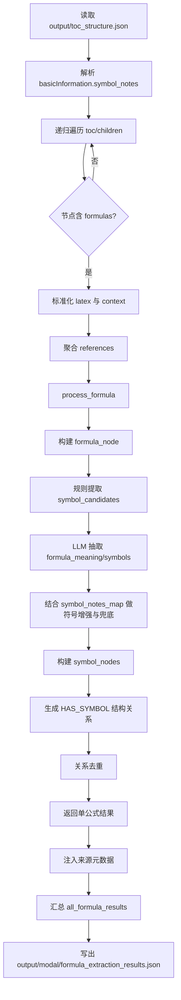

# 公式抽取流程说明

本文档基于当前代码实现整理，描述公式抽取从 TOC 输入到结构化结果输出的完整链路。

## 1. 入口与输入

- 入口脚本：`modalprocessor/formula/C3Formulainjector.py`
- 输入文件：`output/toc_structure.json`
- 输出文件：`output/modal/formula_extraction_results.json`

注入器会递归遍历 `toc` 树及 `children`，在每个节点中读取 `formulas` 列表。

单条公式输入字段（来自 TOC）：

- `id`：公式 ID（可空）
- `latex`：公式 LaTeX（优先）
- `raw` / `content`：当 `latex` 为空时的回退来源
- `display_type`：`block`/`inline`
- `context`：公式上下文（若缺失则回退节点 `content`）

同时读取 `basicInformation.symbol_notes`（全局符号注释）并解析为 `symbol_notes_map`，用于后续符号补全与释义增强。

---

## 2. 注入器阶段（批量组织）

`C3Formulainjector.py` 的主要处理流程如下：

### Step 1：公式文本标准化

- `_normalize_formula_latex(formula_item)` 优先取 `latex`
- 若缺失则尝试 `raw`（会去掉 `$$...$$` 包裹）
- 再回退到 `content`

### Step 2：全局符号注释解析

- `_parse_symbol_notes_map(symbol_notes)` 将形如“符号-解释, 单位”的文本解析为：
  - `name`
  - `description`
  - `unit`

### Step 3：节点级 references 聚合

- `_collect_node_references(node)` 汇总：
  - 当前节点中公式 `context`
  - 当前节点图片 `caption`
  - 图片 `references`
- 去重后截断（最多前 20 条）作为公式抽取的参考信息

### Step 4：调用公式处理器

对每个有效公式调用：

- `FormulaModalProcessor.process_formula(...)`

传入：

- `formula_data`
- `chapter_title`
- `references`
- `symbol_notes`
- `symbol_notes_map`

### Step 5：补充来源元数据并落盘

注入器会补充字段：

- `source_chapter_id`
- `source_chapter_title`
- `source_chapter_path`
- `formula_index_in_node`
- `formula_id`
- `latex`
- `display_type`
- `references`
- `status`

最终写入：`output/modal/formula_extraction_results.json`。

---

## 3. 处理器阶段（单公式核心抽取）

核心文件：`modalprocessor/formula/FormulaModalProcessor.py`，主入口：`process_formula(...)`。

### Step 1：公式节点构建

- `_build_formula_node(...)` 生成 `Formula` 节点
- 提取 `\tag{}` 作为 `equation_tag`
- 形成稳定命名：
  - 有 tag：`公式[tag]::id`
  - 无 tag：`公式::latex片段::id`

### Step 2：符号候选提取（规则层）

- `_extract_symbol_candidates(latex)` 从 LaTeX 中提取候选符号：
  - 下标变量（如 `q_e`、`rho_gl`）
  - 希腊字母命令（如 `sigma`、`theta`）
  - 独立大写参数（如 `M`、`R`、`T`）
  - 部分一元小写变量
- `_normalize_symbol(...)` 做归一化与拼接噪声修复

### Step 3：LLM 语义抽取

- `_llm_extract_formula_semantics(...)` 输入：
  - `latex`
  - `context`
  - `chapter_title`
  - `references`
  - `symbol_candidates`
  - `symbol_notes`
- 期望输出 JSON：
  - `formula_meaning`
  - `symbols[]`（symbol/name/symbol_type/unit/description）
  - 不再要求或使用 `relations[]`

公式模块只做公式节点与符号节点抽取，不再生成符号间计算、依赖、约束、推理、证据或跨模态对齐关系。

### Step 4：符号增强与兜底补全

- `_enrich_symbols_with_notes(...)` 用 `symbol_notes_map` 补充名称、单位、描述
- 若 LLM 漏掉候选符号，但该符号在注释表中存在，则自动补建符号节点
- `_infer_symbol_type(...)` 推断类型：`Variable/Parameter/Constant/Unit`

### Step 5：图谱节点与关系构建

生成节点：

1. `formula_node`（`type=Formula`）
2. `symbol_nodes`（`label=FormulaSymbol`）

生成关系：

1. **公式到符号**（必加，结构关系）
   - `relation=HAS_SYMBOL`
   - `type=HAS_SYMBOL`

注入器会过滤历史或模型返回的非结构公式关系，只保留 `HAS_SYMBOL`；另保留实体到公式 chunk 的 `SOURCE` 来源关系。

最后按 `(source,target,relation,type)` 去重。

### Step 6：结果返回

`process_formula(...)` 返回结构：

- `status`
- `formula_node`
- `symbol_nodes`
- `relations`
- `formula_meaning`
- `raw_llm`

若 `latex` 为空，返回失败：

- `status=failed`
- `error=empty_latex`

---

## 4. 输出数据结构（与现有结果一致）

`output/modal/formula_extraction_results.json` 为数组，每项对应一条公式，通常包含：

- 抽取状态：`status`
- 公式节点：`formula_node`
- 符号节点：`symbol_nodes`
- 关系集合：`relations`
- 语义说明：`formula_meaning`
- 原始模型输出：`raw_llm`
- 来源增强信息：`source_chapter_*`、`formula_index_in_node`、`references` 等

---

## 5. 流程图（Mermaid）

---

## 6. 关键函数速查

- 注入入口：`C3Formulainjector.main`
- 公式标准化：`_normalize_formula_latex`
- 符号注释解析：`_parse_symbol_notes_map`
- 节点 references 聚合：`_collect_node_references`
- 单公式主入口：`FormulaModalProcessor.process_formula`
- 公式节点构建：`_build_formula_node`
- 符号候选提取：`_extract_symbol_candidates`
- LLM 语义抽取：`_llm_extract_formula_semantics`
- 符号注释增强：`_enrich_symbols_with_notes`
