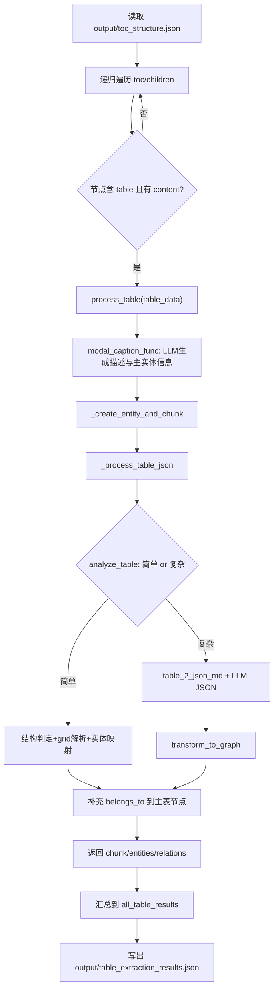

# 表格抽取流程说明

本文档基于当前实现代码整理，覆盖表格抽取从输入到输出的完整链路。

## 1. 入口与输入

- 入口脚本：`modalprocessor/table/C1Tableinjector.py`
- 输入文件：`output/toc_structure.json`
- 遍历方式：递归遍历 `toc` 节点及其 `children`
- 触发条件：节点中存在 `table` 列表，且单个表格对象含 `content`

单个表格输入字段（来自 TOC 节点）主要包括：

- `content`：表格内容（HTML/Markdown 文本）
- `caption`：表题
- `context`：上下文文本
- `title`：章节标题（由注入器补充）

---

## 2. 单表处理主流程

核心处理器：`modalprocessor/table/TableModalProcessor.py`，主入口函数：`process_table(table_data)`。

### Step 1：输入准备

从 `table_data` 读取：

- `table_body = content`
- `table_caption = caption`
- `context`
- `title`

并初始化：

- `table_footnote = ""`
- `table_img_path = ""`

### Step 2：LLM 生成表格语义描述与主实体信息

调用 `modal_caption_func(...)`：

1. 使用 `LLMPrompt.prompt.table_prompt(...)` 组装提示词。
2. 通过 `call_openai_json(...)` 获取 JSON 结果。
3. 解析得到：
   - `detailed_description`：表格详细描述
   - `entity_info`：主表实体信息（名称、类型、摘要等）

### Step 3：构建文本块（Chunk）

调用 `_create_entity_and_chunk(...)`：

- 将原始表格文本与 `detailed_description` 拼接为 `chunk_text`
- 返回 `chunk` 数据，包含：
  - `chunk_text`
  - `entity_info`
  - `original_md`
  - `description`
  - `title`

### Step 4：构建主表节点

在 `process_table(...)` 中创建主实体 `main_entity`：

- `label = tableNode`
- `name = entity_info.entity_name（缺省时退化到 caption/默认名）`
- `type = entity_info.entity_type`
- `properties` 包含摘要、描述、caption
- `raw_content = table_body`

### Step 5：子实体与关系抽取（表格结构解析）

调用 `_process_table_json(table_body)`，分两条路径：

#### 5.1 简单表路径（规则 + 少量 LLM 辅助）

先执行 `analyze_table(table_html)`：

1. **复杂度判定 Prompt**：判断“简单表格/复杂表格”。
2. 若为简单表，再进行 **结构分析 Prompt**：
   - 判断方向：`横向` / `竖向`
   - 提取 `headers`
   - 给出 `data_start_row`、`data_start_col`
3. 使用 `_parse_html_table_to_grid(...)` 规则解析：
   - 解析 `<tr>/<td>/<th>`
   - 处理 `rowspan/colspan`
   - 生成二维 `grid`
4. 根据方向将 `grid` 映射为 `entities`（字典列表）
5. 为每个实体创建图节点（`type = table_entity`）

> 简单表路径当前只返回节点列表，关系列表为空。

#### 5.2 复杂表路径（LLM JSON + 图转换）

当 `analyze_table(...)` 判定为复杂表时：

1. 使用 `LLMPrompt.prompt.table_2_json_md(...)` 构建复杂表转换 Prompt。
2. 调用 `call_openai_json(...)` 生成结构化 JSON。
3. 使用 `tableUtils.transform_to_graph(...)` 递归转换为：
   - `nodes`
   - `relations`（父子“包含”关系）

### Step 6：挂接 belongs_to 关系并汇总输出

`process_table(...)` 会将抽取出的每个子实体额外挂接到主表实体：

- `relation = belongs_to`
- `source = 子实体`
- `target = 主表实体`
- 并补齐 `source_id/target_id/type/description`

最终返回单表结果结构：

- `chunk`
- `entities`（子实体 + 主表实体）
- `relations`（子结构关系 + belongs_to 关系）

---

## 3. 批量执行与结果落盘

`C1Tableinjector.py` 对所有表格执行 `process_table(...)`，并将结果写入：

- 输出文件：`output/table_extraction_results.json`

每个元素对应一张表，包含该表的 chunk、实体和关系。

---

## 4. 流程图（Mermaid）

---

## 5. 关键函数速查

- 注入入口：`C1Tableinjector.main`
- 单表处理：`TableModalProcessor.process_table`
- 描述生成：`TableModalProcessor.modal_caption_func`
- 简单/复杂判定：`TableModalProcessor.analyze_table`
- HTML 网格解析：`TableModalProcessor._parse_html_table_to_grid`
- 图转换：`tableUtils.transform_to_graph`
- 输出落盘：`C1Tableinjector.py` 中 `json.dump(all_table_results, ...)`
