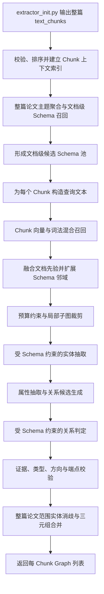

# Schema 选择与文本三元组抽取算法设计

## 1. 文档目标

本文只负责两个核心问题：**Schema 选择**和**受 Schema 约束的文本抽取**。上游 `src/extractors/extractor_init.py` 已经完成整篇论文的 Chunk 收集、模态分组和文本 Chunk 批量传递；本方案不再设计文档解析与 Chunk 切分算法，而是直接接收一篇论文的全部 `text_chunks`，先利用整篇论文的全局语义建立文档级 Schema 先验，再为每个 Chunk 选择结构闭合的局部 Schema 子图，并据此抽取可追溯、可校验的实体、属性和关系三元组。

设计遵循以下原则：

1. **语义召回与图结构约束并用**：Embedding 负责找候选概念，Schema 图负责补全合法关系和方向。
2. **Schema 是约束而不是文本事实**：Schema 中存在一条关系，只表示该关系允许被抽取，不代表当前文本一定陈述了它。
3. **证据优先**：实体、属性和关系必须绑定 Chunk 中可定位的原文证据。
4. **精度优先、允许回退**：高置信结果自动通过，歧义结果二次判别，低置信结果保留为待审候选，不强行入图。
5. **整篇输入、两级选择、逐 Chunk 抽取**：一次接收整篇论文的全部文本 Chunk；先生成文档级候选 Schema 池，再为每个 Chunk 选择局部 Schema，最后在文档范围融合结果。

---

## 2. 当前 Schema 图谱基线

根据 `schema/schema_graph.cypher` 与 Neo4j 数据库实测结果，概念图谱结构如下：

| 图元素 | 当前规模 | 关键字段/含义 |
|---|---:|---|
| `EntityConcept` | 65 | `schema`、`zhName`、`category`、`description`、`examples`、`embedding` |
| `ConceptCategory` | 9 | 顶层领域分类，使用 `name` 标识 |
| `BELONGS_TO_CATEGORY` | 65 | `EntityConcept → ConceptCategory` 的分类归属 |
| `SCHEMA_RELATION` | 297 | 合法概念关系，含 `key`、`relationEn`、`relationZh` |
| 关系语义类型 | 75 | 如 `CONTAINS`、`DEVELOPED_IN`、`CONTROLS`、`PART_OF` 等 |

所有 65 个 `EntityConcept` 当前均具有 1024 维向量，模型为 `BAAI/bge-large-zh-v1.5`。当前数据库尚未创建 Neo4j Vector Index，因此正式运行前应创建索引；在索引创建前，可以对 65 个节点执行全量余弦计算作为兼容回退。

### 2.1 Schema 节点检索文本

概念向量由以下内容拼接生成：

```text
类别：{category}
描述：{description}
示例：{examples}
中文名称：{zhName}
```

Chunk 查询向量也必须使用同一个 Embedding 模型和维度。模型名、维度或文本预处理方式发生变化时，必须重建全部 Schema 向量与索引，禁止混用不同向量空间。

### 2.2 建议创建的 Neo4j 索引

```cypher
CREATE VECTOR INDEX entity_concept_embedding_idx IF NOT EXISTS
FOR (n:EntityConcept)
ON (n.embedding)
OPTIONS {indexConfig: {
  `vector.dimensions`: 1024,
  `vector.similarity_function`: 'cosine'
}};
```

验证索引：

```cypher
SHOW VECTOR INDEXES
YIELD name, state, labelsOrTypes, properties
WHERE name = 'entity_concept_embedding_idx'
RETURN name, state, labelsOrTypes, properties;
```

只有当 `state = 'ONLINE'` 时才切换到向量索引检索。

---

## 3. 总体架构



核心流程分为三层：

- **文档级 Schema 先验层**：输入整篇论文的全部文本 Chunk，识别论文主领域并形成候选 Schema 池。
- **Chunk 级 Schema 选择层**：结合当前 Chunk、相邻 Chunk、章节信息和文档先验，输出带分数的局部 Schema 子图。
- **受约束抽取层**：以局部 Schema 子图为允许集合，从当前 Chunk 原文中抽取实例事实，并在整篇范围进行融合。

---

## 4. 输入与输出定义

### 4.1 输入：整篇论文的文本 Chunk 序列

实际调用入口与 `extractor_init.py` 保持一致：

```python
extract_from_text(
    chunks=text_chunks,
    llm_client=llm_client,
    schema_selector=schema_selector,
) -> list[Graph]
```

`text_chunks` 是同一篇论文的全部文本 Chunk，而不是单个 Chunk。`collect_chunks()` 已为每个 Chunk 补充 `document_id`、`section_id`、`section_title` 和可选的 `source_file`；文本内容来自 `TextChunk.text`。抽取器不得再次切分正文。

单个 Chunk 的典型结构为：

```json
{
  "id": "doc_001_sec_3_chunk_02",
  "order": 12,
  "section_title": "长7烃源岩特征",
  "text": "长7段暗色泥岩有机质丰度较高，是研究区主要烃源岩……",
  "modality": "text",
  "section_id": "sec_3",
  "document_id": "doc_001",
  "source_file": "paper.md"
}
```

其中 `text` 是当前 Chunk 的唯一事实证据来源。`section_title`、同章节其他 Chunk 和相邻 Chunk 只用于 Schema 选择、类型判别与指代消解，不能单独生成当前 Chunk 的事实。优先使用 `TextChunk.order` 确定文档顺序；若缺失或发生冲突，则保留 `collect_chunks()` 的深度优先输出顺序，并在进入并发处理前添加运行期 `chunk_index`。下游输出中的 `chunk_id` 对应输入的 `id`。

### 4.2 Schema 选择结果

```json
{
  "query_text": "文档：……\n章节：……\n正文：……",
  "selector_version": "hybrid_graph_v1",
  "concepts": [
    {
      "schema": "SourceRock",
      "zhName": "烃源岩",
      "category": "油气成藏要素",
      "vector_score": 0.86,
      "lexical_score": 1.0,
      "context_score": 0.90,
      "final_score": 0.91,
      "selection_reason": ["正文精确命中", "向量 Top-K"]
    }
  ],
  "relations": [
    {
      "source_schema": "SourceRock",
      "relationEn": "CONTAINS",
      "relationZh": "包含",
      "target_schema": "OrganicMatter",
      "edge_score": 0.84
    }
  ],
  "selection_confidence": 0.88,
  "fallback_used": false
}
```

### 4.3 抽取结果

```json
{
  "chunk_id": "doc_001_sec_3_chunk_02",
  "schema_selection": {},
  "entities": [],
  "attributes": [],
  "relations": [],
  "rejected_candidates": [],
  "quality": {
    "entity_coverage": 0.92,
    "schema_validity": 1.0,
    "evidence_validity": 1.0,
    "needs_review": false
  }
}
```

---

## 5. 整篇 Chunk 批次预处理与两级 Schema 上下文

### 5.1 输入校验与上下文索引

抽取器收到整篇 `text_chunks` 后只执行非破坏性的批次预处理，不改变 Chunk 边界：

1. 校验所有元素均为文本模态，并包含唯一 `id` 和非空 `text`；空文本直接返回空 Graph。
2. 校验 `document_id` 一致；若一次输入混有多篇论文，应先按 `document_id` 分组后分别运行。
3. 优先按 `order`、其次按输入顺序建立 `chunk_index`，同时建立 `section_id → chunks` 索引。
4. 为每个 Chunk 找到同章节前后相邻 Chunk；只截取相邻文本的短摘要或首尾关键句作为消歧上下文，禁止把整篇论文塞入每次 Prompt。
5. 统计整篇论文中的高频专业词、地层编号、井名、地名和章节主题，构造文档主题画像。
6. 不重新切分、不拼接覆盖原始 `text`，确保每项事实仍能回溯到原始 Chunk ID。

### 5.2 文档级 Schema 候选池

由于一次已经获得整篇论文的全部文本 Chunk，可先进行一次低成本的全局 Schema 预选择。其目标不是直接约束所有 Chunk，而是形成论文领域先验并减少重复冷启动查询。

文档级查询文本由以下内容构成：

```text
论文各章节标题：{deduplicated_section_titles}
论文高频专业词：{top_domain_terms}
代表性 Chunk 摘要：{representative_chunk_summaries}
```

代表性 Chunk 不应简单截取全文前 N 个，而应从各章节均匀抽样，并优先选择专业术语密度高的 Chunk。对文档级查询执行向量与词法混合召回，建议保留 20～35 个概念节点，再补充这些节点之间已存在的 Schema 边，形成 `document_schema_pool`。

文档级候选池的作用：

- 为 Chunk 候选概念提供 `document_prior` 加分；
- 缓存论文高频 Schema，减少重复 Neo4j 查询；
- 帮助短 Chunk、指代 Chunk 和结论性 Chunk 完成类型判别；
- 不作为硬白名单。局部 Chunk 若明确命中池外概念，必须允许从全库召回并动态补入。

文档级候选分数可定义为：

\[
S_{doc}(c)=0.60S_{docVec}+0.25S_{docLex}+0.15S_{sectionCoverage}
\]

其中 `sectionCoverage` 表示该概念在多少个不同章节中获得支持，避免某一个局部章节主导整篇论文的候选池。

### 5.3 Chunk 查询文本

直接对全文向量化容易让通用背景淹没实体线索，建议使用带字段权重的查询文本：

```text
文档主题：{document_topic_profile}
章节标题：{section_title}
相邻上下文：{previous_tail + next_head}
本段主题：{section_title}
当前正文：{normalized_chunk_text}
```

正文预处理只做空白归一化和无意义 Markdown 标记清除，不再次截断或切分 Chunk；不应删除数字、井名、地层编号、英文缩写和单位，因为它们是类型识别的重要线索。当前正文在查询中的权重必须最高，相邻上下文和文档画像只提供先验。

可分别计算标题向量与正文向量，再做加权平均：

\[
q = \operatorname{normalize}(0.15q_{doc} + 0.20q_{section} + 0.65q_{body})
\]

对正文少于约 100 个汉字的短 Chunk，可将正文、章节、文档权重调整为 `0.50/0.30/0.20`。这些权重只影响 Schema 选择，不影响事实证据判定。

---

## 6. Schema 选择算法

### 6.1 算法概览

Schema 选择采用“**文档候选池 → Chunk 混合召回 → 分数融合 → 图扩展 → 子图裁剪 → 置信回退**”的两级选择法，而不是对每个 Chunk 独立只取向量 Top-K。原因是整篇论文的主题具有连续性，而单个概念相似又不能保证关系端点完整；例如召回 `SourceRock` 后，应在当前 Chunk 存在“有机质”“生成油气”等线索时补入 `OrganicMatter`、`Hydrocarbon` 以及相应合法边。

### 6.2 第一步：混合候选召回

#### A. 向量召回

主查询使用参数化 Cypher：

```cypher
CALL db.index.vector.queryNodes(
  'entity_concept_embedding_idx',
  $vector_top_k,
  $query_embedding
)
YIELD node, score
WHERE score >= $min_vector_score
OPTIONAL MATCH (node)-[:BELONGS_TO_CATEGORY]->(category:ConceptCategory)
RETURN node.schema AS schema,
       node.zhName AS zhName,
       node.description AS description,
       node.examples AS examples,
       category.name AS category,
       score AS vector_score
ORDER BY vector_score DESC;
```

参数示例：

```json
{
  "vector_top_k": 12,
  "min_vector_score": 0.55,
  "query_embedding": "1024维浮点数组"
}
```

`0.55` 仅是冷启动值，最终阈值必须在标注验证集上校准。不同 Embedding 模型的分数不可直接复用。

#### B. 词法召回

词法召回用于保护井名、地层编号、英文缩写和概念中文名等向量模型可能弱化的信号。匹配优先级如下：

1. `zhName` 或 `schema` 精确出现；
2. `examples` 中实例或模式命中；
3. 专业后缀规则命中，如“盆地→Basin”“××组→Formation”“××井→Well”；
4. 描述关键词 BM25/全文索引命中。

小规模 Schema 可先在应用层完成标准化字符串匹配；规模扩大后创建 Neo4j Full-text Index。

#### C. 上下文召回

对标题、父章节标题、文档标题分别做轻量召回。上下文命中的概念只能提高候选分数，不能直接产生实例实体或关系。

### 6.3 第二步：候选概念融合评分

对每个概念 \(c\) 计算：

\[
S_{node}(c)=0.45S_{vec}+0.25S_{lex}+0.15S_{ctx}+0.15S_{doc}
\]

其中：

- \(S_{vec}\)：Chunk 与概念的余弦相似度，归一化到 `[0,1]`；
- \(S_{lex}\)：正文词法匹配分，精确中文名为 1.0，示例命中为 0.9，规则命中为 0.75；
- \(S_{ctx}\)：标题和邻近 Chunk 对该概念的支持度；
- \(S_{doc}\)：概念在 `document_schema_pool` 中的文档级支持分；池外概念取 0，但不会因此被禁止进入局部 Schema。

硬保护规则：正文精确命中 `zhName/schema/examples` 的候选，即使综合分略低也进入种子集合。推荐种子准入条件：

```text
S_node >= 0.65
或 lexical_exact = true
或位于向量 Top-3 且 S_vec >= 0.58
```

### 6.4 第三步：Schema 图结构扩展

以种子概念为起点查询一跳出边和入边：

```cypher
MATCH (seed:EntityConcept)
WHERE seed.schema IN $seed_schemas
MATCH (seed)-[r:SCHEMA_RELATION]-(neighbor:EntityConcept)
RETURN seed.schema AS seed_schema,
       startNode(r).schema AS source_schema,
       r.relationEn AS relation_en,
       r.relationZh AS relation_zh,
       endNode(r).schema AS target_schema,
       neighbor.schema AS neighbor_schema,
       neighbor.zhName AS neighbor_zh_name,
       neighbor.category AS neighbor_category
LIMIT $max_expansion_edges;
```

扩展节点不能无条件加入。对邻居 \(v\) 和边 \(e=(u,r,v)\) 计算：

\[
S_{edge}(e)=0.40S_{node}(u)+0.35S_{node}(v)+0.15S_{relLex}+0.10S_{connect}
\]

- \(S_{relLex}\)：正文是否出现关系触发词，例如“位于、属于、包含、控制、发育于、指示”；
- \(S_{connect}\)：该边是否连接两个独立召回的高分种子；若是则取 1，否则取 0.4；
- 未被直接召回的邻居，其 \(S_{node}(v)\) 使用向量相似度和词法信号重新计算，而不是置零。

建议仅在以下条件之一成立时加入扩展边：

1. 两端均为种子概念；
2. 一端为种子，另一端 `S_node >= 0.50`，且有关系触发词；
3. 两端共同构成正文中的显式实体对；
4. 该节点是连接两个高分种子的最短一跳桥接点。

默认只扩展一跳。二跳扩展仅用于两个高分种子不连通且存在唯一短路径时，并设置严格预算，防止 297 条关系全部涌入 Prompt。

### 6.5 第四步：局部 Schema 子图裁剪

裁剪目标是在 Token 预算内最大化语义覆盖与结构连通性：

\[
\max_G \sum_{v\in G}S_{node}(v)+\lambda\sum_{e\in G}S_{edge}(e)-\mu|G|
\]

约束如下：

- 概念节点数建议 `6～15`，最大不超过 `20`；
- 关系边数建议 `10～35`，最大不超过 `50`；
- 保留所有正文精确命中的概念；
- 每个保留关系必须同时保留源、目标概念；
- 优先保留连接多个种子的边，删除孤立低分邻居；
- 同一关系的方向必须保持 Schema 图中的 `source → target`；
- 若候选分布在多个互不相关主题，可保留 2～3 个连通分量，而不是强行用低质量桥接边连接。

建议使用预算化贪心算法：先加入所有硬保护种子，再按“新增覆盖收益 / 新增 Token 成本”递减加入节点和边，直到达到预算。

### 6.6 第五步：选择置信度与回退

定义整体选择置信度：

\[
C_{schema}=0.45\overline{S_{top3}}+0.25Coverage+0.20Connectivity+0.10Margin
\]

- `Coverage`：正文识别出的专业术语中，被候选 Schema 覆盖的比例；
- `Connectivity`：保留概念中参与至少一条候选边的比例；
- `Margin`：入选边界处候选与未入选候选的分差。

回退策略：

| 条件 | 处理方式 |
|---|---|
| `C_schema >= 0.75` | 直接进入受约束抽取 |
| `0.55 <= C_schema < 0.75` | 扩大向量 Top-K，并允许 LLM 对候选概念做一次重排 |
| `C_schema < 0.55` | 使用“开放实体发现 + Schema 对齐”，关系仍必须通过 Schema 校验 |
| Embedding 服务失败 | 使用词法、规则、标题上下文召回 |
| 向量索引不可用 | 65 个概念全量余弦计算；记录 `fallback_used=true` |
| 完全无合法 Schema | 输出待发现候选，不伪造 Schema 类型或关系 |

### 6.7 Schema 选择伪代码

```text
function select_schema(chunk, document_context, document_schema_pool):
    # 构造正文与标题查询，并保证与 Schema 节点使用同一向量模型。
    query_text = build_query_text(chunk, document_context)
    query_vector = embed(query_text)

    # 并行执行向量、词法和上下文召回，降低单一路径漏召回概率。
    vector_candidates = vector_recall(query_vector, top_k=12)
    lexical_candidates = lexical_recall(chunk.text)
    context_candidates = context_recall(document_context)

    # 融合多路分数，正文精确命中的概念作为硬保护种子。
    candidates = fuse_and_score(
        vector_candidates,
        lexical_candidates,
        context_candidates,
        document_schema_pool
    )
    seeds = select_seed_concepts(candidates)

    # 查询 Schema 邻域，只保留受到正文或种子对共同支持的边。
    neighborhood = fetch_one_hop_schema_graph(seeds)
    scored_graph = score_nodes_and_edges(neighborhood, chunk.text)

    # 在节点数、边数和 Prompt Token 预算下选择局部闭合子图。
    selected_graph = budgeted_connected_pruning(scored_graph)
    confidence = evaluate_schema_confidence(selected_graph, chunk.text)

    # 低置信时扩大召回或切换到开放发现模式，但不放弃 Schema 合法性校验。
    return apply_fallback_if_needed(selected_graph, confidence)
```

---

## 7. 受 Schema 约束的文本抽取流程

本节在现有“实体 → 属性 → 关系 → 跨片合并”流程上增加 Schema 约束和校验闭环。

### 7.1 阶段零：抽取前准备

向 LLM 传入精简后的局部 Schema，而不是完整 65 节点、297 边图：

```json
{
  "allowed_entity_types": [
    {"schema": "SourceRock", "zhName": "烃源岩", "description": "……"},
    {"schema": "OrganicMatter", "zhName": "有机质", "description": "……"}
  ],
  "allowed_relations": [
    {"source": "SourceRock", "relation": "CONTAINS", "target": "OrganicMatter"}
  ]
}
```

Prompt 中必须明确：

- 只抽取当前正文明确陈述或可以由同一句直接解析的事实；
- 标题只辅助类型判断，不能充当关系证据；
- 输出必须是严格 JSON；
- 无证据时返回空数组。

### 7.2 阶段一：实体候选识别与类型映射

#### 7.2.1 实体边界

抽取可独立参与关系的名词对象，例如盆地、地层、断层、储层、岩性、矿物、井、样品和实验方法。纯数值、单位、颜色、方位、形态和状态原则上作为属性，不单独作为实体。

每个实体至少输出：

```json
{
  "temp_id": "e1",
  "name": "长7段暗色泥岩",
  "normalized_name": "长7段暗色泥岩",
  "schema": "SourceRock",
  "mention": "长7段暗色泥岩",
  "evidence": "长7段暗色泥岩有机质丰度较高，是研究区主要烃源岩",
  "confidence": 0.94,
  "type_source": "schema_constrained"
}
```

#### 7.2.2 类型判定

实体类型置信度建议综合：

\[
C_{type}=0.40C_{llm}+0.25S_{schema}+0.20S_{name}+0.15S_{context}
\]

- `C_llm`：LLM 给出的类型判断置信度；
- `S_schema`：该类型在 Schema 选择阶段的概念分；
- `S_name`：实体名称与概念描述/示例的语义与规则匹配；
- `S_context`：同句谓词和相邻实体对该类型的支持。

处理规则：

- `C_type >= 0.75`：接受；
- `0.55～0.75`：保留候选类型 Top-2，进入关系阶段联合消歧；
- `< 0.55`：标记 `Unknown`/待发现，不强行映射；
- 若正确类型不在局部 Schema 中，可对该实体名称单独做一次全库概念召回，再将新类型及其必要关系动态补入子图。

#### 7.2.3 实体规范化与指代

1. 名称去除无意义标点，但保留地层编号、井号、希腊字母和化学符号。
2. 同一 Chunk 内“该储层、其、前者”等指代，只在唯一先行词且类型相容时解析。
3. 通用词如“区域、特征、研究、结果”不作为实体，除非 Schema 和上下文都明确支持。
4. 不同 Schema 类型的同名对象不能直接合并。

### 7.3 阶段二：属性抽取

沿用每 5 个实体一组的策略，但每个实体同时传入 `schema`、证据句和允许的通用属性形态。

属性输出建议采用规范结构，而不是把所有属性平铺到实体对象：

```json
{
  "entity_id": "e1",
  "name": "TOC",
  "value": 3.2,
  "value_raw": "3.2%",
  "unit": "%",
  "qualifier": "平均",
  "range_min": null,
  "range_max": null,
  "evidence": "平均TOC为3.2%",
  "char_start": 18,
  "char_end": 28,
  "confidence": 0.93
}
```

关键规则：

1. 值若能独立作为 Schema 实体并参与关系，则不能降格为属性。
2. 数值必须同时保存 `value_raw` 与规范值；单位换算另行执行，不能覆盖原值。
3. 范围值拆成 `range_min/range_max`，保留“大于、约、平均”等限定词。
4. 属性必须指向当前 Chunk 中已接受的实体。
5. 同名属性多值并存，不以新值覆盖旧值；按证据位置和规范值去重。

### 7.4 阶段三：关系候选生成

不让 LLM 在所有实体的笛卡尔积上自由生成关系。先由 Schema 构造合法实体对：

```text
candidate_pairs = {
  (e_i, relation, e_j)
  | type(e_i) -[relation]-> type(e_j) 存在于 selected_schema_graph
}
```

然后按以下条件削减候选：

- 同句实体对优先；
- 相邻句实体对仅在存在指代、并列延续或明确连接词时考虑；
- 超过设定句距的实体对不进入当前 Chunk 关系判断；
- Schema 方向相反时，应交换实例端点，不应创建反向关系名；
- 自关系只有 Schema 明确允许且文本证据充分时才接受。

### 7.5 阶段四：受约束关系判定

对每个候选三元组要求 LLM 进行“成立 / 不成立 / 不确定”判定，并返回精确证据：

```json
{
  "source_id": "e1",
  "type": "CONTAINS",
  "target_id": "e2",
  "source_schema": "SourceRock",
  "target_schema": "OrganicMatter",
  "evidence": "长7段暗色泥岩有机质丰度较高",
  "char_start": 0,
  "char_end": 15,
  "confidence": 0.88,
  "assertion": "affirmed"
}
```

关系置信度：

\[
C_{rel}=0.35C_{llm}+0.25C_{evidence}+0.20C_{endpoints}+0.20S_{edge}
\]

- `C_evidence`：证据是否同时覆盖两端实体和关系触发表达；
- `C_endpoints`：两端实体类型置信度的几何平均；
- `S_edge`：Schema 选择阶段的边分数。

接收阈值建议：

- `C_rel >= 0.75` 且所有硬校验通过：自动接受；
- `0.55～0.75`：进入二次验证或人工复核；
- `< 0.55`：拒绝但保留在 `rejected_candidates` 用于误差分析。

### 7.6 否定、推测和比较信息

关系不能只保存真假，应增加断言属性：

| 文本表达 | `assertion` | 处理 |
|---|---|---|
| “断层控制裂缝发育” | `affirmed` | 正常事实 |
| “断层不控制裂缝发育” | `negated` | 不写成肯定边，可保存否定陈述 |
| “可能控制裂缝发育” | `uncertain` | 降低置信度并保留模态词 |
| “A 比 B 更发育” | `comparative` | 保存比较结构，不简化成普通属性覆盖 |

只有 `affirmed` 且达到阈值的关系默认进入知识图谱主事实层。

### 7.7 阶段五：确定性校验

LLM 输出后必须经过程序校验：

1. **JSON Schema 校验**：字段类型、必填项、枚举值合法。
2. **证据校验**：`evidence` 必须能在标准化前的 Chunk 原文中定位。
3. **端点校验**：关系的 `source_id/target_id` 必须存在。
4. **类型校验**：实体 `schema` 必须位于选中子图或动态补充集合。
5. **关系合法性校验**：`(source_schema, relationEn, target_schema)` 必须在 Neo4j Schema 图中存在。
6. **方向校验**：禁止把合法边反向输出。
7. **幻觉校验**：证据中至少出现两端 mention 或可确定的指代表达。
8. **重复校验**：同一 Chunk 内按规范键去重。

关系合法性批量查询：

```cypher
UNWIND $triples AS triple
OPTIONAL MATCH (s:EntityConcept {schema: triple.source_schema})
               -[r:SCHEMA_RELATION {relationEn: triple.relation_en}]->
               (t:EntityConcept {schema: triple.target_schema})
RETURN triple.candidate_id AS candidate_id,
       r IS NOT NULL AS is_valid,
       r.key AS schema_relation_key;
```

参数示例：

```json
{
  "triples": [
    {
      "candidate_id": "r1",
      "source_schema": "SourceRock",
      "relation_en": "CONTAINS",
      "target_schema": "OrganicMatter"
    }
  ]
}
```

Sanity-check 查询：

```cypher
MATCH (s:EntityConcept)-[r:SCHEMA_RELATION]->(t:EntityConcept)
WHERE s.schema = $source_schema
  AND r.relationEn = $relation_en
  AND t.schema = $target_schema
RETURN s.schema, r.relationEn, t.schema, r.relationZh
LIMIT 1;
```

---

## 8. Chunk 间融合与实体消歧

### 8.1 实体合并键

不能只按“同名同类型”合并，建议使用分层判定：

1. 强键：`document_id + normalized_name + schema + scope`；
2. 地理/地层实体结合父级上下文，如盆地、组、段、井区；
3. 名称相似但上下文冲突时保持为不同实体；
4. 代词实体必须先解析到明确先行词才能合并；
5. 跨文档是否合并交给后续实体对齐模块，不在文本抽取阶段直接全局合并。

### 8.2 关系去重键

```text
(canonical_source_id, relationEn, canonical_target_id, assertion)
```

重叠 Chunk 产生相同关系时：

- 合并证据列表；
- 置信度可取最大值，或采用多证据聚合 `1 - Π(1-c_i)`；
- 保留所有 `chunk_id` 和字符位置；
- 若肯定与否定证据冲突，不覆盖，标记 `conflicted=true` 进入复核。

### 8.3 属性合并

属性按 `(entity_id, attribute_name, normalized_value, unit)` 去重。不同时间、层位、样品或实验条件下的同名属性不能合并，需要保存限定上下文。

---

## 9. 完整处理伪代码

```text
function extract_from_text(text_chunks, llm_client, schema_selector):
    # extractor_init.py 已完成 Chunk 切分和文本模态分组，此处只校验整篇输入。
    ordered_chunks = validate_and_index_document_chunks(text_chunks)
    if ordered_chunks is empty:
        return []

    # 汇总章节标题、高频术语和代表性 Chunk，先建立整篇论文的 Schema 先验池。
    document_context = build_document_context(ordered_chunks)
    document_schema_pool = select_document_schema_pool(document_context)
    chunk_results = []

    for chunk in ordered_chunks:
        # 当前 Chunk 是主查询，相邻 Chunk、章节信息和文档候选池只提供选择先验。
        local_context = build_local_context(chunk, ordered_chunks, document_context)
        selected_schema = select_schema(
            chunk,
            local_context,
            document_schema_pool
        )

        # 第一次模型调用只识别当前 Chunk 的实体及候选类型，不生成关系事实。
        entities = extract_entities(chunk.text, selected_schema.concepts)
        entities = normalize_and_validate_entities(entities, chunk)

        # 对未覆盖或低置信类型按需执行全库召回，避免文档候选池成为硬白名单。
        selected_schema = repair_schema_for_ambiguous_entities(
            entities,
            selected_schema
        )

        # 为已确认实体抽取字面量属性，并保留原值、单位和当前 Chunk 证据。
        attributes = extract_attributes_in_batches(
            chunk.text,
            entities,
            batch_size=5
        )
        attributes = validate_attributes(attributes, entities, chunk)

        # 仅对局部 Schema 允许的实体类型组合生成关系候选并进行事实判定。
        relation_candidates = build_schema_valid_pairs(
            entities,
            selected_schema.relations,
            chunk.text
        )
        relations = classify_relations(chunk.text, relation_candidates)
        relations = deterministic_relation_validation(
            relations,
            entities,
            selected_schema,
            chunk
        )

        # 每个输入 Chunk 对应一个可审计 Chunk Graph，保持与 extractor_init.py 接口一致。
        chunk_results.append(build_chunk_graph(
            chunk,
            selected_schema,
            entities,
            attributes,
            relations
        ))

    # 以整篇论文为范围统一实体 ID、合并重复证据并标记冲突，再按原顺序返回 Graph。
    return document_level_align_and_merge(chunk_results)
```

这里的返回值仍是 `list[Graph]`，长度原则上与输入 `text_chunks` 一致。文档级融合可以统一实体标识和证据，但不应丢失每个 Graph 的源 `chunk_id`，以便 `extractor_init.py` 统计和后续多模态合并。

---

## 10. Prompt 组织建议

建议采用三次调用而非一次性生成全部图：

1. **实体调用**：正文 + 候选实体类型；
2. **属性调用**：正文 + 每批 5 个已确认实体；
3. **关系调用**：正文 + 已确认实体 + 已裁剪的合法候选关系。

关系 Prompt 不应展示与当前实体对无关的 Schema 边。对每批候选实体对可控制在 15～25 个，避免模型因候选过多而遗漏。

推荐的系统约束摘要：

```text
你是石油地质知识抽取器。Schema 仅定义允许的实体类型与关系，不代表正文中存在事实。
只能依据给定正文输出；每项必须返回可在正文中精确定位的证据。
不得创造实体、属性、关系或补充常识。无明确证据时输出空数组。
关系方向必须与 allowed_relations 完全一致，输出严格 JSON。
```

---

## 11. 阈值与默认参数

以下参数是冷启动建议值，必须通过验证集调优：

| 参数 | 建议初值 | 说明 |
|---|---:|---|
| `VECTOR_TOP_K` | 12 | 向量初始召回数 |
| `DOCUMENT_SCHEMA_TOP_K` | 30 | 整篇论文文档级候选概念数 |
| `MIN_VECTOR_SCORE` | 0.55 | 初始向量过滤阈值 |
| `SEED_SCORE` | 0.65 | 高置信种子概念阈值 |
| `MAX_SCHEMA_NODES` | 15 | Prompt 中 Schema 节点软上限 |
| `MAX_SCHEMA_EDGES` | 35 | Prompt 中 Schema 边软上限 |
| `MAX_EXPANSION_HOPS` | 1 | 默认图扩展深度 |
| `ENTITY_ACCEPT_SCORE` | 0.75 | 实体类型自动接受阈值 |
| `RELATION_ACCEPT_SCORE` | 0.75 | 关系自动接受阈值 |
| `REVIEW_SCORE` | 0.55 | 低于该值直接拒绝 |
| `ATTRIBUTE_BATCH_SIZE` | 5 | 单次属性抽取实体数 |
| `RELATION_PAIR_BATCH_SIZE` | 20 | 单次关系判定候选对数 |

不要在没有验证集的情况下频繁人工修改阈值。应保存每次选择分数、模型版本、Prompt 版本和最终判定，以支持离线重放。

---

## 12. 评估方案

### 12.1 数据集划分

从论文或报告中人工标注 100～300 个代表性 Chunk，覆盖 9 个顶层分类、跨句关系、否定句、表述歧义和无事实 Chunk。按文档划分训练/验证/测试集，禁止同一文档的相邻 Chunk 分散到不同集合，避免信息泄漏。

### 12.2 Schema 选择指标

- `Concept Recall@K`：金标准实体类型是否在候选概念中；
- `Relation Schema Recall`：金标准关系的合法 Schema 边是否被选入；
- `Subgraph Precision`：所选节点/边中与 Chunk 相关的比例；
- 平均 Schema 节点数、边数和 Prompt Token 数；
- 低置信回退率与索引回退率。

Schema 选择阶段应优先优化召回率，建议目标：概念 Recall@15 ≥ 0.97、关系 Schema Recall ≥ 0.95，再通过抽取与证据校验保证最终精度。

### 12.3 抽取指标

- 实体严格/宽松 Precision、Recall、F1；
- 实体类型准确率；
- 属性 `(实体, 属性名, 值, 单位)` F1；
- 关系三元组 Micro/Macro F1；
- 关系方向准确率；
- 证据跨度 IoU/F1；
- Schema 合法率；
- 幻觉率、否定误判率、跨 Chunk 重复率。

### 12.4 消融实验

论文中建议至少比较：

1. 无 Schema 的自由抽取；
2. 只用向量 Top-K；
3. 向量 + 词法混合召回；
4. 混合召回 + 图扩展裁剪；
5. 完整方案 + 确定性校验与低置信回退。

这样能够分别证明向量语义检索、图结构补全和约束校验的贡献。

---

## 13. 性能、缓存与并发

1. Schema 图只有 65 个节点时，可缓存全部概念元数据和 297 条边；向量索引仍建议创建，以保持未来扩展能力。
2. 对规范化后的查询文本计算哈希，缓存查询向量和 Schema 选择结果。
3. 文档级 Schema 候选池必须先完成；随后各 Chunk 可并发选择和抽取，但相邻上下文索引应只读，同一 Embedding/LLM 客户端必须受速率限制器控制。
4. Neo4j 查询使用参数，不拼接用户文本；邻域查询必须有节点、边和 `LIMIT` 上限。
5. 在扩展查询上线前运行 `EXPLAIN`；避免无界变长路径和全图笛卡尔积。
6. Schema 版本变化时使缓存失效，可使用 `schema_version + embedding_model + selector_version` 组成缓存命名空间。

---

## 14. 异常与降级策略

| 异常 | 降级方式 | 是否继续抽取 |
|---|---|---|
| Neo4j 不可用 | 使用最近一次本地 Schema 快照 | 是，标记降级 |
| Vector Index 不在线 | 全量 65 节点余弦计算 | 是 |
| Embedding API 不可用 | 词法规则 + 全文匹配 + 标题上下文 | 是 |
| LLM 返回非法 JSON | JSON 修复一次，仍失败则重试一次 | 有上限重试 |
| 未选出 Schema | 开放实体发现，关系不自动入主图 | 是，待审 |
| 关系不在 Schema 中 | 放入 `rejected_candidates` 或关系发现模块 | 不进入主图 |
| 证据无法定位 | 拒绝该事实 | 否 |

---

## 15. 推荐模块边界

```text
src/extractors/
├── schema_router.py                 # 通用 Schema 选择入口
├── schema_constrained.py            # 受 Schema 约束的公共抽取编排
└── text_extractor/
    ├── schema_selector.py           # 文本查询构造、混合召回与子图裁剪
    ├── text_extractor.py            # 整篇 text_chunks 批量流程入口
    ├── entity_extractor.py          # 实体识别、类型映射和规范化
    ├── attribute_extractor.py       # 属性批量抽取与单位规范化
    ├── relation_extractor.py        # 合法实体对生成和关系判断
    ├── validator.py                 # 证据、Schema、方向与 JSON 校验
    └── merger.py                    # 整篇论文范围的 Chunk 结果融合
```

当前项目中的 `text_extractor/schema_selector.py` 为空，而 `text_extractor.py` 已引用尚未落盘的 `schema_router.SchemaSelector` 和 `schema_constrained.extract_chunk_graph`。因此实现时应优先补齐公共选择器与约束抽取编排，或调整导入路径使文本专用选择器成为实际入口，避免设计与代码接口脱节。

---

## 16. 分阶段实施顺序

### 第一阶段：可运行最小闭环

1. 创建并验证 Neo4j Vector Index；
2. 实现整篇论文文档级候选池；
3. 实现 Chunk 向量 Top-K + 词法精确命中的混合召回；
4. 实现一跳 Schema 扩展和固定预算裁剪；
5. 实现实体、属性、关系三阶段 JSON 抽取；
6. 实现证据定位与 Schema 合法性硬校验；
7. 按输入 Chunk 顺序返回现有 Graph 数据模型并完成基础单元测试。

### 第二阶段：质量增强

1. 引入标题/相邻 Chunk 上下文分数；
2. 增加实体类型 Top-2 联合消歧；
3. 增加否定、推测、比较断言；
4. 增加跨 Chunk 指代、冲突检测和多证据融合；
5. 使用标注验证集校准阈值。

### 第三阶段：论文实验与生产化

1. 完成消融实验和误差分类；
2. 增加缓存、限流、监控和本地 Schema 快照；
3. 记录 Schema/模型/Prompt 版本，支持可重复实验；
4. 对待发现类型和关系接入 `relation_discovery`，人工审核后再更新 Schema。

---

## 17. 最终验收清单

- [x] 查询向量与 Schema 节点向量使用相同模型和 1024 维度；
- [x] `entity_concept_embedding_idx` 状态为 `ONLINE`；
- [ ] 每个 Chunk 都保存 Schema 选择结果、分数和版本；
- [ ] 一篇论文只构建一次文档级 Schema 候选池，Chunk 局部选择允许池外补充；
- [ ] 抽取器不对 `extractor_init.py` 传入的 Chunk 再次切分；
- [ ] Prompt 只包含裁剪后的局部 Schema；
- [ ] 所有接受实体均有原文 mention 和证据位置；
- [ ] 所有接受关系均通过端点、类型、方向和 Schema 边校验；
- [ ] Schema 允许关系不会被误当作正文事实；
- [ ] 否定和推测关系不会作为肯定事实写入；
- [ ] 重叠 Chunk 的实体、属性和关系能够稳定去重；
- [ ] 失败路径具有有限重试、降级标记和可审计日志；
- [ ] 验证集上报告 Schema Recall、实体/关系 F1、证据准确率和幻觉率；
- [ ] Cypher 全部参数化，扩展查询有明确 `LIMIT`，昂贵查询上线前已执行 `EXPLAIN`。

本方案的关键不是“先选几个相似概念再让 LLM 自由抽取”，而是把向量召回、Schema 拓扑、文本证据和确定性程序校验组成闭环：向量保证召回，图结构保证类型与关系合法，LLM负责语义判断，程序规则负责最终可控性与可追溯性。
