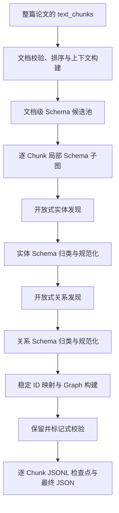

# Schema 选择与文本三元组抽取算法设计

## 1. 文档目的

本文档说明 `src/extractors/text_extractor` 当前已经实现的两部分算法：

1. 面向整篇论文与单个文本 Chunk 的两级 Schema 选择算法；
2. 基于“先开放抽取、再 Schema 归类”的实体与关系抽取算法。

本文只描述当前代码，不重新设计上游 Chunk 切分。上游 `extractor_init.py` 已经把同一篇论文的全部文本 Chunk 传入本模块；本模块负责排序、上下文组织、Schema 选择、逐 Chunk 抽取、结构校验和持久化。

当前输出不是单独的三元组数组，而是统一的 `Graph`：实体存入 `entities`，关系三元组存入 `relations`，事件存入 `events`。目前事件抽取阶段暂时关闭，因此核心事实形式为：

```text
(source_entity)-[relation_type]->(target_entity)
```

---

## 2. 总体设计思想

整体流程遵循“先建立文档级先验，再做局部选择；先发现事实，再做 Schema 归类；保留原始候选，再标注质量问题”的思路。



Schema 在流程中承担两种作用：

- 在选择阶段，它是对论文主题和当前 Chunk 语义范围的结构化先验；
- 在归类阶段，它是实体类型和关系类型的候选白名单。

Schema 关系只表示“这种类型关系在知识模型中被定义”，不表示当前正文一定陈述了该事实。关系事实仍须先从当前 Chunk 正文中抽取。

---

## 3. 模块职责

| 文件 | 主要职责 |
|---|---|
| `document_context.py` | 校验并排序 Chunk，建立章节和相邻上下文索引，抽取领域术语，生成文档主题画像 |
| `schema_models.py` | 定义概念、Schema 关系、文档上下文和选择结果的数据结构 |
| `schema_repository.py` | 从 Neo4j 读取概念图、执行向量检索、一跳邻域查询和诱导关系查询 |
| `schema_selector.py` | 执行文档级候选池选择与 Chunk 级局部 Schema 选择 |
| `text_extractor.py` | 编排实体发现、实体归类、关系发现、关系归类和逐 Chunk 抽取 |
| `text_extractor_parser.py` | 将宽松 LLM 响应映射为稳定 ID 的 `Entity`、`Relation` 和 `Graph` |
| `text_extractor_validator.py` | 检查 Graph 引用一致性，并把结果写入元数据 |
| `pipeline.py` | JSONL 逐 Chunk 持久化、断点续跑和最终 JSON 汇总 |

提示词统一位于 `prompts/extractor_text_prompts.py`，文本模态目录只负责调用与结果合并。

---

## 4. Schema 选择算法设计

### 4.1 输入与输出

Schema 选择器一次接收同一篇论文的全部文本 Chunk。每个 Chunk 至少需要：

```json
{
  "id": "0:text:2",
  "order": 2,
  "document_id": "document-1",
  "section_id": "0",
  "section_title": "章节标题",
  "section_summary": "章节总结",
  "schemaKeys": ["盆地", "断层"],
  "document_schema_keys": ["构造单元", "地质时代"],
  "modality": "text",
  "text": "当前 Chunk 正文"
}
```

`SchemaSelector.prepare_document()` 返回 `DocumentSchemaContext`：

- `document`：排序后的文档上下文；
- `document_schema_pool`：整篇论文共用的 Schema 候选池；
- `chunk_schemas[chunk_id]`：每个 Chunk 的局部 Schema 子图。

### 4.2 阶段一：文档上下文构建

`build_document_context()` 首先执行确定性预处理：

1. 把字典或 Pydantic Chunk 转为普通字典；
2. 检查 `id` 非空且不重复；
3. 检查所有输入均为文本模态；
4. 检查非空 `document_id` 只对应同一篇论文；
5. 按 `(order, 原输入位置)` 稳定排序；
6. 建立 Chunk 索引、章节索引和同章节相邻 Chunk 索引；
7. 汇总文档级与章节级 `schemaKeys`；
8. 构造文档主题画像。

领域术语提取使用 `jieba.posseg`，主要保留中文名词性词项 `n/ng/ns/nt/nz`，排除人名、通用停用词和引文噪声。英文只保留形如 `U-Pb`、大写缩写或带数字/连字符的技术词。领域术语默认最多保留 40 个，以免大量低频词稀释后续覆盖率。

主题画像由以下信息组成：

- 文档标题、摘要、总结和作者关键词；
- 章节标题与章节总结；
- 文档级、章节级 `schemaKeys`；
- 高频专业词；
- 按章节均匀选出的代表性正文片段。

相邻上下文只在同一章节内读取，默认取前一 Chunk 尾部 180 字和后一 Chunk 头部 180 字。

### 4.3 阶段二：文档级 Schema 候选池

文档级选择的目标是建立稳定的论文主题先验，避免每个 Chunk 独立召回导致类型漂移。

#### 4.3.1 核心概念树选择

Neo4j 中的 `EntityConcept` 通过 `BELONGS_TO_CATEGORY` 归属于概念树。若提供 LLM，模型根据文档主题画像从可用概念树白名单中选择 Top3，并补充领域关键词；模型异常、输出非法或少选时，算法按树内头部概念得分补足 Top3。

Top3 核心概念树中的全部概念节点都会保留，以保证论文核心领域的 Schema 召回率。

#### 4.3.2 文档级混合召回

系统把主题画像、模型关键词、`schemaKeys` 和领域术语组合为查询文本，并生成查询向量。优先调用 Neo4j 向量索引 `entity_concept_embedding_idx`；索引不可用时，退化为查询向量与全部概念向量的内存余弦相似度计算。

每个概念综合四类信号：

| 信号 | 权重 | 含义 |
|---|---:|---|
| `vector_score` | 0.45 | 文档主题与概念描述的向量相似度 |
| `lexical_score` | 0.25 | 中英文名称、示例、别名与领域词的词法匹配 |
| `coverage` | 0.10 | 概念在不同章节标题中的覆盖比例 |
| `schema_key_score` | 0.20 | 文档级 `schemaKeys` 对概念的直接支持 |

文档概念分数为：

$$
S_{doc}=\frac{\sum_{i\in A} w_i s_i}{\sum_{i\in A} w_i}
$$

其中，$A$ 表示当前实际可用的信号集合。若 `schemaKeys` 没有提供任何有效支持，会去掉对应权重并对其余权重重新归一化，避免概念固定损失 20% 分数。

词法分数不是简单的子串匹配，而是综合：

- 概念中文名或英文 Schema 名精确命中；
- 概念示例命中；
- 地质同义词和简称命中，如“断层/断裂”“烃源岩/源岩”；
- jieba token 集的 Jaccard 相似度；
- 文档领域术语在概念描述或示例中的命中数量。

`schema_key_score` 对英文 Schema 名或中文名精确命中记为 1.0，别名命中记为 0.90，包含式模糊命中记为 0.75。

#### 4.3.3 文档池组成

最终文档池由两部分组成：

1. Top3 核心概念树的全部节点；
2. 核心树之外按得分排序的跨树先验概念，默认最多取 30 个，代码硬上限为 35 个。

节点确定后，再查询这些节点之间 Neo4j 中已有的全部有向 `SCHEMA_RELATION`，形成文档级诱导子图。关系不参与节点召回和节点裁剪。

### 4.4 阶段三：Chunk 级局部 Schema 选择

Chunk 级选择以当前正文为主证据，以章节信息、同章节相邻文本和文档候选池为辅助先验。

查询文本结构为：

```text
文档主题 + 章节标题 + 章节总结 + 章节 schemaKeys
+ 相邻上文 + 相邻下文 + 当前正文
```

#### 4.4.1 核心树节点继承

文档级 Top3 核心概念树节点全部继承到局部 Schema，并重新计算当前正文词法分数、上下文分数和章节 `schemaKeys` 分数。这样核心领域节点不会因单个短 Chunk 语义不足而丢失。

#### 4.4.2 跨树候选精召回

核心树之外的概念使用五类信号：

| 信号 | 权重 | 含义 |
|---|---:|---|
| `vector_score` | 0.35 | Chunk 查询向量与概念向量的相似度 |
| `lexical_score` | 0.20 | 当前正文对概念的词法支持 |
| `context_score` | 0.10 | 章节摘要与相邻文本的词法支持 |
| `document_score` | 0.15 | 概念在文档级候选池中的先验分数 |
| `schema_key_score` | 0.20 | 当前章节 `schemaKeys` 的直接支持 |

同样采用“仅对可用信号归一化”的加权公式。精确命中的概念优先于仅依靠综合分数的概念，然后按 `final_score` 降序选择最多 10 个跨树种子节点。

#### 4.4.3 受控一跳扩展

为补充关系端点，算法从跨树种子节点查询一跳入边和出边邻居。邻居根据正文词法支持与上下文支持排序；无直接支持的跨树邻居只给予较低的拓扑先验分。最终最多补充 15 个一跳概念节点，邻域查询边数上限为 200。

#### 4.4.4 生成局部诱导子图

局部节点集合为：

```text
核心树全部节点 ∪ Chunk 跨树 TopK 种子 ∪ 受控一跳邻居
```

节点去重后，查询这些节点之间 Neo4j 中实际存在的全部有向关系。最终局部 Schema 中的关系只由节点集合诱导得到，不单独做关系召回、打分或裁剪。

### 4.5 选择置信度与降级标记

当前选择置信度定义为：

$$
C_{schema}=0.65\overline{S}_{top3}+0.20C_{terms}+0.15C_{graph}
$$

其中：

- $\overline{S}_{top3}$：最终节点中 Top3 `final_score` 的平均值；
- $C_{terms}$：查询领域术语被已选概念覆盖的比例；
- $C_{graph}$：至少参与一条诱导关系的节点占比。

当向量索引回退，或 Chunk 选择置信度低于 0.55 时，`fallback_used` 标记为 `true`。该标记用于日志和质量分析，不会自动中断后续抽取。

### 4.6 Schema 选择伪代码

```text
function prepare_document(chunks):
    document = build_document_context(chunks)
    if document is empty:
        return empty DocumentSchemaContext

    all_concepts = neo4j.load_all_concepts()
    core_categories = llm_select_top3_categories(document.topic_profile)
    vector_hits = vector_search(document.topic_profile)

    for concept in all_concepts:
        concept.document_score = weighted_score(
            vector, lexical, section_coverage, document_schema_keys
        )

    core_nodes = all nodes in core_categories
    cross_tree_prior = top scored non-core nodes
    document_pool = induced_subgraph(core_nodes + cross_tree_prior)

    for chunk in document.chunks:
        core_nodes = inherit_all_core_nodes(document_pool)
        cross_tree_seeds = top10_by_weighted_score(
            vector, body_lexical, local_context,
            document_prior, section_schema_keys
        )
        neighbors = top15_one_hop_neighbors(cross_tree_seeds)
        chunk_schemas[chunk.id] = induced_subgraph(
            core_nodes + cross_tree_seeds + neighbors
        )

    return DocumentSchemaContext(document, document_pool, chunk_schemas)
```

---

## 5. 文本实体与关系抽取算法设计

### 5.1 核心策略：抽取与 Schema 归类解耦

当前算法不是一次受 Schema 强约束的抽取，而是对实体和关系分别采用两步流程：

```text
开放式候选发现 -> 基于局部 Schema 的类型归类与名称规范化
```

这样设计的原因是：若在第一次调用中就把局部 Schema 当成硬白名单，Schema 选择偶尔漏召回时会直接造成事实丢失。先开放发现可以优先保证候选召回，后续再把候选映射到局部 Schema；无法映射的候选保留原始中文语义，并降级为 `other`，而不是删除。

一个非空 Chunk 实际执行 4 次结构化 LLM 调用：

1. 开放式实体发现；
2. 实体 Schema 归类；
3. 开放式关系发现；
4. 关系 Schema 归类。

事件抽取当前被显式关闭，`events` 保持为空数组。

### 5.2 阶段一：开放式实体发现

`ENTITY_PROMPT_noSchema` 只读取当前 Chunk 正文，不使用局部 Schema 限制候选类型。模型负责识别正文明确出现的石油地质对象，并返回：

- `name`：原文实体名称；
- `official_name`：可确定的规范名称；
- `type_zh`：初步中文概念类型；
- `attributes`：数值、单位、测试条件、层位、位置等属性；
- `provenance`：原文证据字符串。

此阶段的目标是发现候选事实，不要求模型输出最终英文 Schema 类型。

### 5.3 阶段二：实体 Schema 归类与规范化

局部 Schema 概念被裁剪为以下字段后传入 `ENTITYFULL_PROMPT_Schema`：

```json
{
  "schema": "Basin",
  "zh_name": "盆地",
  "description": "概念定义",
  "example": ["参考实例"]
}
```

归类模型必须逐一处理原实体，不得新增、删除、合并、拆分或改写 `name`。判断优先级为：

1. 概念 `description` 的语义定义；
2. 中文名 `zh_name`；
3. 示例 `example`。

命中局部 Schema 时：

- `type` 复制概念的英文 `schema`；
- `type_zh` 复制概念的 `zh_name`；
- `official_name` 填写可靠的规范名，无法确定时等于原 `name`。

未命中时：

- `type = other`；
- `type_zh` 保留首次抽取的中文类型；
- 候选继续保留。

合并时优先按实体名称匹配归类结果；同名实体使用列表逐一消费，模型漏项或乱序时再按原位置回填。最后为当前响应中的实体分配连续临时 ID：`entity_1`、`entity_2` 等。

### 5.4 阶段三：开放式关系发现

`RELATION_PROMPT_noSchema` 接收当前正文和已完成归类的实体列表，只在这些实体之间发现正文明确陈述的关系。每条关系必须包含：

- `source_id/source_name/source_type`；
- `target_id/target_name/target_type`；
- 原始中文 `relation_name`；
- `attributes`；
- `provenance`。

`source_id` 与 `target_id` 必须引用实体阶段产生的临时 ID。此阶段不要求关系已经存在于局部 Schema，避免因关系 Schema 漏选直接丢弃原文事实。

### 5.5 阶段四：关系 Schema 归类与规范化

局部 Schema 关系被裁剪为：

```json
{
  "source_schema": "Formation",
  "relationEn": "LOCATED_IN",
  "relationZh": "位于",
  "target_schema": "Basin"
}
```

`RELATIONFULL_PROMPT_Schema` 同时检查关系语义、源实体类型、目标实体类型和方向。命中时：

- `type` 复制 `relationEn`；
- `type_zh` 与 `relation_name` 复制 `relationZh`。

未命中时：

- `type = other`；
- `type_zh` 与 `relation_name` 保留首次抽取的中文关系名；
- 关系继续保留。

归类结果优先按 `(source_id, target_id)` 匹配原始关系，保证模型改变返回顺序时仍能映射到正确边；同一对端点存在多条关系时按列表顺序逐一消费。归类模型不得交换关系方向，也不得修改首次抽取的属性和证据。

### 5.6 阶段五：稳定 ID 与统一 Graph 构建

`parse_extraction_payload()` 把临时 ID 转换为基于内容哈希的稳定 ID：

```text
entity_id   = ent_{sha1(document_id | name | entity_type)[:20]}
relation_id = rel_{sha1(document_id | source_id | relation_type | target_id)[:20]}
event_id    = evt_{sha1(document_id | name | event_type)[:20]}
```

实体 ID 使用文档范围而不是 Chunk 范围，使同一文档中名称和类型相同的实体具有一致 ID，便于后续 `Graph.merge()` 去重。关系 ID由稳定端点、关系类型和文档 ID 决定。

解析器还会：

- 把关系临时端点 ID 映射为稳定实体 ID；
- 用已解析实体同步关系中的端点名称和类型；
- 对已知 Schema 关系补充中文关系名；
- 把 Schema 选择详情写入 `graph.metadata.extra["schema_selection"]`；
- 把各阶段原始响应保存在 `raw_response` 中用于追溯。

### 5.7 保留并标记式校验

当前校验遵循“保留所有候选，只记录错误”的原则。它不执行 Schema 白名单拒绝，也不检查 `provenance` 是否为正文子串。

实体校验包括：

- `name`、`type` 是否缺失；
- `aliases` 是否为数组；
- `attributes`、`metadata` 是否为对象；
- `provenance` 是否为字符串。

关系校验包括：

- 源、目标临时 ID 能否映射到实体；
- `type` 是否缺失；
- 端点名称和类型字段是否完整且为字符串；
- `attributes`、`metadata`、`provenance` 的字段格式。

每个候选的结果写入：

```json
{
  "metadata": {
    "validation": {
      "passed": false,
      "errors": ["source_entity_not_found"]
    }
  }
}
```

关系端点缺失时不会删除关系，而是生成可复现的 `missing_ent_*` 占位 ID，并在校验元数据中保留原始端点 ID，使问题仍可审计。

Graph 级校验统计写入：

```json
{
  "validation": {
    "passed": false,
    "accepted_count": 3,
    "rejected_count": 1,
    "retained_invalid_count": 1,
    "rejected": [],
    "final_consistency_passed": false,
    "final_consistency_errors": []
  }
}
```

其中 `final_consistency_errors` 来自 `Graph.validate_references()`，只检查关系端点和事件参与者的引用一致性。

### 5.8 空文本与调用失败

- 空正文不调用 LLM，直接返回空 `Graph`，并写入 `empty_reason = empty_text`；
- 单次 LLM 调用异常或返回非对象时，当前阶段降级为空对象，不阻断整篇论文；
- 实体发现为空时，实体归类不再调用模型；
- 关系发现为空时，关系归类不再调用模型；
- Schema 向量索引异常时使用全量余弦检索结果继续运行；
- 单个 Chunk 的抽取结果独立构建，便于逐段保存和错误隔离。

### 5.9 文本抽取伪代码

```text
function extract_from_text(chunks, llm_client):
    document = build_document_context(chunks)
    schema_context = SchemaSelector(llm_client).prepare_document(document.chunks)
    graphs = []

    for chunk in schema_context.document.chunks:
        local_schema = schema_context.chunk_schemas[chunk.id]

        if chunk.text is empty:
            graph = empty_graph(reason="empty_text")
            graphs.append(graph)
            continue

        raw_entities = llm(ENTITY_PROMPT_noSchema(chunk.text))
        typed_entities = llm(
            ENTITYFULL_PROMPT_Schema(raw_entities, local_schema.concepts)
        )
        entities = merge_entity_classification(raw_entities, typed_entities)

        raw_relations = llm(
            RELATION_PROMPT_noSchema(entities, chunk.text)
        )
        typed_relations = llm(
            RELATIONFULL_PROMPT_Schema(raw_relations, local_schema.relations)
        )
        relations = merge_relation_classification(raw_relations, typed_relations)

        graph = parse_to_stable_graph(entities, relations, events=[])
        retain_and_mark_validation(graph)
        graphs.append(graph)
        persist_checkpoint_if_configured(graph)

    return graphs
```

---

## 6. 持久化与断点续跑

`pipeline.extract_text_chunks_to_file()` 使用“JSONL 日志 + 最终 JSON 汇总”的方式保存结果：

1. 启动时读取同名 `.jsonl` 检查点；
2. 根据 `graph.metadata.chunk_id` 跳过已完成 Chunk；
3. 每完成一个 Chunk 立即追加一行 Graph JSON；
4. 同步更新状态为 `running` 的阶段汇总文件；
5. 全部完成后写入状态为 `completed` 的最终 JSON。

这种设计避免长论文在中途异常时丢失全部进度。损坏的 JSONL 尾行会被忽略，之前的完整记录仍可用于续跑。

---

## 7. 当前算法边界

为正确理解输出质量，需要明确以下当前边界：

1. `schemaKeys` 是重要的召回信号，但不是事实证据；
2. 章节摘要和相邻文本只帮助 Schema 选择，当前开放式抽取 Prompt 实际以当前正文为事实来源；
3. Schema 归类失败的实体和关系保留为 `other`，不会丢弃；
4. 解析器不因为类型不在局部 Schema 中而拒绝候选；
5. 当前不校验证据字符串是否可在正文中精确定位；
6. 当前不对低置信候选做拒绝阈值裁剪；
7. 当前事件抽取关闭，因此 `events` 为空；
8. 当前关系归类要求方向与 Schema 完全匹配，但程序解析阶段只用 Schema 补充中文名，不执行硬白名单删除；
9. 文档内相同 `name + type` 的实体得到相同稳定 ID，最终跨 Chunk 合并由后续 `Graph.merge()` 完成；
10. `fallback_used` 表示选择过程发生向量回退或置信度偏低，不等于抽取结果一定错误。

---

## 8. 可解释性与审计信息

每个 Schema 概念都保存以下分数和原因：

- `vector_score`；
- `lexical_score`；
- `context_score`；
- `schema_key_score`；
- `document_score`；
- `final_score`；
- `selection_reasons`。

每个 Chunk Graph 还保存完整 `schema_selection`、候选级 `validation`、Graph 级一致性结果和各阶段原始响应。由此可以回答：

- 某个概念为什么进入局部 Schema；
- 是向量、词法、上下文还是 `schemaKeys` 起主要作用；
- 是否发生索引回退；
- 某个实体或关系为什么被标记为无效；
- 模型原始返回与最终 Graph 之间发生了哪些规范化。

---

## 9. 推荐评估指标

Schema 选择阶段建议评估：

- 文档级和 Chunk 级 Concept Recall@K；
- Relation Schema Recall；
- 局部 Schema 节点数与关系数；
- `schemaKeys` 命中贡献率；
- 向量索引回退率；
- 低于 0.55 的低置信 Chunk 比例。

文本抽取阶段建议评估：

- 实体识别 Precision、Recall、F1；
- 实体 Schema 类型准确率与 `other` 比例；
- 关系三元组 Precision、Recall、F1；
- 关系方向准确率；
- 端点引用完整率；
- 候选校验通过率；
- 跨 Chunk 实体稳定 ID 一致率；
- 每 Chunk 平均 LLM 调用次数与失败降级率。

论文消融实验可依次比较：无 Schema、仅向量召回、向量与词法融合、加入 `schemaKeys`、加入文档级核心树先验、加入一跳图扩展，以及完整的抽取后 Schema 归类流程。

---

## 10. 总结

当前实现的关键不是让 Schema 直接替代文本事实判断，而是让不同机制各司其职：

- 文档主题、领域术语、`schemaKeys` 和向量检索负责提高概念召回；
- 核心概念树与一跳扩展负责保持局部 Schema 的结构完整性；
- 开放式实体和关系发现负责避免因 Schema 漏选而过早丢失事实；
- Schema 归类负责把开放候选映射为规范类型；
- `other` 回退与保留并标记式校验负责保存可审计的失败样本；
- 稳定 ID、Graph 元数据和 JSONL 检查点负责后续融合与运行追踪。

因此，整个算法形成了“文档级先验—Chunk 局部选择—开放事实发现—Schema 规范化—结构校验—持久化审计”的闭环。
