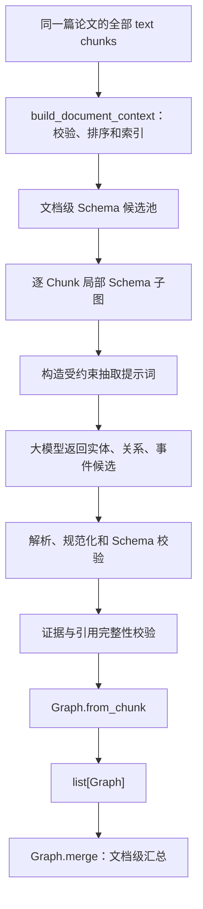

# 基于两级 Schema 选择的文本知识抽取方案

## 1. 方案目标

本文档描述 `src/extractors/text_extractor` 后续应采用的文本抽取流程。方案直接建立在
`tests/test_text_schema_selector.py` 已验证的概念 Schema 获取能力之上：先对同一篇论文的全部文本
Chunk 调用一次 `SchemaSelector.prepare_document()`，得到文档级候选概念池和每个 Chunk 的局部
Schema 子图，再让大模型在局部 Schema 白名单内抽取实体、关系和事件。

最终业务输出必须使用 `model/graph.py` 中已经定义的模型：

- 单个 Chunk 输出一个 `Graph`；
- 实体使用 `Entity`，关系使用 `Relation`，事件使用 `Event`；
- 来源范围、抽取阶段和调试信息写入 `GraphMetadata`；
- 文档级结果使用 `Graph.merge()` 合并，不再另建“三元组结果”“抽取结果”等平行数据结构。

Schema 选择结果是抽取约束，不是文本事实。某条 Schema 关系存在，只表示这种关系允许出现；只有当前
Chunk 正文提供了明确证据时，才能生成实例关系或事件。

## 2. 当前基础与需要调整的接口

### 2.1 已完成的能力

现有测试已经覆盖以下能力：

1. `build_document_context()` 对整篇 Chunk 排序、建立章节索引和相邻上下文；
2. 从正文中过滤引文噪声并提取领域术语；
3. 继承文档总结、章节总结、文档 `schemaKeys` 和章节 `schemaKeys`；
4. 文档级向量召回、词法命中和 `schemaKeys` 融合；
5. Chunk 级概念种子选择、一跳邻域扩展、节点/边预算裁剪；
6. Neo4j 向量索引不可用时，回退为全量余弦相似度计算；
7. 输出 `DocumentSchemaContext`，其中包含：
   - `document`：整篇文档上下文；
   - `document_schema_pool`：文档级 Schema 候选池；
   - `chunk_schemas[chunk_id]`：每个 Chunk 的局部 `RelevantSchema`。

### 2.2 文本抽取入口需要迁移

当前文本抽取入口仍按旧接口逐 Chunk 调用 `selector.select()`，没有使用已经完成的
`prepare_document()`。新流程必须改为：

```python
def extract_from_text(chunks, llm_client, schema_selector=None) -> list[Graph]:
    """整篇选择一次 Schema，再逐 Chunk 生成统一的 Graph 抽取结果。"""

    selector = schema_selector or SchemaSelector()
    schema_context = selector.prepare_document(chunks)
    graphs = []
    for chunk in schema_context.document.chunks:
        chunk_id = str(chunk["id"])
        local_schema = schema_context.chunk_schemas[chunk_id]
        graph = extract_text_chunk_graph(
            chunk=chunk,
            local_schema=local_schema,
            llm_client=llm_client,
        )
        graphs.append(graph)
    return graphs
```

上面函数的中文注释说明：该函数先利用整篇论文建立稳定的 Schema 先验，然后按照文档顺序抽取每个
Chunk，避免对每段独立选 Schema 造成类型漂移和上下文污染。

## 3. 总体流程



流程分为四个阶段：

1. **整篇上下文构建**：一次只允许处理一篇论文，按 `order` 排序并建立章节和邻接索引；
2. **两级 Schema 选择**：生成文档候选池，再为各 Chunk 生成局部概念与合法关系集合；
3. **受约束事实抽取**：只从当前 Chunk 正文生成事实，上下文仅帮助消歧；
4. **模型化与校验**：把候选转换为 `Graph`，校验关系端点和事件参与实体后再返回。

## 4. 输入约定

`extract_from_text()` 接收同一篇论文的全部文本 Chunk。每个 Chunk 至少应包含：

```json
{
  "id": "0:text:2",
  "order": 2,
  "document_id": "document-1",
  "section_id": "0",
  "section_title": "华北克拉通西南缘中元古代构造演化",
  "section_summary": "本节研究构造事件性质与动力学机制。",
  "schemaKeys": ["盆地", "构造单元", "地质时代", "岩性"],
  "document_schema_keys": ["盆地", "研究区", "岩性", "实验"],
  "modality": "text",
  "text": "作者在鄂尔多斯盆地西南缘识别出一套双峰式火成岩组合。"
}
```

约束如下：

- `id` 必须存在且在本次输入中唯一；
- 非空 `document_id` 必须一致；
- `modality` 必须是文本模态；
- 空正文允许保留顺序，但不调用大模型，直接返回空 `Graph`；
- `section_summary`、`schemaKeys`、相邻正文和文档主题只用于选型及指代消解；
- `Entity.provenance`、`Relation.provenance` 和 `Event.provenance` 必须来自当前 `text`，不能使用总结补造事实。

## 5. Schema 选择结果如何参与抽取

对每个 Chunk，从 `chunk_schemas[chunk_id]` 中构造两个白名单：

```python
concept_whitelist = {
    concept.schema: concept
    for concept in local_schema.concepts
}
relation_whitelist = {
    relation.key: relation
    for relation in local_schema.relations
}
```

上面代码的中文注释说明：概念白名单限制 `Entity.type`，关系白名单使用
`(source_schema, relation_en, target_schema)` 同时限制关系类型、方向和两端实体类型。

选择分数只用于提示模型关注重点和记录调试信息，不直接变成事实置信度。抽取时遵守以下规则：

- `Entity.type` 必须等于某个 `SchemaConcept.schema`；
- `Entity.type_zh` 使用该概念的 `zh_name`；
- `Relation.type` 使用 `SchemaRelation.relation_en`；
- `Relation.type_zh` 使用 `relation_zh`；
- 关系必须满足 `(源实体.type, Relation.type, 目标实体.type)` 在局部关系白名单中；
- 局部 Schema 没有允许的关系时，仍可抽取实体和事件，但 `relations` 必须为空；
- 不因某概念得分高而生成正文未出现的实体。

## 6. 分步抽取算法

### 6.1 第一步：实体候选抽取

模型只识别当前 Chunk 中有明确名称或可稳定指代的领域对象。每个实体候选包含：

- `name`：原文中的主要名称；
- `type`：局部概念白名单中的英文 Schema；
- `official_name`：正文明确给出或规范化模块可靠确定时填写；
- `aliases`：仅保留正文明确出现的别名；
- `description`：对当前语境的简短概括；
- `attributes`：无法合理建模为独立实体/事件/关系的键值事实；
- `provenance`：当前正文中的连续原文证据。

同一 Chunk 内，同名、同类型且指向同一对象的候选合并。不同类型或明确指向不同对象时不得仅按名称合并。

### 6.2 第二步：关系候选抽取

先根据已通过的实体两两组合，再用局部 `SchemaRelation` 过滤合法方向。模型只能判断正文是否真正表达了
该关系，不能自由创造关系类型。

关系候选必须同时满足：

1. `source_id` 或 `target_id` 均对应当前 Chunk Graph 中的实体，某一个不存在的实体类型标注为others；
2. 类型三元组存在于 `relation_whitelist`；
3. `provenance` 能支持关系方向；
4. 不能把“可能、推测、尚有争议”改写成确定事实，语气应保存到 `attributes`，如
   `{"certainty": "推测"}`。

### 6.3 第三步：事件抽取

当正文描述带参与者、时间、位置或过程属性的动态事实时，使用 `Event`，不要强行压缩成普通二元关系。
例如实验、观测、构造运动、沉积、运移和聚集过程可分别映射到 `EventType`，无法稳定归类时使用
`other` 或 Schema 扩展字符串。

事件参与者必须先作为 `Entity` 抽取，`participants` 只保存这些实体的 ID。时间和位置分别写入
`time`、`location`，实验方法、参数和结论等写入 `attributes`。

### 6.4 第四步：属性归属

属性必须归属于实体、关系或事件之一，不设计独立的顶层 `attributes` 数组：

- 对象自身性质写入 `Entity.attributes`；
- 关系限定条件写入 `Relation.attributes`；
- 时间、位置之外的过程/实验信息写入 `Event.attributes`。

属性值尽量保留原始单位和限定词。例如 `1.8～1.6 Ga` 不应被无依据地换算或裁剪。

## 7. 大模型结构化返回协议

模型只需返回与 `Graph` 主体对应的三个数组，禁止让模型生成 `metadata`：

```json
{
  "entities": [
    {
      "temp_id": "e1",
      "name": "鄂尔多斯盆地",
      "official_name": null,
      "type": "Basin",
      "type_zh": "盆地",
      "aliases": [],
      "description": "研究对象所在盆地",
      "attributes": {},
      "provenance": "位于鄂尔多斯盆地西南缘",
      "metadata": {}
    }
  ],
  "relations": [],
  "events": [
    {
      "temp_id": "v1",
      "type": "observation",
      "name": "识别双峰式火成岩组合",
      "participants": ["e1"],
      "time": null,
      "location": "鄂尔多斯盆地西南缘",
      "attributes": {"result": "识别出一套双峰式火成岩组合"},
      "provenance": "在位于鄂尔多斯盆地西南缘的地区识别出一套双峰式火成岩组合",
      "metadata": {}
    }
  ]
}
```

`temp_id` 仅用于一次模型响应内部的引用。解析器负责生成最终稳定 ID，并把关系端点和事件参与者从
临时 ID 映射到最终 ID。这样可以避免让模型自行编造全局 ID。

## 8. ID 生成与规范化

建议使用可复现的内容哈希生成 ID：

```text
entity_id   = ent:{sha1(document_id|normalized_name|type)[:16]}
relation_id = rel:{sha1(chunk_id|source_id|type|target_id|provenance)[:16]}
event_id    = evt:{sha1(chunk_id|type|name|provenance)[:16]}
```

实体 ID 使用文档范围而不是 Chunk 范围，使同一实体可在 `Graph.merge()` 时自然合并。关系和事件保留
Chunk 证据差异，防止不同段落的独立陈述被错误覆盖。只有完成实体链接后才填写 `normalized_id`；未完成
对齐时保持 `None`。

## 9. Graph 构建与输出

解析和校验完成后，单 Chunk 结果必须通过 `Graph.from_chunk()` 构造：

```python
graph = Graph.from_chunk(
    document_id=str(chunk.get("document_id") or ""),
    chunk_id=str(chunk["id"]),
    modality=SourceModality.TEXT,
    entities=entities,
    relations=relations,
    events=events,
    raw_response=raw_response,
    stage="stage_04_text_extraction_front",
)
graph.metadata.extra.update(
    {
        "schema_selection": local_schema.to_dict(),
        "validation": validation_summary,
    }
)
```

上面代码的中文注释说明：业务事实只进入 `entities`、`relations` 和 `events`，Schema 选择过程和校验统计
属于运行信息，因此写入 `GraphMetadata.extra`；原始模型响应仅用于调试与追溯。

单 Chunk 的最终 JSON 形态如下：

```json
{
  "entities": [
    {
      "id": "ent:82bfbab52b91f09a",
      "name": "鄂尔多斯盆地",
      "official_name": null,
      "type": "Basin",
      "type_zh": "盆地",
      "aliases": [],
      "description": "研究对象所在盆地",
      "attributes": {},
      "provenance": "位于鄂尔多斯盆地西南缘",
      "normalized_id": null,
      "metadata": {}
    }
  ],
  "relations": [],
  "events": [],
  "metadata": {
    "document_id": "document-1",
    "chunk_id": "0:text:2",
    "modality": "text",
    "stage": "stage_04_text_extraction_front",
    "raw_response": null,
    "extra": {
      "schema_selection": {
        "selector_version": "hybrid_graph_v1",
        "concepts": [],
        "relations": [],
        "query_terms": [],
        "selection_confidence": 0.82,
        "fallback_used": false
      },
      "validation": {"accepted": 1, "rejected": 0}
    }
  }
}
```

`extract_from_text()` 的公开返回类型为 `list[Graph]`，列表顺序与
`schema_context.document.chunks` 的排序一致。需要文档级图时，由上层调用：

```python
document_graph = Graph.merge(
    chunk_graphs,
    document_id=document_id,
    stage="stage_04_text_extraction_merge",
)
```

上面函数的中文注释说明：该调用按稳定 ID 合并各 Chunk Graph，输出仍是统一的 `Graph`，便于后续多模态
融合继续复用同一模型。

## 10. 校验与失败处理

### 10.1 必须执行的校验

每个 Chunk 至少执行以下校验：

| 校验项 | 处理方式 |
|---|---|
| 实体类型不在局部概念白名单 | 拒绝实体，同时拒绝引用它的关系和事件参与项 |
| 关系类型、方向或端点类型不在局部关系白名单 | 拒绝关系 |
| `provenance` 不是当前正文的子串 | 拒绝候选或进入一次证据修复，不得直接入图 |
| 关系端点不存在 | 拒绝关系 |
| 事件参与实体不存在 | 移除无效参与者；全部无效时按事件语义决定拒绝事件 |
| ID 冲突但内容不同 | 重新生成 ID，并记录冲突统计 |
| Pydantic 模型校验失败 | 记录字段错误，拒绝对应候选 |

构造完成后调用 `graph.validate_references()`。只有返回空列表，Graph 才能作为有效结果输出。

### 10.2 空结果和服务异常

- 空正文：返回具有完整 `GraphMetadata` 的空 Graph，不调用 LLM；
- 局部 Schema 为空：返回空 Graph，并在 `metadata.extra` 标记 `empty_schema=true`；
- Embedding/Neo4j 回退：沿用 `RelevantSchema.fallback_used`，仍可继续抽取；
- LLM 超时或返回非法 JSON：有限次数重试，仍失败则返回空 Graph，并记录错误摘要；
- 单个 Chunk 失败不能中断整篇论文，其失败信息写入对应 Graph 元数据。

## 11. 推荐的模块划分

```text
src/extractors/text_extractor/
├── document_context.py       # 已完成：整篇 Chunk 校验、排序和主题画像
├── schema_models.py          # 已完成：Schema 选择阶段的数据模型
├── schema_repository.py      # 已完成：Neo4j 查询和向量检索回退
├── schema_selector.py        # 已完成：文档级 + Chunk 级两级 Schema 选择
├── prompt_builder.py         # 待实现：把正文和局部 Schema 构造成抽取提示词
├── response_parser.py        # 待实现：解析结构化响应并映射稳定 ID
├── graph_validator.py        # 待实现：Schema、证据和引用完整性校验
└── text_extractor.py         # 待改造：prepare_document + 逐 Chunk Graph 编排
```

其中 `response_parser.py` 和 `graph_validator.py` 不应重新定义实体、关系、事件或图模型，只导入
`model.graph` 中的现有类型。

## 12. 测试方案与验收标准

在保留 `tests/test_text_schema_selector.py` 的基础上，新增文本 Graph 抽取测试：

1. **整篇只选择一次**：断言 `prepare_document()` 只调用一次；
2. **Chunk Schema 对应正确**：每段使用自身 `chunk_id` 对应的局部 Schema；
3. **统一模型输出**：所有返回项均为 `Graph`，内部对象分别为 `Entity`、`Relation`、`Event`；
4. **白名单约束**：越界实体类型、非法关系类型和反向关系均被拒绝；
5. **证据约束**：总结或相邻 Chunk 中存在、当前正文不存在的事实不得进入当前 Graph；
6. **引用完整性**：`validate_references()` 始终返回空列表；
7. **稳定 ID**：同一输入重复运行得到相同 ID；
8. **空正文和异常隔离**：产生可追溯的空 Graph，且不影响其他 Chunk；
9. **合并兼容性**：`Graph.merge()` 能合并返回列表并保留唯一实体、关系和事件；
10. **元数据完整**：`document_id`、`chunk_id`、`modality`、`stage` 和 Schema 选择摘要齐全。

验收时应重点保证三条不可妥协的边界：**Schema 不等于事实、上下文不等于当前证据、返回结构只使用
`model/graph.py` 的统一 Graph 模型。**
